# Cahier des charges — MiniShop

**Site e-commerce avec Back-office — Spécification du système, conception de base de données, application Web PHP/MySQL/PDO**

| | |
|---|---|
| **Projet** | MiniShop (SAE — Service d'Activités Étudiantes) |
| **Commanditaire / maître d'ouvrage** | Département Informatique — IUT / Université Côte d'Azur |
| **Référente pédagogique** | Thanh-Phuong Nguyen (`thanh-phuong.nguyen@univ-cotedazur.fr`) |
| **Maîtrise d'œuvre** | Groupe de 3 étudiants (2 personnes toléré) |
| **Version du document** | 1.0 |
| **Date** | 21 septembre 2026 |
| **Statut** | Prêt pour validation — voir §16 (grille de conformité) |
| **Périmètre couvert** | Document de spécification (20 pts) **et** document d'analyse/conception de base de données (20 pts), comme exigé aux points 2) et 3) du sujet |

> **Comment lire ce document.** Le sujet impose un plan en 9 parties (§1 à §9) et un plan de conception de base de données en 4 sous-parties (§12). Ce cahier des charges reprend **ces deux plans à l'identique**, et ajoute la méthode « 8 étapes » de rédaction d'un CDC (contexte, objectifs mesurables, périmètre, ressources, délais, budget) dans §13, ainsi que les annexes rejouables (scripts SQL, tests, code, GitLab) en §17. Chaque exigence porte un identifiant (`EF-*`, `ENF-*`, `RB-*`, `CT-*`, `SEC-*`) afin d'être **vérifiable** : aucune exigence n'est écrite si elle ne peut pas être testée.

---

## Sommaire

0. [Avant-propos, usages et méthode](#0-avant-propos-usages-et-méthode)
1. [Présentation du projet](#1-présentation-du-projet)
2. [Objectifs](#2-objectifs)
3. [Acteurs](#3-acteurs)
4. [Fonctionnalités](#4-fonctionnalités)
5. [Les diagrammes UML](#5-les-diagrammes-uml)
6. [Règles métier](#6-règles-métier)
7. [Contraintes techniques](#7-contraintes-techniques)
8. [Sécurité](#8-sécurité)
9. [Architecture du système](#9-architecture-du-système)
10. [Modélisation des données et SQL](#10-modélisation-des-données-et-sql)
11. [Pré-conditions de recette, hypothèses, hors périmètre](#11-pré-conditions-de-recette-hypothèses-hors-périmètre)
12. [Conception de la base de données (document « Analyse de BD »)](#12-conception-de-la-base-de-données)
13. [Organisation du projet : périmètre, ressources, délais, budget](#13-organisation-du-projet-périmètre-ressources-d%C3%A9lais-budget)
14. [Déroulement GitLab et traçabilité de la contribution](#14-déroulement-gitlab-et-traçabilité-de-la-contribution)
15. [Document de tests et de validation (synthèse)](#15-document-de-tests-et-de-validation-synthèse)
16. [Grille de conformité / auto-validation des livrables et des pénalités](#16-grille-de-conformité--auto-validation-des-livrables-et-des-pénalités)
17. [Annexes](#17-annexes)

---

## 0. Avant-propos, usages et méthode

### 0.1 Ce que contient (et ne contient pas) un cahier des charges

Un cahier des charges décrit **le besoin (le *quoi*)**, pas la solution (le *comment*). Il doit être : **nécessaire, réalisable, clair, vérifiable, cohérent**.

Ce projet est double : il est à la fois un CDC « client » (MiniShop doit fonctionner) et un CDC « pédagogique » (MiniShop doit **prouver** que les 11 compétences du référentiel sont maîtrisées). La rédaction suit donc deux règles :

1. **toute exigence est testable** : chaque `EF-*`/`ENF-*`/`RB-*`/`SEC-*` est rattachée à un moyen de vérification concret (requête SQL, commande shell, cas de test PHPUnit, requête HTTP) ;
2. **la partie solution n'apparaît que là où le sujet l'exige explicitement** : le sujet demande un SQL/PDO/MySQL/PHP précis (§7, §8, §12) : ces choix sont donc des **contraintes contractuelles** et non des préférences techniques.

| Qualité d'un bon CDC | Comment elle est garantie ici |
|---|---|
| Nécessaire | §4 recouvre **les 14 cas d'utilisation minimum** et les 3×n fonctionnalités du sujet, sans en retirer aucune |
| Réalisable | §13.4 planning sur 12 semaines × 3 personnes = 360 h, charges vérifiées ligne à ligne |
| Clair | identifiants d'exigence, vocabulaire unique (§0.3), règles métier numérotées avec leur traduction SQL |
| Vérifiable | §15 + annexe 17.8 : 29 tests SQL **exécutés** (29/29 conformes), tests fonctionnels, tests de sécurité |
| Cohérent | matrice de traçabilité exigence → modèle → procédure → test (`docs/02-document-tests-validation.md` §6), aucune exigence orpheline |

### 0.2 Positionnement dans le cycle de projet

```
Expression de besoin ──► [CAHIER DES CHARGES] ──► Spécifications ──► Conception BD ──► Réalisation ──► Tests/recette
     (sujet de SAE)        ce document, §1-§11       §12 MCD/MLD         sql/01..04        app/…           §15
                                    ▲                                          │
                                    └────── validations / arbitrages ◄─────────┘
```

Le CDC est figé à la fin de la 2ᵉ semaine ; toute évolution postérieure passe par un avenant (§16.3) afin d'éviter la dérive de périmètre : le sujet est déjà noté sur un périmètre précis, ajouter une « fonctionnalité qui semblait cool » **coûte** des points (temps pris sur les pénalités listées §16.2).

### 0.3 Vocabulaire projet (langage unique)

| Terme | Définition retenue | Termes proscrits |
|---|---|---|
| **produit** | article du catalogue, rattaché à une seule catégorie, avec prix HT, taux de TVA, prix TTC calculé, stock physique | article, référence (réservé au code `reference`) |
| **catégorie** | rayon du catalogue, 0 à N produits | rubrique, type, marque |
| **panier** | sélection temporaire de produits et quantités, portée par la session (ou persistée, variante V1) | chariot, cart |
| **commande** | panier **validé** et enregistré, avec numéro, lignes, statut | facture, bon |
| **ligne de commande** | produit + quantité + **prix figé à l'achat** dans une commande | détail, item |
| **stock** | quantité physique disponible, jamais négative | disponibilité, réserve |
| **statut** | état du cycle de vie d'une commande (6 valeurs, §6 RB-11) | état, étape |
| **front-office** | site public + espace client | boutique, site client |
| **back-office** | espace d'administration | admin, BO, manager |
| **règle de gestion** | contrainte d'intégrité exprimée dans le métier (RB-xx) | règle, check |

---

## 1. Présentation du projet

### 1.1 Description de l'état actuel

L'entreprise MiniShop vend du matériel informatique et des objets connectés. Aujourd'hui, la vente à distance est assurée par un mélange de moyens artisanaux :

- un **catalogue PDF** mis à jour à la main, partagé par courriel, sans recherche ni filtre : les clients appellent pour connaître la disponibilité ;
- les commandes arrivent **par téléphone et par courriel**, sont recopiées dans un **tableur partagé** ; les erreurs de recopie (quantités, prix, adresses) sont fréquentes et détectées à l'expédition ;
- le **stock est tenu dans une seconde feuille du tableur**, modifiée « quand on y pense » : les ruptures ne sont découvertes qu'au moment de préparer le colis, et un même article est parfois vendu deux fois ;
- aucun historique exploitable : la direction ne sait pas dire quel produit s'est le mieux vendu le mois dernier, ni combien de commandes ont été annulées et pourquoi ;
- le prix affiché dans le PDF et le prix appliqué sur la facture peuvent diverger (les promos sont écrites « en dur » dans le document commercial, pas dans la base).

**Coûts et risques de l'état actuel** (constat métier, à charge du client de les chiffrer pour son exploitation réelle) : temps de ressaisie, litiges de prix, ventes perdues pour cause de stock fantôme, absence de piste d'audit en cas de contrôle.

### 1.2 Besoin exprimé

Développer un **site e-commerce** permettant aux clients de consulter un catalogue, de gérer un panier et de passer des commandes, et permettant au personnel de gérer les produits, les catégories, les stocks et les commandes dans un **espace d'administration**.

### 1.3 Objectif pédagogique (partie intégrante du besoin)

Le projet doit mettre en pratique les 11 connaissances du référentiel. Chaque ligne est rattachée à la ou aux sections qui en apportent la **preuve** — c'est ce qui permet au jury de vérifier, et non de supposer :

| # | Compétence du référentiel | Preuve dans le projet (section / artefact) | Vérification concrète |
|---|---|---|---|
| 1 | Conception et modélisation de bases de données | §12.1 MCD, §12.2 MLD, diagrammes `mcd_minishop.png`, `mld_minishop.png` | relecture guidée par la table des cardinalités §12.1.3 |
| 2 | SQL et MySQL | `sql/01_minishop_schema.sql` (DDL + données), vues, index FULLTEXT | `scripts/load_db.sh` puis requêtes de contrôle §12.4 |
| 3 | Développement PHP | application MVC PHP 8 (§9), `app/**` | `php -l`, PHPUnit, parcours fonctionnel |
| 4 | Programmation orientée objet | §9.2 classes `Model` / `Repository` / `Controller` / `Service`, autoloading PSR-4 | liste des classes §9.2 + annexe 17.7 |
| 5 | Accès aux bases avec PDO | §8.1 et annexe 17.7 : `prepare`/`execute`, `CALL sp_*`, transactions | `grep` de conformité §15.3 (aucune interpolation dans le SQL) |
| 6 | Programmation côté client avec JavaScript | §4.5.3 (panier dynamique, filtres, validation live, compteur de caractères) | test F-13 (JS désactivé : le site reste correct) |
| 7 | Authentification et gestion des sessions | §8.4, séquence 1 (`seq_authentification.png`) | test S-04 (fixation), S-05 (CSRF), F-04 |
| 8 | Sécurité des applications Web | §8 complet (9 points de vulnérabilité, tous chiffrés) | 10 tests offensifs `S-01…S-10` (§3.2 du document de tests) |
| 9 | Procédures stockées | **17 procédures + 1 fonction** livrées (minimum demandé : 5) — §12.5, `sql/02_minishop_procedures.sql` | `scripts/load_db.sh` affiche le compteur ; appels prouvés par les séquences 2 et 4 |
| 10 | Déclencheurs (triggers) | **16 triggers** livrés (minimum demandé : 5) — §12.6, `sql/03_minishop_triggers.sql` | tests SQL T-03, T-08, T-11, T-21, T-22 (29/29 conformes) |
| 11 | Tests et validation d'une application Web | §15 + annexe 17.8 (harnais `scripts/run_sql_tests.sh`, 29 tests, plan de recette) | sortie du harnais, consignée dans `tests/sql/rapport_tests_sql.md` (généré par la campagne) |

### 1.4 Intérêt et bénéfices attendus

**Côté entreprise :** un catalogue à jour en permanence, un stock rendu fiable par la base (et non par la discipline des utilisateurs), des commandes horodatées et tracées, une piste d'audit des changements de statut, une facturation défendable grâce au prix figé à l'achat.

**Côté pédagogique :** l'application ne « marche pas grâce au PHP bien écrit », elle marche **parce que la base interdit le contraire** : c'est exactement la démonstration attendue par les points 9 et 10 du référentiel. Les 29 tests SQL le prouvent en contournant volontairement l'application (INSERT/UPDATE écrits à la main, déclenchement réel des triggers).

### 1.5 Contexte légal et contractuel

Données personnelles des clients (nom, coordonnées, historique d'achat) : le projet est une **maquette pédagogique**, il n'y a donc ni registre de traitement, ni DPO, ni contrat de sous-traitance à produire. En revanche, les obligations structurantes du commerce en ligne sont **spécifiées comme exigences** (elles sont peu coûteuses et notables) : information précontractuelle sur le prix TTC (§4.2 UC-03, `ENF-14`), droit de rétractation matérialisé par l'annulation (§4.4 UC-09), sécurité et confidentialité des données (§8), traçabilité des écritures (§6 RB-11). Les mentions légales et les CGV sont livrées en pages statiques (`EF-GEN-05`) ; aucun paiement réel n'est intégré (§11.2 hors périmètre).

Mentions obligatoires du cadre pédagogique : code rendu sous licence de l'établissement, aucun dépôt de données personnelles réelles dans GitLab, hashes de mots de passe de démonstration uniquement (§12.7).

### 1.6 Parties prenantes

| Partie prenante | Rôle dans le projet | Attentes | Livrables qui y répondent |
|---|---|---|---|
| Maître d'ouvrage pédagogique (enseignante référente) | valide le périmètre, note | exhaustivité du plan demandé, respect des pénalités, traçabilité GitLab | §1 à §12, §14, §16 |
| Client final de MiniShop (personnel de l'entreprise) | usage du back-office | fiabilité du stock, simplicité, historique des commandes | §4.5, §6, §15 |
| Clients acheteurs | achat en ligne sans mauvaise surprise | catalogue à jour, prix correct, confirmation de commande | §4.2, §4.3, §4.4 |
| Équipe de réalisation (3 étudiants) | conception, développement, tests, soutenance | périmètre clair, charges réparties, outillage rapide | §13, §14 |
| Jury de soutenance | évaluation | démonstration des 11 compétences en 15 min | §17.11 |

### 1.7 Conformité au sujet — pointage ligne à ligne (sujet reçu, document `sujetSAE.pdf`)

Le pointage ci-dessous a été refait **contre le PDF du sujet** (6 rubriques énoncées, pas seulement la partie
cahier des charges). « Preuve » = le moyen de vérifier soi-même, pas une promesse : **exécuté** = commande lancée
sur la base, **conçu** = exigence spécifiée dont la vérification suppose l'application PHP (non écrite, §16.4).

| Ce que demande le sujet | Où c'est traité | Preuve | État |
|---|---|---|---|
| Les **9 rubriques** du document de spécification (1 Présentation … 9 Architecture) | §1 → §9 dans le même ordre | sommaire du présent document | **documenté** |
| **3 acteurs** minimum (`Visiteur`, `Client`, `Administrateur`) et leurs 3×n fonctionnalités | §3, §4.1 (16 fonctionnalités client, 11 visiteur, 9 admin, aucune retirée) | matrice §4.1 ↔ tests | **documenté** |
| Diagramme de cas d'utilisation, **14 cas** minimum | §5.1 (global + 2 zooms), annexe 17.1 : 14 fiches | `docs/diagrams/cas_utilisation_*.png` (3 rendus) | **documenté + rendu** |
| **3 cas détaillés textuellement** (préconditions, scénario nominal, alternatifs) | §5.1.5.1 (UC-07, celui de l'exemple), §5.1.5.2 (UC-02), §5.1.5.3 (UC-14) | les **11 pas** de l'exemple repris pas à pas + les **5** scénarios alternatifs cités | **documenté** |
| Diagramme de classes : classes, attributs, méthodes, associations, **cardinalités**, **choix justifiés** | §5.2 + tableau de justification ligne à ligne | `diagramme_classes.png` + §12.8 (7 arbitrages justifiés) | **documenté + rendu** |
| **≥ 4 diagrammes de séquences** intégrant procédure stockée et déclencheur | §5.3 : authentification, recherche produit, ajout au panier, passer commande (+2 bonus : annulation, back-office) | 6 séquences rendues, chaque flèche nomme `CALL sp_…` ou `trg_…` | **documenté + rendu** |
| Les **11 contraintes métier** (email unique, prix > 0, stock ≥ 0, commande ≥ 1 ligne, quantité > 0, prix figé, 1 catégorie, …) | §6 (RB-01…RB-11 citées **à l'identique**) | `T-01`…`T-16` | **exécuté (29/29)** |
| **MCD** avec entités, associations, cardinalités justifiées | §12.1 | `mcd_minishop.png` (8 entités) | **documenté + rendu** |
| **MLD**, exemples du sujet (`CLIENT(id_client PK, nom, prenom, email, password, date_creation)`) | §12.2 | même table, `password` → `mot_de_passe_hash` (le sujet interdit le mot de passe en clair) | **documenté** |
| **Normalisation** : dépendances fonctionnelles, 1FN/2FN/3FN, clés primaires **et** étrangères justifiées, redondances | §12.3.1 → §12.3.5 | 4 requêtes de preuve renvoyant 0 ligne | **exécuté** |
| **Script SQL** traduisant le MLD **avec insertion de données** | §12.4, `sql/01`, `sql/04` | `./scripts/load_db.sh` (sortie en §15.4) | **exécuté** |
| **≥ 5 procédures stockées** dont `sp_create_order`, `sp_add_order_item`, `sp_update_order_status` | §12.5 (17) + correspondance des noms au §12.5.2 | compteur du chargeur, `T-06`…`T-29` | **exécuté** |
| **Question pédagogique** : procédure stockée plutôt que PHP — logique centralisée, sécurité, transactions, réutilisabilité, contrôle des accès | §12.5.1 (**6 axes**, dont les 5 du sujet + le coût) | démonstration chiffrée `2N+2 → 1` aller-retour | **documenté** |
| **≥ 5 triggers**, dont « Trigger 1 — Stock » (`stock - quantité commandée`) et « Trigger 2 — Historique » sur `ORDER_STATUS_HISTORY` | §12.6 (16) + §12.5.2 (colonnes exactes du sujet + 4 utiles) | `T-07`, `T-21`, `T-22` | **exécuté** |
| Sécurité : `PDO::prepare`/`execute`, `password_hash`/`password_verify`, `htmlspecialchars`, `$_SESSION['user_id']`, `commande.php?id=25` | §8.1, §8.4, §8.5, §8.7 | `bash tests/security/controles.sh` (**10/10**) | **exécuté (statique)** |
| Architecture **3 couches MVC** | §9 + §4.5 | `architecture_mvc.png` | **documenté + rendu** |
| Application PHP/MySQL/PDO **MVC**, GitLab (participation de chacun), **document de tests et validation** | §10 (procédures et triggers **réellement utilisés** par l'app), §14.2 (GitLab, commits par développeur), §15 + `docs/02` | `.gitlab-ci.yml` (8 jobs), `README.md` d'installation | **spécifié, code à produire** |
| Soutenance **15 min** | §17.11 + `docs/03-support-soutenance.md` (déroulé minute par minute) | minutage affiché | **documenté** |
| Barème 20/20/30/10/10 **et ses pénalités** | §16 : chaque pénalité du sujet a une ligne « comment elle est évitée » | §16.1 à §16.3 | **documenté** |
| Groupe de 3, **composition envoyée par courriel** (`sujet : Composition SAE`), **URL GitLab partagée** avec l'enseignante | §14.2, annexe 17.7 (§GitLab) | checklist S1 du planning (§14.4) | **à réaliser par l'équipe** |

---

## 2. Objectifs

### 2.1 Objectifs de l'entreprise (bénéfices attendus)

1. Vendre en ligne un catalogue complet et **toujours à jour** (produits, prix, disponibilité) sans ressaisie manuelle.
2. Garantir qu'une commande acceptée **peut être honorée** : le stock est réservé au moment de l'enregistrement, jamais après.
3. Pouvoir **justifier le prix facturé** des mois après la vente, même si le tarif a changé entre-temps.
4. Disposer d'un minimum de pilotage : commandes par statut, chiffre d'affaires par période, produits en rupture.
5. Réduire à zéro les litiges dus à une vente en surstock (deux clients, dernière unité).

### 2.2 Objectifs pédagogiques et critères de réussite

| Objectif | Critère de réussite **mesurable** |
|---|---|
| Modéliser puis normaliser une base relationnelle | MCD avec 8 entités et cardinalités justifiées ; MLD en 3FN démontrée (§12.3) ; 0 anomalie de mise à jour identifiée |
| Traduire le modèle en SQL MySQL complet | `scripts/load_db.sh` s'exécute sans erreur et affiche tables 8, vues 3, fonctions 1, procédures 17, déclencheurs 16, avec données de démonstration |
| Implémenter 5 règles de gestion dans la base (pas seulement en PHP) | 29 tests SQL conformes, dont 15 tests qui **contournent l'application** (INSERT/UPDATE directs) |
| Sécuriser une application PHP/PDO réelle | 0 requête SQL concaténée, 0 mot de passe en clair, 0 affichage non échappé, 0 accès à la ressource d'autrui : 10 tests offensifs `S-01…S-10` en échec |
| Développer une application MVC fonctionnelle | 14 cas d'utilisation démontrables de bout en bout, 3 rôles distincts, plan de recette §15 exécuté |
| Travailler en équipe avec GitLab | ≥ 60 commits, 3 auteurs distincts, merges par merge request, README d'installation à jour (1 commit/semaine/personne minimum) |

### 2.3 Objectifs techniques mesurables (extraits de la palette de recettes)

| Indicateur | Cible | Comment on mesure |
|---|---|---|
| Temps de réponse des pages catalogue (12 produits, 100 lignes de données) | < 500 ms p95 | `ab -n 200 -c 4` ou `curl -w '%{time_total}'` en local, consigné dans `docs/02-document-tests-validation.md` (§3.3, mesures `tests/perf/mesurer.sh`) |
| Nombre de requêtes SQL par page | ≤ 5 (dont 1 `CALL`) | journal `general_log` activé pendant la mesure |
| Couverture des règles de gestion par la base | 19/19 (100 %) | colonne « niveau d'application » du tableau §6 |
| Requêtes non préparées | 0 | deux `grep` bloquants en CI : recherche d'une interpolation et d'une concaténation dans `query(` / `exec(` (§15.3, contrôles 1 et 1b) |
| Mots de passe stockés en clair | 0 | `SELECT COUNT(*) FROM client WHERE CHAR_LENGTH(mot_de_passe_hash) < 60;` → 0 |
| Cas d'utilisation livrés | 14/14 | table §5.1 et annexe 17.1 |
| Fonctionnalités demandées couvertes | 100 % | matrice §4.1 |
| Test de charge de réservation concurrente | aucune survente | `tests/charge/reserver.sh` : 20 demandes simultanées sur 12 exemplaires → 12 commandes, 8 refus |

### 2.4 Calendrier de l'objectif (jalons du référentiel)

- J1 (fin S2) : CDC validé, périmètre figé. — J2 (fin S4) : MCD/MLD + script SQL + 5 procédures + 5 triggers.
- J3 (fin S7) : application MVC utilisable (front-office complet). — J4 (fin S9) : back-office + sécurité durcie.
- J5 (fin S10) : tests et validation écrits et rejoués. — J6 (S12) : soutenance.

---

## 3. Acteurs

### 3.1 Acteurs du système (3 acteurs primaires imposés + 2 acteurs secondaires)

| Acteur | Définition | Qui l'incarne dans la démo | Authentification | Droits (résumé) |
|---|---|---|---|---|
| **Visiteur** | personne non identifiée sur le site public | toute navigation en navigation privée | aucune | consulter catégories, produits, rechercher, filtrer, voir la fiche produit, **créer un compte**, ouvrir une session |
| **Client** | visiteur inscrit, identifié | `alice@example.com` | session PHP (`$_SESSION['user_id']`) | tout le visiteur + gérer son compte, son panier, passer une commande, consulter son historique, **annuler** une commande non expédiée |
| **Administrateur** | membre du personnel du back-office | `admin@minishop.fr` | session PHP (`$_SESSION['admin_id']`, rôle distinct) | gérer produits, catégories, stocks, commandes et statuts ; ne gère **jamais** le compte d'un client (RB-13) |
| *SGBD MySQL* (secondaire) | exécute les procédures stockées, déclencheurs, contraintes, transactions | — | comptes applicatifs distincts (§8.6) | garant final des règles de gestion |
| *Faux client / attaquant* (secondaire, pour l'étude de sécurité uniquement) | utilisateur malveillant : injection SQL, XSS, IDOR, CSRF, force brute | 10 tests offensifs `S-01…S-10` (document de tests) | n'a aucun droit légitime | ses tentatives doivent **échouer**, et l'échec est un livrable |

**Généralisation (à représenter dans le diagramme de cas d'utilisation) :** `Client` et `Administrateur` héritent de `Visiteur` : ils conservent le droit de naviguer dans le catalogue sans être dans l'espace d'administration. C'est ce qui permet à l'administrateur de vérifier qu'un produit masqué n'apparaît bien plus côté client.

### 3.2 Rôles et périmètre d'autorité

| Action sensible | Visiteur | Client | Administrateur | Règle qui l'interdit/autorise |
|---|---|---|---|---|
| Consulter le catalogue | ✅ | ✅ | ✅ | — |
| Créer un compte | ✅ | ✅ | ❌ | RB-13 (le back-office ne crée pas de compte client) |
| Voir sa commande | n/a | ✅ (la sienne) | ✅ | RB-08 + SEC-08 (contrôle d'appartenance) |
| Voir la commande d'un autre | ❌ | ❌ | ✅ (mais tracé dans l'historique) | SEC-08, `ENF-12` |
| Modifier un prix / un stock | ❌ | ❌ | ✅ | RB-02, RB-03, RB-18 |
| Supprimer une commande | ❌ | ❌ | ❌ (interdit après validation) | RB-09 : on annule, on ne détruit pas |
| Annuler une commande | ❌ | ✅ tant que non expédiée | ✅ | RB-11 |
| Modifier son propre mot de passe | n/a | ✅ | ✅ | RB-12 |
| Créer/bloquer un compte administrateur | ❌ | ❌ | ✅ si rôle `SUPER` | RB-13 |

### 3.3 Responsabilités de l'équipe (RACI — 3 personnes)

| Lot de travaux | Développeur A *(chef de projet)* | Développeur B *(modèle + BD)* | Développeur C *(présentation + tests)* |
|---|---|---|---|
| CDC, arbitrages de périmètre, planning | **R/A** | C | C |
| MCD, MLD, normalisation, script SQL | C | **R/A** | I |
| Procédures stockées + triggers | C | **R/A** | I |
| Modèle PHP (entités, repositories, PDO) | C | **R** | A (relecture sécurité) |
| Contrôles + vues front-office (client) | **A** | I | **R** |
| Back-office (produits, catégories, stocks, commandes) | **A** | C | **R** |
| Sécurité (sessions, CSRF, échappement, autorisation) | **A** | C | **R** |
| JavaScript client (panier, filtres, validation live) | I | I | **R/A** |
| Tests & validation, harnais SQL, revue de recette | C | **R** | **R** |
| Soutenance, maquette, README GitLab, démo | **A/R** | **R** | **R** |

> R = réalise, A = approuve, C = consulté, I = informé. Répartition volontairement **transverse** : chaque personne livre des commits dans les trois couches (modèle, contrôles, vues) pour que la contribution individuelle soit visible dans GitLab (§14).

### 3.4 Conditions d'entrée par acteur (pour la démo et la recette)

- Visiteur : navigateur récent, aucun compte, aucun cookie de session valide.
- Client : compte créé par `UC-04`, mot de passe ≥ 12 caractères, adresse de livraison renseignée (sinon `UC-07` demande l'adresse à l'étape 5).
- Administrateur : compte pré-créé par le script d'installation (le site public n'offre **aucun** moyen de créer un administrateur — SEC-10).

---

## 4. Fonctionnalités

### 4.1 Table de correspondance exigence ↔ cas d'utilisation ↔ écran ↔ test

Chaque exigence fonctionnelle est numérotée, rattachée à l'énoncé du sujet, à un cas d'utilisation, à une route applicative, aux règles métier qui la contraignent et au test de recette.

**Visiteur**

| ID | Exigence fonctionnelle | Sujet | UC | Route / écran | Règles | Test |
|---|---|---|---|---|---|---|
| `EF-VIS-01` | Consulter la liste des catégories (avec nombre de produits visibles) | « Consulter les catégories » | UC-01 | `GET /categories` | RB-19 | F-01 |
| `EF-VIS-02` | Rechercher un produit (nom, description, référence ; insensible à la casse et aux accents) | « Rechercher un produit » | UC-02 | `GET /recherche?q=` | RB-19, SEC-02 | F-02, S-01 |
| `EF-VIS-03` | Filtrer : catégorie, prix min/max, disponibilité ; cumuler les filtres, les conserver dans l'URL, trier | « Filtrer les produits » | UC-01 | `GET /catalogue?cat=&prix_max=&stock=1&tri=` | RB-19, `ENF-05` | F-03 |
| `EF-VIS-04` | Consulter la fiche détaillée (prix TTC, TVA, disponibilité, catégorie, image, description) | « fiche détaillée » | UC-03 | `GET /produit/{slug}` | RB-02, RB-19 | F-05 |
| `EF-VIS-05` | Parcourir le catalogue paginé (12 par défaut) + pagination | implicite (catalogue) | UC-01 | `GET /catalogue?page=n` | `ENF-04` | F-04 |
| `EF-VIS-06` | Créer un compte (nom, prénom, email, mot de passe + confirmation, CGV) | « Créer un compte » | UC-04 | `POST /inscription` | RB-01, RB-12, RB-13 | F-06, F-07 |
| `EF-VIS-07` | Se connecter / se déconnecter | « Se connecter » | UC-05 | `POST /connexion`, `GET /deconnexion` | RB-12, SEC-04/05 | F-08, S-05 |
| `EF-VIS-08` | Consulter pages statiques (CGV, mentions, aide) | §1.5 | — | `GET /cgv`, `/mentions` | — | F-24 |
| `EF-VIS-09` | Voir un panier « hors session » limité au navigateur, sans commande possible | cohérence métier | UC-06 | `GET /panier` | RB-19 | F-09 |

**Client**

| ID | Exigence fonctionnelle | Sujet | UC | Route / écran | Règles | Test |
|---|---|---|---|---|---|---|
| `EF-CLI-01` | Modifier ses informations (état civil, coordonnées, adresse par défaut) ; email unique ré-contrôlé | « Modifier ses informations » | UC-05 | `POST /compte` | RB-01, RB-12 | F-10 |
| `EF-CLI-02` | Changer son mot de passe (ancien mot de passe exigé, re-hash) | sécurité | UC-05 | `POST /compte/mot-de-passe` | RB-12 | F-11 |
| `EF-CLI-03` | Ajouter un produit au panier avec quantité | « Ajouter des produits au panier » | UC-06 | `POST /panier/ajouter` | RB-18, RB-19 | F-12 |
| `EF-CLI-04` | Modifier les quantités d'une ligne (plafonnée au stock disponible) | « Modifier les quantités » | UC-06 | `POST /panier/quantite` | RB-18 | F-13 |
| `EF-CLI-05` | Supprimer un produit du panier | « Supprimer des produits du panier » | UC-06 | `POST /panier/retirer` | — | F-14 |
| `EF-CLI-06` | Voir le récapitulatif (sous-total HT, TVA, total TTC) | validation du panier | UC-06 | `GET /panier` | RB-15, RB-16 | F-15 |
| `EF-CLI-07` | **Valider une commande** : adresse, récapitulatif, confirmation, numéro de commande | « Valider une commande » | UC-07 | `POST /commande/valider` | RB-04, RB-05, RB-06, RB-18 | F-16, F-17, F-18 |
| `EF-CLI-08` | Consulter son historique de commandes (date, statut, montant, nb lignes) | « historique » | UC-08 | `GET /mes-commandes` | RB-08, SEC-08 | F-19 |
| `EF-CLI-09` | Consulter le détail d'une de ses commandes (lignes, prix payés, statuts successifs) | historique | UC-08 | `GET /mes-commandes/{id}` | RB-08, RB-06 | F-20, S-04 |
| `EF-CLI-10` | **Annuler** une commande non expédiée (le stock revient, **le port est annulé avec les lignes**) | cas d'usage minimum n° 9 | UC-09 | `POST /mes-commandes/{id}/annulation` | RB-11, RB-18, RB-20 | F-21, `T-28` |

**Administrateur**

| ID | Exigence fonctionnelle | Sujet | UC | Route / écran | Règles | Test |
|---|---|---|---|---|---|---|
| `EF-ADM-01` | Ajouter / modifier un produit (tous champs, prix HT, TVA, stock initial, catégorie, visibilité) | « Ajouter/modifier un produit » | UC-10 | `POST /admin/produits` | RB-02, RB-07, RB-14, RB-16 | F-22, F-23 |
| `EF-ADM-02` | Supprimer un produit — ou le masquer si déjà commandé | « supprimer un produit » | UC-10 | `POST /admin/produits/{id}/suppression` | RB-14, RB-09 | T-15, T-20 |
| `EF-ADM-03` | Ajouter / modifier / supprimer une catégorie | « gérer une catégorie » | UC-11 | `/admin/categories` | RB-07, RB-08, RB-14 | F-25 |
| `EF-ADM-04` | Modifier le stock (entrée, sortie, valeur d'inventaire) avec motif | « Modifier le stock » | UC-12 | `POST /admin/stocks` | RB-03, RB-17, RB-18 | F-26, T-19 |
| `EF-ADM-05` | Consulter les ruptures et les seuils d'alerte, trier par criticité | stocks | UC-12 | `GET /admin/stocks?etat=alerte` | `ENF-13` | F-27 |
| `EF-ADM-06` | Consulter les commandes (liste filtrable : statut, client, période, montant) | « Consulter les commandes » | UC-13 | `GET /admin/commandes` | RB-10, RB-15 | F-28 |
| `EF-ADM-07` | Modifier le statut d'une commande (transition contrôlée, commentaire obligatoire pour une annulation) | « Modifier le statut » | UC-14 | `POST /admin/commandes/{id}/statut` | RB-11, RB-09 | F-29 |
| `EF-ADM-08` | Consulter la piste d'audit des statuts d'une commande | historique/audit | UC-13 | `GET /admin/commandes/{id}` | RB-11 | F-30 |
| `EF-ADM-09` | Indicateurs du jour : CA par statut, top 5 produits, ruptures | pilotage (cohérent avec §2.1) | UC-13 | `GET /admin` | — | F-31 |
| `EF-ADM-10` | Gérer les comptes administrateurs (rôle `SUPER` uniquement) | RB-13 | — | `/admin/equipe` | RB-12, RB-13 | F-32 |

**Exigences transverses (générées par les 3 acteurs)**

| ID | Exigence | UC | Règles | Test |
|---|---|---|---|---|
| `EF-GEN-01` | Aucun affichage de prix ou de stock « sortis du navigateur » : le serveur est la source unique | tous | RB-02, RB-15, RB-16 | S-02 |
| `EF-GEN-02` | Panier persistant pendant toute la durée de la session, vidé après commande | UC-06/07 | RB-19 | F-17 |
| `EF-GEN-03` | Messages d'erreur homogènes, traduits depuis les codes de la base (`STOCK_INSUFFISANT`, `EMAIL_DEJA_UTILISE`, …) | tous | §12.5 | F-18 |
| `EF-GEN-04` | Journal applicatif des rejets de règles (qui, quoi, quand) sans mot de passe ni donnée sensible | tous | SEC-13 | S-08 |
| `EF-GEN-05` | Pages CGV / mentions légales / contact | — | §1.5 | F-24 |
| `EF-GEN-06` | Installateur/seed : `scripts/load_db.sh` remet la base à l'état de démonstration | — | §12.4 | F-00 |

### 4.2 Exigences non fonctionnelles (complètes, en annexe 17.3)

Résumé : `ENF-01` à `ENF-16` couvrent les performances, la volumétrie, la disponibilité, l'ergonomie, l'accessibilité (RGAA 40 % minimum sur les parcours clés), la compatibilité navigateur, la portabilité d'hébergement, la maintenabilité (PSR-12, `declare(strict_types=1)`), la journalisation, la sauvegarde/restauration, la sécurité (§8), l'audit, l'internationalisation (EUR, fr-FR) et l'exploitabilité des codes d'erreur. Détail et moyen de vérification dans l'annexe 17.3.

### 4.3 Description détaillée — espace Visiteur

| ID | Description fonctionnelle | Données en entrée | Traitement | Données en sortie / effet | Exceptions |
|---|---|---|---|---|---|
| `EF-VIS-01` | Liste des catégories, chacune avec le nombre de produits **visibles** | — | `SELECT` avec jointure et `COUNT` (ou vue `v_catalogue`) | `id`, `nom`, `slug`, `nb_produits` | catégorie vide affichée à 0 (jamais masquée) |
| `EF-VIS-02` | Recherche plein texte approximative | `q` (1 à 120 car., trim) | `CALL sp_search_products(q, …)` — `LIKE` construit en SQL sur `nom`, `description`, `reference` | liste paginée + `total_trouves` | 0 résultat → message neutre, suggestions de catégories ; `q` trop long → tronqué et signalé |
| `EF-VIS-03` | Filtres cumulables + tri | `cat` (int), `prix_min`/`prix_max` (décimal), `stock` (bool), `tri` (liste blanche), `page` | mêmes paramètres transmis à la procédure ; filtres ignorés si invalides (jamais d'erreur 500) | liste + filtres appliqués réaffichés dans les contrôles | `prix_min > prix_max` → inversion demandée à l'utilisateur |
| `EF-VIS-04` | Fiche produit détaillée | `slug` (ou `id`) | sélection du produit `visible = 1` + catégorie + état de stock calculé | prix TTC, détail TVA, disponibilité, description, image, bouton « ajouter au panier » | produit masqué → 404 générique (pas de liste des produits retirés) |
| `EF-VIS-05` | Pagination | `page` | `LIMIT/OFFSET` bornés (12 par défaut, 60 max) | lien « page n/N », 12 articles | `page` > nombre de pages → page vide + lien « première page » |
| `EF-VIS-06` | Création de compte | nom, prénom, email, mot de passe × 2, CGV acceptées | validations serveur, `password_hash()`, `CALL sp_create_account(…)` | compte créé, session ouverte, retour à la page d'origine | email déjà utilisé (`EMAIL_DEJA_UTILISE`), faiblesse du mot de passe, CGV non acceptées |
| `EF-VIS-07` | Connexion / déconnexion | email, mot de passe | voir séquence §5.3.1 (hash comparé par `password_verify()`, régénération d'ID de session) | session ouverte (`user_id`), panier conservé | email ou mot de passe incorrect (message volontairement identique), compte bloqué, temporisation après 5 échecs |
| `EF-VIS-09` | Panier hors session | id_produit, quantité | écriture en session, **aucune** écriture en base | récapitulatif, bouton de commande menant à l'inscription/connexion | panier vide → validation refusée (`RB-04`) |

### 4.4 Description détaillée — espace Client

| ID | Description fonctionnelle | Données en entrée | Traitement | Sortie / effet | Exceptions |
|---|---|---|---|---|---|
| `EF-CLI-01` | Modifier ses informations | état civil, coordonnées | `CALL sp_update_client(…)` (email ré-contrôlé unique) | compte à jour, message de confirmation | email déjà utilisé → refus avec explication, aucune donnée perdue |
| `EF-CLI-03` | Ajouter au panier | `id_produit`, `quantite` ≥ 1 | vérification `visible` + disponibilité, agrégation si le produit est déjà au panier | quantité plafonnée au stock, total recalculé, badge mis à jour (AJAX) | `STOCK_INSUFFISANT` avec « il reste N exemplaire(s) » |
| `EF-CLI-04` | Modifier une quantité | `id_produit`, nouvelle quantité | contrôle serveur de la disponibilité, recalcul | ligne mise à jour | même refus que ci-dessus ; quantité 0 = retrait explicite (pas de suppression implicite) |
| `EF-CLI-05` | Retirer un produit | `id_produit` | suppression de l'entrée de session | récapitulatif sans la ligne | ligne inexistante → ignoré silencieusement (idempotence) |
| `EF-CLI-06` | Récapitulatif | — | somme calculée **côté serveur** à partir du prix en base (jamais du panier client) | sous-total HT, TVA, total TTC, nombre d'articles | prix modifié entre-temps → écart affiché avant validation |
| `EF-CLI-07` | Valider une commande | adresse sélectionnée ou saisie | `CALL sp_create_order_from_basket(client, adresse, lignes_json, payee)` dans **une transaction** | numéro de commande, statut, montants, lignes figées, stock décrémenté | voir les 5 scénarios alternatifs du cas UC-07 (§5.2.1) |
| `EF-CLI-08/09` | Historique et détail | `id_commande` (optionnel) | requête **toujours** filtrée par `id_client = $_SESSION['user_id']`, contrôle répété en base | liste / détail + statut + prix payés + suivi | id d'une commande d'un autre client → 404 (jamais 403, pour ne pas révéler l'existence) |
| `EF-CLI-10` | Annuler une commande | `id_commande`, motif | `CALL sp_cancel_order(id, client)` : restitution du stock **par trigger**, statut `ANNULEE`, port et montant remis à 0 (`RB-15`/`RB-20`), trace | confirmation, stock rendu, montant soldé, ligne d'historique | `COMMANDE_NON_ANNULABLE` si `EXPEDIEE`/`LIVREE` ; `ACCES_NON_AUTORISE` si le client n'est pas le propriétaire |

### 4.5 Description détaillée — espace Administrateur

| ID | Description fonctionnelle | Données en entrée | Traitement | Sortie / effet | Exceptions |
|---|---|---|---|---|---|
| `EF-ADM-01` | Créer / modifier un produit | référence, nom, slug, description, prix HT, TVA, stock, seuil, catégorie, visibilité, image | `CALL sp_save_product(…)` (prix TTC recalculé par trigger) | produit créé/modifié, id retourné | `REFERENCE_DEJA_UTILISEE`, `SLUG_DEJA_UTILISE`, `RB02_PRIX_DOIT_ETRE_STRICTEMENT_POSITIF`, `CATEGORIE_INTROUVABLE` |
| `EF-ADM-02` | Supprimer un produit | `id_produit` | `CALL sp_delete_product(…)` : **suppression physique si aucune commande**, sinon bascule `visible = 0` | disparition du catalogue client | `PRODUIT_REFERENCE_INTERDIT_DE_SUPPRIMER` si l'application tentait un `DELETE` direct (trigger) |
| `EF-ADM-03` | Gérer les catégories | nom, slug, description | `sp_save_category` / `sp_delete_category` | catégorie créée/renommée/supprimée | `CATEGORIE_NON_VIDE_REASSIGNER_LES_PRODUITS` (RB-14) ; jamais de suppression en cascade silencieuse |
| `EF-ADM-04` | Modifier le stock | mode (`SET`/`DELTA`), quantité, motif | `CALL sp_adjust_stock(…)` avec verrou de ligne | nouveau stock, motif tracé dans le commentaire de l'action | `RB03_STOCK_NE_PEUT_PAS_ETRE_NEGATIF` |
| `EF-ADM-05` | Alertes de stock | filtre `etat` | état calculé (`RUPTURE`, `TRES_BAS`, `DISPONIBLE`) dans la procédure de recherche | liste triée, accès direct à la réapprovisionnement | — |
| `EF-ADM-06` | Consulter les commandes | statut, client, période, montant | `sp_search_products`-like pour commandes (filtres paramétrés) | liste paginée, total du montant filtré | période incohérente (`deb > fin`) → inversion demandée |
| `EF-ADM-07` | Modifier le statut | `id_commande`, statut cible, commentaire | `CALL sp_update_order_status(…)` : matrice de transitions vérifiée **deux fois** (procédure + trigger) | statut à jour, commentaire, ligne d'historique | `RB11_TRANSITION_STATUT_INTERDITE`, `COMMANDE_INTROUVABLE` |
| `EF-ADM-08` | Piste d'audit | `id_commande` | lecture de `order_status_history` (aucune écriture possible par l'app) | chronologie `ancien → nouveau`, auteur, horodatage | — |
| `EF-ADM-09` | Indicateurs | période | `CALL sp_revenue_report(deb, fin)` | CA par statut, panier moyen, top 5 produits | — |
| `EF-ADM-10` | Comptes du back-office | nom, email, mot de passe, rôle | création/blocage réservés au rôle `SUPER` | compte actif/inactif | non-`SUPER` → 403 ; email dupliqué → refus |

#### 4.5.1 Ce que le back-office ne fait **pas** (bornes explicites)

- aucune modification du **prix déjà facturé** d'une ligne (`RB-09`, `T-11`) ;
- aucune **suppression** de commande validée, ni de client ayant commandé (`FK … ON DELETE RESTRICT`) ;
- aucune **saisie** du `montant_total` d'une commande (`RB-15`) : le champ n'existe pas dans le formulaire ;
- aucun accès aux **comptes clients** (mot de passe, création, suppression) : c'est le client qui gère son compte (`RB-13`) ;
- aucun **export** de données clients au format tabulaire (périmètre pédagogique ; cf. §11.2).

#### 4.5.2 Écrans livrés (maquette basse fidélité)

| Zone | Écran | Composants clés | Règles visuelles |
|---|---|---|---|
| Front | Accueil / catalogue | filtres latéraux, grille de cartes, tri, pagination | badge `Rupture` gris, `Bientôt épuisé (N)` orange |
| Front | Fiche produit | visuel, prix TTC + mention TVA, sélecteur quantité (`max=stock`), description | bouton désactivé si `stock = 0` |
| Front | Panier | lignes éditables, total, bouton « Valider » | total rendu par le serveur, jamais calculé en JS |
| Front | Commande (2 étapes) | adresse (sélection/saisie), récapitulatif, confirmation | numéro de commande en grand, lien historique |
| Front | Compte | infos, mot de passe, commandes, détail/annulation | annulation demandée par bouton explicite + confirmation |
| Back | Tableau de bord | indicateurs, alertes | 3 cartes + 1 tableau |
| Back | Produits | table + recherche, formulaire modale, suppression | prix HT saisi, TTC affiché calculé |
| Back | Catégories | table, nb produits, actions | bouton supprimer désactivé si non vide |
| Back | Stocks | table filtrable, formulaire de mouvement | `SET`/`DELTA`, motif obligatoire |
| Back | Commandes | filtres statut/période, détail, actions de statut | seules les transitions valides sont proposées |

#### 4.5.3 Rôle de JavaScript (côté client) — précis, sans illusion de sécurité

1. **Retour immédiat** sur la saisie de quantité : `min=1`, `max=stockAffiche`, message inline (pas d'appel réseau pour une erreur évidente).
2. **Ajout au panier sans rechargement** (`fetch` JSON) : mise à jour du badge, du récapitulatif et du stock affiché ; en cas de `STOCK_INSUFFISANT`, le bouton est grisé et le message du serveur est repris tel quel.
3. **Filtres du catalogue** : envoi au `change`, conservation de l'état dans l'URL (`history.replaceState`) pour que les filtres soient partageables.
4. **Validation live du formulaire d'inscription** : longueur et classes de caractères du mot de passe, correspondance des deux champs, compteur de caractères de la description ; l'adresse email n'est validée que sur le format (l'unicité est une information **serveur**).
5. **Confirmation avant action destructive** (annulation de commande, suppression de produit).
6. **Accessibilité** : annonces `aria-live` pour les mises à jour du panier, focus conservé après validation de formulaire, navigation clavier complète.
7. **Interdits explicites** : aucun calcul de prix, aucune décision de stock, aucun contrôle d'autorisation en JS. `ENF-07` exige que **tout** fonctionne avec JavaScript désactivé (seuls les confort visuel et instantanéité disparaissent).

---

## 5. Les diagrammes UML

> Les sources modifiables sont livrées dans `docs/diagrams/src/*.puml` (PlantUML) et rendues par `docs/diagrams/render.sh` ; les images ci-dessous sont les rendus `png` versionnés dans le dépôt. Le chapitre compte **8 diagrammes** rendus et rejouables : 3 de cas d'utilisation (vue globale + 2 zooms), 1 de classes, 5 de séquence, 1 d'activités, 1 de transitions d'états, 1 d'architecture, plus le MCD et le MLD au §12 — aucun des trois types exigés par le sujet n'est absent (pénalité « manque un diagramme UML » : 0).

### 5.1 Cas d'utilisation

#### 5.1.1 Diagramme global (3 acteurs, 14 cas, généralisations, `include`/`extend`)

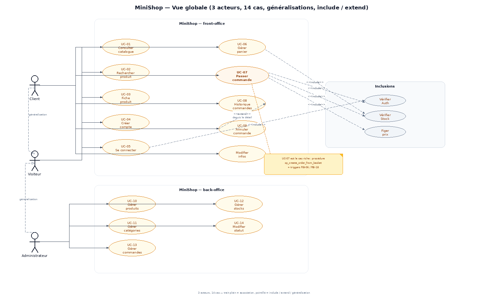

Lecture : le Visiteur ouvre le système sur la consultation et la création de compte ; le Client et l'Administrateur **héritent** du Visiteur (généralisations en pointillés vers `Visiteur`) ; les cas `include` (authentification, disponibilité du stock, snapshot de prix) factorisent les sous-étapes communes ; `UC-09 Annuler une commande` est un `extend` de la consultation du détail, comme le sujet l'indique (annulation depuis l'historique).

#### 5.1.2 Zoom : gestion du catalogue par l'administrateur

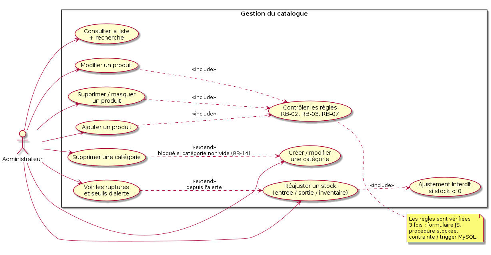

#### 5.1.3 Zoom : commandes (client et back-office)

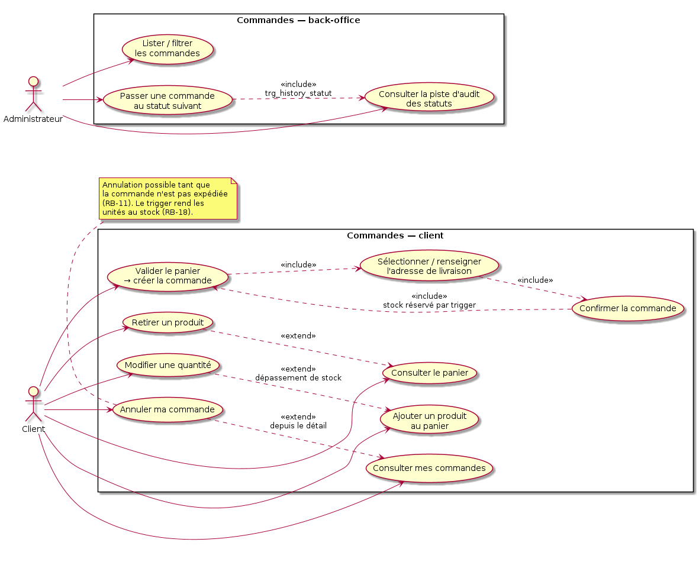

#### 5.1.4 Catalogue des 14 cas d'utilisation minimum documentés

Les 14 cas exigés par le sujet sont repris à l'identique, et chacun est rattaché aux exigences, aux règles et au(x) test(s). Le détail texte complet (acteurs secondaires, postconditions, extensions) est en **annexe 17.1**.

| # | Cas d'utilisation | Acteur principal | Acteurs secondaires | Préconditions | Exigences | Règles | Test |
|---|---|---|---|---|---|---|---|
| UC-01 | Consulter le catalogue | Visiteur | MySQL | — | `EF-VIS-01/03/05` | RB-19 | F-01, F-03, F-04 |
| UC-02 | Rechercher un produit | Visiteur | MySQL (`sp_search_products`) | texte de recherche non vide | `EF-VIS-02` | RB-19, SEC-02 | F-02, S-01 |
| UC-03 | Consulter un produit — fiche détaillée | Visiteur | MySQL | produit visible et existant | `EF-VIS-04` | RB-02, RB-19 | F-05 |
| UC-04 | Créer un compte | Visiteur | MySQL (`sp_create_account`) | CGV acceptées | `EF-VIS-06` | RB-01, RB-12, RB-13 | F-06, F-07 |
| UC-05 | Se connecter / se déconnecter | Visiteur, Client | MySQL (`sp_get_credentials`) | compte actif | `EF-VIS-07`, `EF-CLI-01/02` | RB-12, SEC-04/05/06 | F-08, S-05, S-06 |
| UC-06 | Gérer le panier | Client (ou Visiteur) | — | au moins un article pour commander | `EF-CLI-03/04/05/06`, `EF-VIS-09` | RB-18, RB-19, RB-15 | F-09, F-12…F-15 |
| UC-07 | Passer une commande | Client | MySQL (`sp_create_order_from_basket`, triggers) | authentifié, panier ≥ 1 article, stock suffisant | `EF-CLI-07` | RB-04, RB-05, RB-06, RB-15, RB-18 | F-16, F-17, F-18 |
| UC-08 | Consulter l'historique des commandes | Client | MySQL | authentifié | `EF-CLI-08/09` | RB-08, SEC-08 | F-19, F-20 |
| UC-09 | Annuler une commande | Client | MySQL (`sp_cancel_order`) | commande à soi, statut `≤ PAYEE` | `EF-CLI-10` | RB-11, RB-18 | F-21 |
| UC-10 | Gérer les produits | Administrateur | MySQL (`sp_save_product`, triggers) | session admin valide | `EF-ADM-01/02` | RB-02, RB-07, RB-14, RB-16 | F-22, F-23, T-15, T-20 |
| UC-11 | Gérer les catégories | Administrateur | MySQL (`sp_save_category`, `sp_delete_category`) | idem | `EF-ADM-03` | RB-07, RB-08, RB-14 | F-25, T-14 |
| UC-12 | Gérer les stocks | Administrateur | MySQL (`sp_adjust_stock`) | idem | `EF-ADM-04/05` | RB-03, RB-17, RB-18 | F-26, F-27, T-19 |
| UC-13 | Gérer les commandes (back-office) | Administrateur | MySQL | idem | `EF-ADM-06/08/09` | RB-10, RB-15 | F-28, F-30, F-31 |
| UC-14 | Modifier le statut d'une commande | Administrateur | MySQL (`sp_update_order_status`, `trg_history_statut`) | commande existante, transition valide | `EF-ADM-07` | RB-11, RB-09 | F-29, T-12, T-13 |

#### 5.1.5 Trois cas d'utilisation détaillés par description textuelle

Le sujet demande d'en détailler **trois** (et non les 14). Choix justifié : un cas du parcours d'achat critique (UC-07, celui de l'exemple du sujet), un cas de lecture intensif où se joue l'injection SQL (UC-02), un cas du back-office où se jouent le déclencheur d'audit et la machine à états (UC-14). Les trois mettent en scène une procédure stockée et/ou un déclencheur, ce qui n'est pas le cas de la majorité des autres.

##### 5.1.5.1 UC-07 — Passer une commande

- **Acteur principal :** Client. **Acteurs secondaires :** SGBD MySQL (procédure `sp_create_order_from_basket`, triggers de stock et d'audit), JavaScript côté client (confort uniquement).
- **Description :** le client transforme son panier en une commande enregistrée, horodatée, numérotée, dont les lignes figent le prix payé et dont le stock est immédiatement réservé.
- **Préconditions :**
  1. le client est authentifié (`$_SESSION['user_id']` non vide) ;
  2. le panier contient au moins un produit (`RB-04`) ;
  3. les produits disposent d'un stock suffisant (`RB-18`) ;
  4. le jeton CSRF de la requête est valide (`SEC-06`) ;
  5. le client a une adresse de livraison (ou la saisit pendant le cas).
- **Scénario nominal :** *les 11 pas de l'exemple du sujet sont couverts pas à pas ; les ajouts (visibilité,
  jeton CSRF, frais de livraison, verrou de stock) sont marqués **[+]** — ils n'en remplacent aucun.*
  1. le client consulte son panier ;
  2. le système affiche les produits et les quantités **[+** sous-total, TVA, total — valeurs **calculées côté
     serveur**, jamais recopiées d'un champ de formulaire**]** ;
  3. le client valide son panier (bouton « Passer la commande ») ;
  4. le système vérifie l'existence et la visibilité de chaque produit, puis les stocks ;
  5. le client sélectionne ou renseigne son adresse de livraison, puis confirme ;
  6. le système appelle `sp_create_order_from_basket(id_client, adresse, lignes_json, payée)` : insertion de la commande `BROUILLON`, numérotation `CMD2026-NNNNNN` ;
  7. pour chaque ligne, le système pose un verrou de stock (`SELECT … FOR UPDATE`), insère la ligne, et le **trigger** `trg_ligne_prix_snapshot` fige le prix unitaire (`RB-06`), puis `trg_ligne_decrement_stock` décrémente le stock (`RB-18`) ;
  8. le système calcule les **frais de livraison** (`sp_compute_shipping` : 4,90 EUR standard, offerts à partir
     de 80,00 EUR de marchandises — règle lue dans `parametre`) puis le `montant_total = SUM(total_ligne) +
     frais_port` (`RB-15`, `RB-20`) ; le récapitulatif affiché **avant** la confirmation porte déjà ce total
     (obligation d'information précontractuelle, §8.9) ;
  9. le système passe le statut à `EN_PREPARATION` (ou `PAYEE` dans la variante paiement simulé), et `trg_history_statut` écrit la ligne d'audit ;
  10. le système **valide la transaction**, vide le panier de session ;
  11. le système affiche le numéro de commande, le récapitulatif et un lien vers le détail.
- **Scénarios alternatifs :**
  - **A1 — Stock insuffisant** (étape 4/7) : le trigger émet `SIGNAL '45000' STOCK_INSUFFISANT` ; la procédure fait `ROLLBACK` ; **aucune** commande n'est créée, **aucun** stock n'est modifié ; le message « Il reste N exemplaire(s) de « Casque sans fil Aura » » s'affiche, le panier est conservé pour ajustement.
  - **A2 — Produit supprimé entre l'ajout au panier et la validation** : `PRODUIT_SUPPRIME_DU_CATALOGUE`, rollback, la ligne est retirée du panier et signalée.
  - **A3 — Panier vide** : la validation est refusée avant tout appel à la base (`RB-04`) ; message et retour au catalogue.
  - **A4 — Client non authentifié** : redirection vers `/connexion?return=/commande/valider`, panier conservé en
    session, reprise automatique après connexion (`SEC-05`).
  - **A5 — Erreur lors de la création de la commande** (le cinquième scénario du sujet) : toute levée de signal en
    cours de transaction (`SIGNAL` d'un déclencheur, contrainte `CHECK`/`UNIQUE`, incident serveur en milieu de
    parcours) déclenche le `ROLLBACK` de `sp_create_order_from_basket` : **aucune donnée partielle** ne subsiste —
    pas de commande orpheline, aucun stock décrémenté, aucune ligne d'historique. **Vérifié par `T-29`** (5
    assertions : code renvoyé, `p_id_commande` remis à `NULL`, aucune commande sur l'adresse de test, comptage de
    la table inchangé, stock de la ligne **valide** intact, aucune trace écrite) et par `T-21` (stock restitué
    ligne par ligne) ; exigé par `ENF-16`, arbitré en `V7`/`V3`.
  - **A6 — Franchise de port atteinte en cours de route** (étape 8) : tant que la commande est `BROUILLON`, le port
    est **recalculé** à chaque ajout ou retrait de ligne (`sp_compute_shipping`) ; à la validation il est **figé**
    (`RB-20`), comme le prix unitaire (`RB-06`), et toute réécriture manuelle est refusée par le trigger.
  - **A7 — Adresse de livraison absente** : l'étape 5 devient obligatoire, les données déjà saisies sont conservées
    (aucun rechargement destructif) ; un refus n'efface jamais le panier.
- **Scénarios d'exception :**
  - **E1 — Erreur lors de la création de la commande** (panne, deadlock, contrainte inattendue) : `ROLLBACK` du `PDO`, transaction annulée dans la procédure, journal `application.log` avec trace (sans donnée sensible), message « Votre commande n'a pas pu être enregistrée, aucun débit de stock n'a été effectué. Réessayez. » ; vérification SQL : `SELECT COUNT(*) FROM commande WHERE date_commande > NOW() - INTERVAL 1 MINUTE AND statut = 'BROUILLON'` → 0.
  - **E2 — Double clic / rejeu** : le second `POST` porte le même jeton CSRF consommé → refus 419, ou `COMMANDE_DEJA_VALIDÉE` si le brouillon existe déjà (`RB-04` et `T-16` évitent la double commande).
  - **E3 — Concurrent qui prend la dernière unité** : le verrou de ligne sérialise les deux transactions ; l'une aboutit, l'autre reçoit `STOCK_INSUFFISANT` (test de charge §2.3).
- **Postconditions :** commande **existante** et consultable uniquement par son propriétaire et l'administration ; lignes immuables ; stock diminué de la quantité commandée ; une ligne par changement de statut dans `order_status_history`.
- **Règles métier appliquées :** `RB-04`, `RB-05`, `RB-06`, `RB-10`, `RB-11`, `RB-15`, `RB-16`, `RB-18`.
- **Écrans :** `/panier`, `/commande/adresse`, `/commande/confirmer`, `/commande/{numero}`.
- **Données en entrée / en sortie :** entrée `{id_client (session), adresse_livraison, [{id_produit, quantite}], jeton}` ; sortie `{id_commande, numero, montant_total, statut, [{produit, quantite, prix_unitaire}], stock restant}`.

##### 5.1.5.2 UC-02 — Rechercher un produit

- **Acteur principal :** Visiteur (le Client et l'Administrateur héritent du cas). **Secondaire :** SGBD (procédure `sp_search_products`).
- **Description :** trouver des produits à partir d'un texte libre et d'un jeu de filtres, avec tri et pagination, sans exposer les produits masqués.
- **Préconditions :** aucune authentification requise ; la base contient des produits.
- **Scénario nominal :**
  1. le visiteur saisit « casq » dans le champ de recherche et valide ;
  2. le contrôleur normalise l'entrée (trim, max 120 caractères, `htmlspecialchars` à l'affichage) et construit un objet de requête **validé** ;
  3. le système appelle `sp_search_products(mot_cle, categorie NULL, prix NULL, NULL, en_stock NULL, tri 'nom', page 1, 12 par page, admin 0)` ;
  4. la procédure construit sa requête dynamique en liant **toutes** les valeurs par marqueurs `?` (`EXECUTE … USING`), le `LIKE` étant formé par `CONCAT("%", ?, "%")` **en SQL**, jamais en PHP ;
  5. la procédure renvoie deux jeux de résultats : la page demandée et le compteur `total_trouves` ;
  6. le système affiche les 12 (ou moins) produits avec prix TTC, état de stock, catégorie et pagination « 1 / N » ;
  7. le visiteur ajoute un filtre de prix ou une catégorie : les filtres sont cumulés et reportés dans l'URL (partageables).
- **Scénarios alternatifs :**
  - **A1 — Aucun résultat** : message « Aucun produit ne correspond à « casq » » + 3 suggestions de catégories ; aucune erreur, aucune stack trace.
  - **A2 — Tri demandé non reconnu** (`?tri=prix;DROP`) : le tri retombe sur `nom` (liste blanche de 5 valeurs), l'entrée est journalisée (`SEC-13`) mais la requête aboutit.
  - **A3 — Filtres incohérents** (`prix_min > prix_max`) : demande d'ajustement, filtres conservés.
  - **A4 — Recherche vide** : équivalent à la consultation du catalogue (`UC-01`).
  - **A5 — Page hors bornes** : page vide + lien vers la première page (pas d'erreur 500).
- **Scénarios d'exception :** **E1 — base indisponible** : page de service dégradée, code 503, aucune information technique affichée ; **E2 — requête trop lente** : limite applicative (page bornée à 60 lignes) rend le cas impossible par construction.
- **Postconditions :** aucune ; le cas ne modifie aucune donnée (idempotent, `GET`).
- **Règles :** `RB-19` (visibilité), `SEC-01/SEC-02` (injection), `ENF-04` (pagination), `ENF-05` (état des filtres dans l'URL).
- **Écrans :** `/recherche`, `/catalogue`.

##### 5.1.5.3 UC-14 — Modifier le statut d'une commande (back-office)

- **Acteur principal :** Administrateur. **Secondaire :** SGBD (procédure `sp_update_order_status`, trigger `trg_history_statut`, trigger `trg_commande_transition_statut`).
- **Description :** faire avancer une commande dans son cycle de vie (`BROUILLON → EN_PREPARATION → PAYEE → EXPEDIEE → LIVREE`, ou `ANNULEE` depuis les états autorisés) en conservant la trace de chaque transition.
- **Préconditions :** session administrateur valide et rôle `GESTIONNAIRE` ou `SUPER` (`RB-13`) ; la commande existe ; la transition demandée figure dans la matrice `RB-11` ; une annulation exige un commentaire non vide.
- **Scénario nominal :**
  1. l'administrateur filtre la liste des commandes sur le statut `EN_PREPARATION` ;
  2. le système affiche les commandes, avec le bouton « Passer à EXPÉDIÉE » (et **seulement** les transitions autorisées, calculées depuis la matrice) ;
  3. l'administrateur choisit la commande, renseigne le numéro de suivi dans le commentaire et valide ;
  4. le système appelle `sp_update_order_status(id_commande, 'EXPEDIEE', commentaire, id_admin, 'ADMIN')` ;
  5. la procédure pose un verrou (`SELECT … FOR UPDATE`), vérifie le statut courant et la matrice, écrit `UPDATE commande SET statut = 'EXPEDIEE'` ;
  6. le trigger `trg_commande_transition_statut` re-vérifie la transition (défense en profondeur : un `UPDATE` écrit à la main est aussi bloqué) ;
  7. le trigger `trg_history_statut` insère automatiquement `EN_PREPARATION → EXPEDIEE` dans `order_status_history` ;
  8. le système affiche le nouveau statut, l'horodatage et la chronologie complète.
- **Scénarios alternatifs :**
  - **A1 — Transition interdite** (par ex. `LIVREE → EN_PREPARATION`) : `RB11_TRANSITION_STATUT_INTERDITE`, statut inchangé, message explicite avec la liste des destinations autorisées ; vérification : `order_status_history` ne contient **pas** de nouvelle ligne (test T-12/T-13).
  - **A2 — Statut déjà à jour** : `STATUT_DEJA_A_JOUR`, aucune écriture, aucun doublon d'historique.
  - **A3 — Commande en `BROUILLON`** (jamais validée par le client) : refus `COMMANDE_NON_TRAITABLE` ; l'administration n'intervient pas sur un panier en cours.
  - **A4 — Annulation** : passage en `ANNULEE` autorisé depuis `EN_PREPARATION`/`PAYEE` ; le retrait des lignes n'a pas lieu (historique conservé), mais la restitution du stock est déclenchée si l'annulation s'accompagne d'une purge du brouillon (`sp_cancel_order`).
  - **A5 — Concurrence** : deux administrateurs modifient la même commande ; le verrou de ligne sérialise, le second voit `STATUT_DEJA_A_JOUR` ou la transition devenue invalide.
- **Scénarios d'exception :** **E1 — commande supprimée entre-temps** : `COMMANDE_INTROUVABLE`, rafraîchissement de la liste ; **E2 — écriture manuelle en base** (mysql/Workbench) : la transition est **aussi** refusée par le trigger, et si elle est autorisée elle est **quand même** tracée — la piste d'audit ne dépend pas de l'application.
- **Postconditions :** statut cohérent avec la matrice ; une ligne d'audit par changement réel ; `date_modification` rafraîchie ; aucune donnée financière modifiée (le `montant_total` reste la somme des lignes, `RB-15`).
- **Règles :** `RB-11`, `RB-09`, `RB-10`, `RB-13`, `RB-15`.
- **Écrans :** `/admin/commandes`, `/admin/commandes/{id}`.

### 5.2 Diagramme de classes

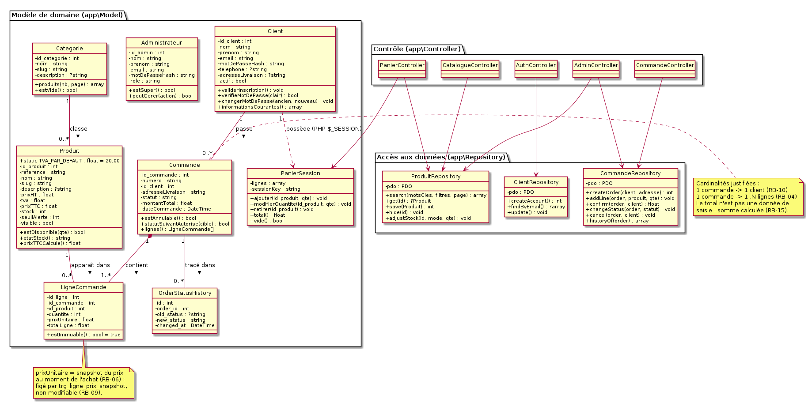

Le sujet demande d'identifier les classes, d'en définir attributs et méthodes, les associations, les cardinalités, et de **justifier** les choix. Les éléments demandés sont donc repris sous forme de tableau (le diagramme seul ne suffit pas à montrer la justification) :

| Classe | Stéréotype | Attributs (types) | Méthodes principales | Association et cardinalité | Justification du choix |
|---|---|---|---|---|---|
| `Client` | entité | `id_client:int`, `nom`, `prenom`, `email`, `motDePasseHash`, `telephone?`, `adresseLivraison?`, `actif:bool`, dates | `validerInscription()`, `verifieMotDePasse()`, `changerMotDePasse()`, `informationsCourantes()` | `1 — 0..* Commande` | Le hash n'est **jamais** exposé par un getter public (`RB-12`) ; la comparaison se fait par `password_verify()`, pas par la classe |
| `Administrateur` | entité | idem + `role:string` | `estSuper()`, `peutGerer(action)` | `1 — 0..* Commande` (suivi), `1 — 0..* Produit` (gestion) | Classe séparée de `Client` : droits, champs et cycle de vie différents (§12.4) |
| `Categorie` | entité | `id_categorie:int`, `nom`, `slug`, `description?` | `produits(nb,page)`, `estVide()` | `1 — 0..* Produit` | `estVide()` matérialise `RB-14` côté modèle (message d'aide au lieu d'un rejet sec) |
| `Produit` | entité | `id_produit`, `reference`, `nom`, `slug`, `description?`, `prixHT:float`, `tva:float`, `prixTTC:float`, `stock:int`, `seuilAlerte:int`, `visible:bool` | `estDisponible(qte)`, `etatStock()`, `prixTTCCalcule()` | `1 — 0..* LigneCommande` | `prixTTC` est **en lecture seule** dans la classe : il est produit par le trigger (RB-16), l'objet PHP ne peut pas l'imposer |
| `Commande` | entité | `id_commande`, `numero`, `id_client`, `adresseLivraison`, `statut`, `montantTotal`, `dateCommande` | `estAnnulable()`, `statutSuivantAutorise(cible)`, `lignes()` | `1 — 1..* LigneCommande` (composition) | pas de setter `montantTotal` public : le total vient de la somme calculée (`RB-15`) |
| `LigneCommande` | entité | `id_ligne`, `id_commande`, `id_produit`, `quantite:int`, `prixUnitaire:float`, `totalLigne:float` | `estImmuable()` (toujours `true`) | `0..* — 1 Produit` | prix figé à l'achat : aucun `setPrix()` n'existe (`RB-06`, `RB-09`) |
| `OrderStatusHistory` | entité en lecture seule | `id`, `order_id`, `old_status`, `new_status`, `changed_by`, `changed_at` | `lignesDe(commandeId)` | `0..* — 1 Commande` | écriture **interdite** depuis le code applicatif : seul `trg_history_statut` écrit (§12.6) |
| `PanierSession` | service objet | `lignes:array`, `sessionKey:string` | `ajouter()`, `modifierQuantite()`, `retirer()`, `total()`, `vide()`, `versJSON()` | `1 — 1 Client` (par session) | classe dédiée : le panier est le seul endroit où le plafond de quantité est appliqué avant la base |
| `AuthMiddleware`, `Csrf`, `Hasher` | services transverses | — | `authentifie()`, `exigeRole()`, `verifieJeton()`, `hache()`, `verifie()` | — | isoler la sécurité en objets testables, sinon elle est recopiée dans chaque contrôleur |
| `ClientRepository`, `ProduitRepository`, `CommandeRepository` | accès aux données | `pdo:PDO` | `findByEmail()`, `search()`, `save()`, `createOrder()`, `confirm()`, `cancel()`, `changeStatus()` | — | **seuls** à écrire du SQL ; un repository par aggregate, jamais de SQL dans un contrôleur ou une vue |
| `Database` | fabrique | — | `pdo():PDO` (singleton) | — | configuration PDO centralisée : `ERRMODE_EXCEPTION`, `ATTR_EMULATE_PREPARES=false`, UTF-8 (`ENF-09`) |
| `Router`, `Request`, `Response` | microframework | — | `dispatch(Request)`, `param()`, `json()`, `redirect()` | — | 120 lignes suffisent et restent lisibles au jury ; pas de framework externe (référentiel PHP « maison » attendu) |

**Cardinalités et justification (extrait des règles du sujet) :**

| Association | Cardinalité | Pourquoi, et traduction SQL |
|---|---|---|
| `Client` → `Commande` | `1,1 — 0,*` | « un client peut passer plusieurs commandes », « une commande appartient à un seul client » (`RB-10`) → `commande.id_client` NOT NULL + FK `RESTRICT` (on ne supprime pas un client qui a commandé) |
| `Categorie` → `Produit` | `1,1 — 0,*` | « un produit appartient à une seule catégorie » (`RB-07`, FK NOT NULL), « une catégorie peut contenir plusieurs produits » (`RB-08`, une catégorie vide est légale) |
| `Commande` → `LigneCommande` | `1,1 — 1,*` | `RB-04` (au moins une ligne) → FK `CASCADE` : la ligne ne survit pas à sa commande ; composition dans le diagramme |
| `Produit` → `LigneCommande` | `1,1 — 0,*` | un produit apparaît dans 0..N lignes ; FK `RESTRICT` → `RB-14` et test T-15 |
| `Commande` → `OrderStatusHistory` | `1,1 — 0,*` | 0 ligne le temps du brouillon initial non tracé, puis 1 par changement de statut effectif (`RB-11`) |
| `Client` → `PanierSession` | `1,1 — 0,1` | panier volatil : pas de classe persistante par défaut ; variante V1 ajoute `Panier`/`LignePanier` (§12.8) |

### 5.3 Diagrammes de séquence

Le sujet impose **4 séquences intégrant procédure stockée et déclencheur** : authentification, recherche d'un produit, ajout au panier, passer une commande. Elles sont livrées ci-dessous (numérotées 1 à 4) **augmentées** d'une cinquième (consultation de la fiche produit) et de deux diagrammes complémentaires (activités et états) parce que l'énoncé demande explicitement les scénarios alternatifs du cas « Passer une commande », qui ne tiennent pas dans une séquence linéaire.

#### 5.3.1 Séquence 1 — Authentification

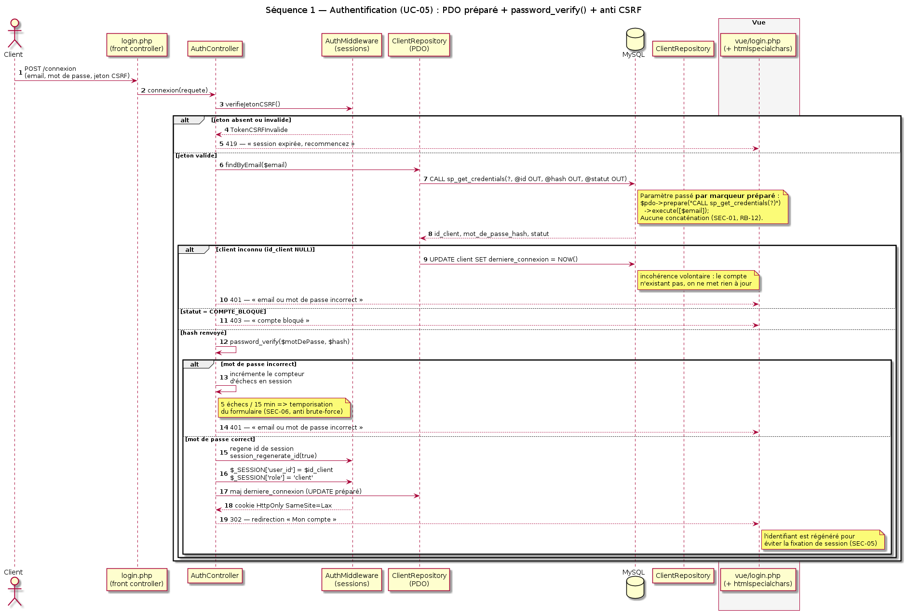

Points de conception visibles sur le diagramme : la requête d'authentification passe par `CALL sp_get_credentials(?)` (paramètre préparé, `SEC-01`) ; la **comparaison** du mot de passe reste en PHP avec `password_verify()` (seule `password_verify()` sait comparer un bcrypt en temps constant) ; la session est régénérée à chaque changement de privilège (`SEC-05`) ; l'identifiant inconnu et le mot de passe erroné produisent le **même** message (`SEC-04`).

#### 5.3.2 Séquence 2 — Recherche d'un produit

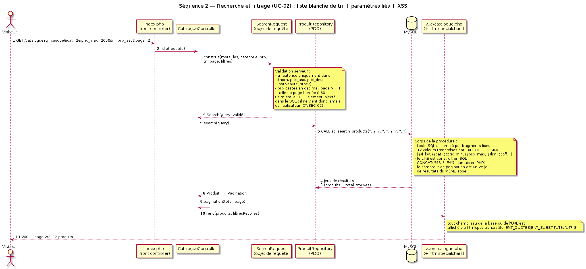

Le tri est la seule valeur injectée dans le texte SQL : il vient d'une liste blanche de 5 valeurs, ce qui permet de le rendre lisible dans la procédure tout en gardant toutes les données utilisateur sous forme de paramètres liés (`SEC-02`).

#### 5.3.3 Séquence 3 — Ajout au panier

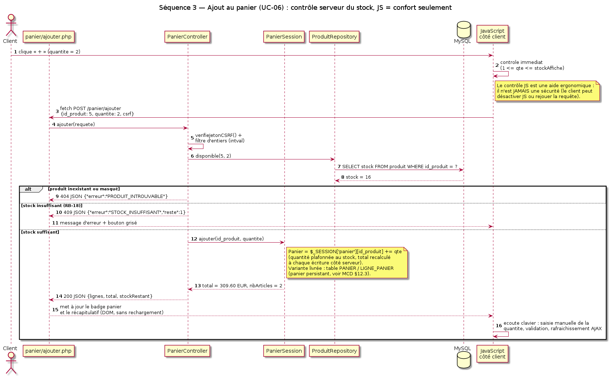

Le contrôle de disponibilité est fait **avant** l'écriture en session, et le plafond du `<input max>` n'est qu'une indication : la décision finale appartient au serveur (et, pour une commande, aux triggers).

#### 5.3.4 Séquence 4 — Passer une commande (procédure stockée + triggers)

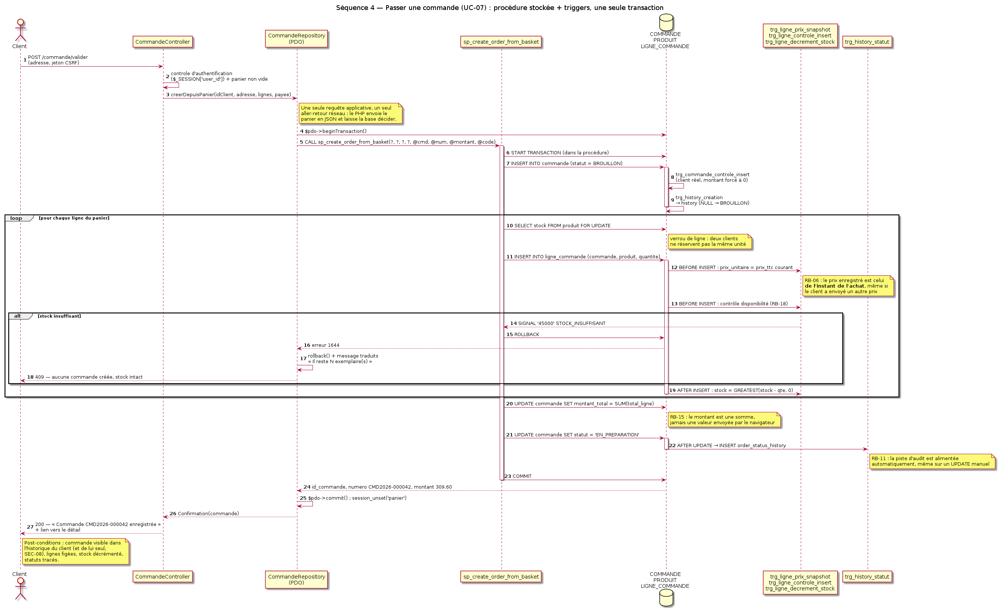

C'est la séquence « preuve » du projet : un seul appel applicatif (`CALL sp_create_order_from_basket`) déclenche, dans **une** transaction, l'insertion de la commande, la boucle sur les lignes, le snapshot de prix et le décrément de stock (2 triggers), le calcul du montant, le changement de statut et la trace d'audit (2 triggers), avec `ROLLBACK` intégral si le stock manque.

#### 5.3.5 Séquence 5 (bonus) — Consulter la fiche produit

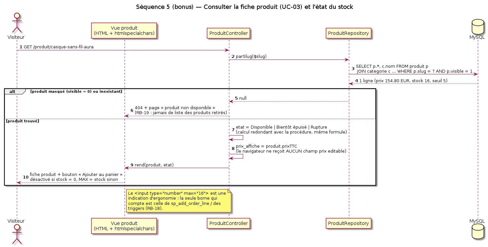

#### 5.3.6 Diagramme d'activités — Passer une commande (chemins nominaux et alternatifs)

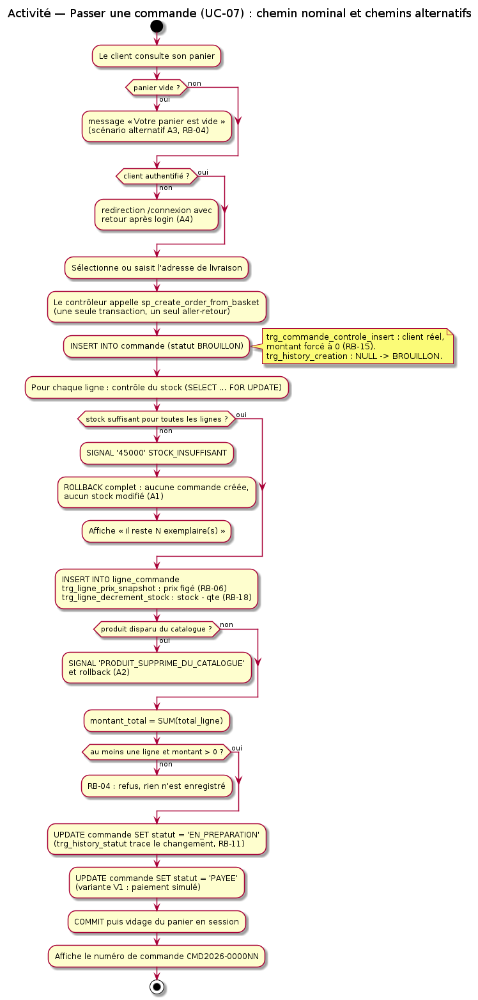

#### 5.3.7 Diagramme d'états — Cycle de vie d'une commande (`RB-11`)

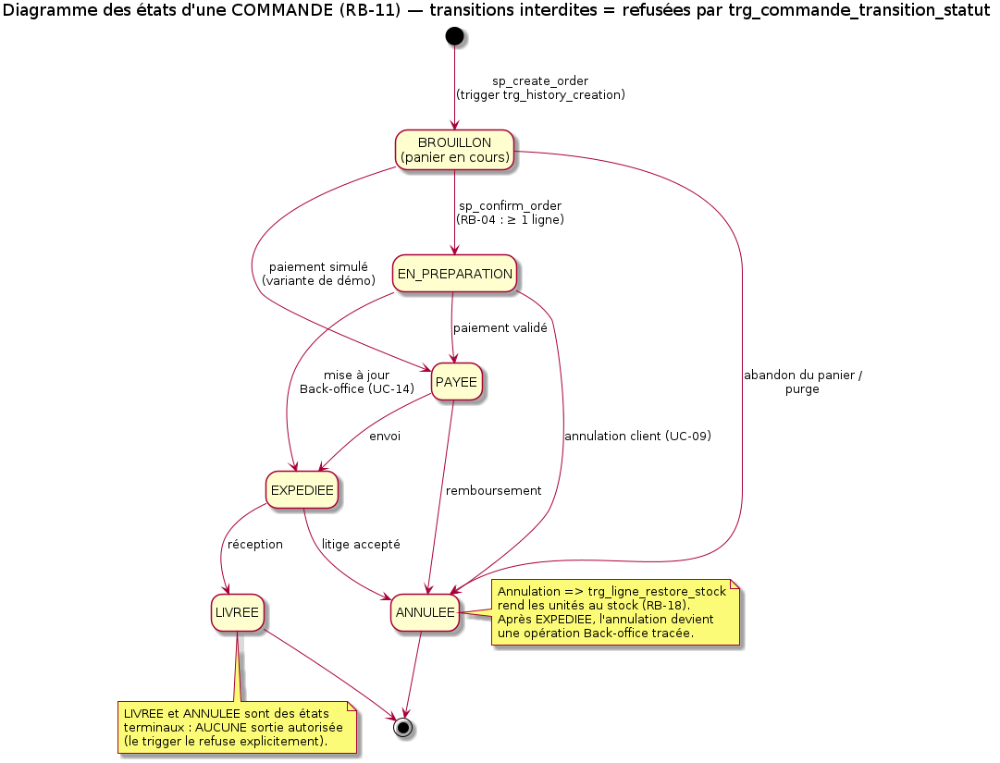

La matrice des transitions de ce diagramme est **la** spécification : elle est écrite en trois endroits cohérents (documentée ici, dans `sp_update_order_status`, et dans `trg_commande_transition_statut`) et testée par T-12/T-13.

---

## 6. Règles métier

### 6.1 Méthode : une règle = une énoncé, une traduction formelle, des points de contrôle, un test

Les 11 règles du sujet (dont la n° 11 laissée ouverte « Une commande peut avoir les états : … », complétée par RB-11) sont **toutes** spécifiées, et 8 règles complémentaires sont ajoutées parce qu'elles découlent directement des exigences de sécurité et de traçabilité du sujet. Pour chacune, la colonne « niveau d'application » est cruciale : le jury vérifie que la règle n'est pas seulement écrite dans le PHP.

| ID | Règle (énoncé) | Traduction formelle | Niveau d'application (défense en profondeur) | Traduction SQL / code | Test |
|---|---|---|---|---|---|
| `RB-01` | L'adresse email d'un client est **unique** | `∀ c1,c2 ∈ CLIENT : c1.email = c2.email ⇒ c1 = c2` | formulaire (JS) + modèle (pré-contrôle) + **contrainte unique** | `CONSTRAINT uk_client_email UNIQUE (email)` ; `sp_create_account` renvoie `EMAIL_DEJA_UTILISE` | `T-04`, F-07 |
| `RB-02` | Le prix d'un produit est **strictement positif** | `∀ p ∈ PRODUIT : p.prix_ht > 0` | formulaire + `sp_save_product` + **CHECK** | `CONSTRAINT ck_produit_prix CHECK (prix_ht > 0)` | `T-01` |
| `RB-03` | Le stock ne peut **jamais** être négatif | `∀ p ∈ PRODUIT : p.stock ≥ 0`, à tout instant, y compris sous écriture directe | `sp_adjust_stock` + **CHECK** + **trigger** | `CHECK (stock >= 0)` + `trg_produit_regles` + `GREATEST(stock − qte, 0)` dans `trg_ligne_decrement_stock` | `T-02`, `T-03`, `T-19` |
| `RB-04` | Une commande doit contenir **au moins une ligne** | `∀ o ∈ COMMANDE : \|LIGNE_COMMANDE(o)\| ≥ 1` (hors `BROUILLON`) | contrôleur + `sp_confirm_order` + trigger de purge | `SIGNAL 'RB04_…'` + `trg_commande_delete` (interdit de laisser une commande avec lignes supprimées) | `T-16`, `T-24`, F-18 |
| `RB-05` | La quantité commandée est **supérieure à zéro** | `∀ l ∈ LIGNE_COMMANDE : l.quantite > 0` | `<input min=1>` + `sp_add_order_line` + **CHECK** | `CHECK (quantite > 0)` | `T-06`, `T-07` |
| `RB-06` | Le prix enregistré dans `LIGNE_COMMANDE` est le **prix au moment de l'achat** | `l.prix_unitaire = PRODUIT.prix_ttc(T_achat)` | trigger (source de vérité), non modifiable ensuite | `trg_ligne_prix_snapshot` (BEFORE INSERT) + `trg_ligne_immutable` (BEFORE UPDATE) | `T-11`, `T-23` |
| `RB-07` | Un produit appartient à **une seule** catégorie | `∀ p ∃! c : p.id_categorie = c.id` | selecteur unique + FK `NOT NULL` | `id_categorie INT UNSIGNED NOT NULL` + FK `RESTRICT` | F-22, revue MLD |
| `RB-08` | Une catégorie peut contenir **plusieurs** produits | `∀ c : \|PRODUIT(c)\| ∈ 0..N` | modèle + SQL | aucune contrainte d'occupation ; catégorie vide autorisée et affichée | F-25 |
| `RB-09` | *(complément)* Une commande ne se **réécrit** pas : lignes, produit, quantités et prix sont définitifs ; elle ne se supprime pas après validation | `UPDATE`/`DELETE` sur lignes et commandes validées ⇒ refus | triggers | `trg_ligne_immutable`, `trg_commande_delete` | `T-11`, `T-24`, F-29 |
| `RB-10` | Une commande appartient à **un seul client** | `o.id_client` NOT NULL et existant | modèle + FK + trigger | `fk_commande_client … ON DELETE RESTRICT` + `trg_commande_controle_insert` | `T-17` |
| `RB-11` | Une commande peut avoir les états `BROUILLON`, `EN_PREPARATION`, `PAYEE`, `EXPEDIEE`, `LIVREE`, `ANNULEE`, avec transitions **uniques et tracées** *(le sujet laisse la liste des états **incomplète** — la ligne « Une commande peut avoir les états : » se termine par un deux-points dans le PDF : la liste ci-contre est donc un **arbitrage documenté**, §12.8 V5, et non une reprise du texte)* | machine à états §5.3.7 | contrôleur (liste des transitions) + `sp_update_order_status` + **trigger** + **ENUM** | `statut ENUM(…)` + `trg_commande_transition_statut` + `trg_history_statut`/`trg_history_creation` | `T-12`, `T-13`, `T-22`, F-29 |
| `RB-12` | *(complément)* Aucun mot de passe n'est stocké en clair ; la vérification est faite par `password_verify()` | `len(hash) ≥ 60 AND hash LIKE '$2y$%'` | modèle + procédure + contrôle d'installation | `sp_create_account` refuse une valeur de moins de 60 caractères (`HASH_MOT_DE_PASSE_INVALIDE`) ; requête de recette `ENF-11` | `T-05`, F-00 |
| `RB-13` | *(complément)* Séparation stricte des rôles : l'administrateur ne gère pas les comptes clients ; le client n'accède jamais au back-office | `role(session) ⇒ périmètre des routes` | routeur (garde d'accès) + procédure | `RB-13` implémenté par `AuthMiddleware::exigeRole()` ; comptes `administrateur` créés uniquement par l'installation | F-32, S-03 |
| `RB-14` | *(complément)* Intégrité référentielle : on ne supprime pas une catégorie occupée ni un produit référencé | `DELETE` refusé si `COUNT(références) > 0` | `sp_delete_category`/`sp_delete_product` + FK + triggers | `CATEGORIE_NON_VIDE…`, `PRODUIT_REFERENCE_INTERDIT_DE_SUPPRIMER` | `T-14`, `T-15`, `T-20` |
| `RB-15` | *(complément)* Le `montant_total` d'une commande est une **somme calculée**, jamais une saisie | `o.montant_total = Σ l.total_ligne + o.frais_port` | procédure + trigger | `trg_commande_transition_statut` (refus `RB15_MONTANT_CALCULE_INTERDIT`), `trg_commande_controle_insert` (montant forcé à 0) | `T-10`, F-16 |
| `RB-16` | *(complément)* Le `prix_ttc` d'un produit est **dérivé** : `prix_ttc = ROUND(prix_ht × (1 + tva/100), 2)` | idem | triggers | `trg_produit_ttc`, `trg_produit_ttc_update` | F-22 + requête de cohérence §12.4 |
| `RB-17` | *(complément)* Un produit du catalogue peut être **retiré sans être détruit** (masquage `visible = 0`) ; la commande déjà passée reste explicable | `visible` booléen, pas de purge physique | modèle + procédure | `sp_delete_product` bascule `visible = 0` | `T-20`, F-23 |
| `RB-18` | La quantité **réservée** ne peut excéder le stock disponible : `stock ≥ Σ quantités` (par commande et globalement à l'instant de la commande) | `∀ p : p.stock ≥ Σ l.quantite` sur les commandes non annulées | `sp_add_order_line` + triggers + verrou de ligne (`FOR UPDATE`) | `trg_ligne_controle_insert`, `trg_ligne_decrement_stock`, `trg_ligne_restore_stock` | `T-08`, `T-09`, `T-21`, test de charge |
| `RB-19` | Seuls les produits `visible = 1` sont exposés au front-office (recherche, catalogue, fiche) | `SELECT … WHERE visible = 1` côté client | `sp_search_products(p_admin = 0)` + contrôleur | paramètre `p_admin` de la procédure ; vue `v_catalogue` | `T-25`, F-23 |
| `RB-20` | *(complément, origine légale)* Les **frais de livraison** sont une donnée de la commande : calculés **avant** la validation (obligation d'affichage), **figés** à la validation comme le prix (`RB-06`), jamais saisissables, **annulés** avec la commande | `o.frais_port ≥ 0` et `o.montant_total = Σ l.total_ligne + o.frais_port`, à tout instant | `sp_compute_shipping` (règle lue dans `parametre`) + **trigger** + **CHECK** | `frais_port DECIMAL(10,2) NOT NULL DEFAULT 0` + `ck_commande_port (frais_port >= 0)` + `trg_commande_transition_statut` (`RB15_MONTANT_CALCULE_INTERDIT` sur toute rupture de la formule) | `T-28`, F-33 |

> **9 règles « complément » (RB-09, RB-12 à RB-20) n'étaient pas listées dans le sujet** : elles rendent cohérentes les règles demandées et la section Sécurité. Elles sont explicitement signalées comme telles pour que le jury puisse distinguer ce qui est imposé de ce qui est ajouté par l'équipe.

### 6.2 Où chaque règle est-elle *vraiment* appliquée ?

| Règle | JS (confort) | Contrôleur PHP | Modèle / procédure | Contrainte SQL | Trigger | Test |
|---|---|---|---|---|---|---|
| RB-01 email unique | ✅ format | ✅ message clair | ✅ `sp_create_account` | ✅ `UNIQUE` | — | T-04 |
| RB-02 prix > 0 | ✅ `min=0.01` | ✅ | ✅ `SIGNAL` | ✅ `CHECK` | ✅ (TTC recalculé) | T-01 |
| RB-03 stock ≥ 0 | ✅ `min=0` | ✅ | ✅ `sp_adjust_stock` | ✅ `CHECK` | ✅ | T-02/03/19 |
| RB-04 ≥ 1 ligne | — | ✅ | ✅ `sp_confirm_order` | FK `CASCADE` | ✅ purge | T-16/24 |
| RB-05 qté > 0 | ✅ `min=1` | ✅ | ✅ | ✅ `CHECK` | ✅ (contrôle + décrément) | T-06/07 |
| RB-06 prix figé | — | — | ✅ INSERT simple | ✅ `CHECK` | ✅✅ (snapshot + immuabilité) | T-11/23 |
| RB-09/10/11 | — | ✅ (transitions proposées) | ✅ | ✅ `ENUM` + FK | ✅✅ | T-12/13/22 |
| RB-12 hash | politique de mot de passe | ✅ `password_hash()` | ✅ refus < 60 car. | longueur `CHAR(60)` | — | T-05 |
| RB-14 | — | — | ✅ | ✅ `RESTRICT` | ✅ | T-14/15/20 |
| RB-15/16/20 | — | ✅ (aucun champ saisi, ni prix ni port) | ✅ recalcul + `sp_compute_shipping` | — | ✅✅ | T-10, T-28 |
| RB-18 | `max=stock` | ✅ message | ✅ `FOR UPDATE` | `CHECK` | ✅✅ | T-08/09/21 |

Lecture de la table : les règles `RB-06`, `RB-11`, `RB-18` sont appliquées **deux fois** côté base (contrainte + trigger) **et** par la procédure. C'est ce que le sujet cherche à évaluer (« procédures stockées, déclencheurs ») : le mécanisme de base n'est pas décoratif, il est le seul qui tienne face à une écriture qui ne passe pas par PHP — et les tests T-02, T-03, T-07, T-08, T-10, T-11, T-14, T-15, T-17, T-24 l'attaquent exactement ainsi.

### 6.3 Règles non fonctionnelles qui se lisent comme des règles métier

- toute écriture de stock (hors commande) doit porter un **motif** (`EF-ADM-04`) ;
- un rejet de règle par la base est **toujours** journalisé (`EF-GEN-04`) ;
- un refus ne doit jamais laisser de données incohérentes : chaque écriture multi-tables est transactionnelle (`ENF-16`).

---

## 7. Contraintes techniques

### 7.1 Contraintes imposées par le sujet (non négociables)

| ID | Contrainte | Détail / justification | Moyen de vérification |
|---|---|---|---|
| `CT-01` | **PHP** (8.1+) en développement orienté objet | aucune structure procédurale mixte ; `declare(strict_types=1)` en tête de chaque fichier | `find app -name '*.php' -exec head -3 {} \; \| grep -c strict_types` = nb fichiers |
| `CT-02` | **MySQL** comme SGBD, accès par **PDO** | `PDO::prepare()` / `PDO::execute()` exclusivement pour les requêtes paramétrées ; `PDO::ERRMODE_EXCEPTION` ; `ATTR_EMULATE_PREPARES = false` | `grep -R "new PDO" -A 8 app/Config/Database.php` |
| `CT-03` | **SQL écrit aussi dans la base** : 5 procédures stockées minimum | **16 livrées** (§12.5) | `SELECT COUNT(*) FROM information_schema.ROUTINES …` |
| `CT-04` | **5 déclencheurs minimum** | **16 livrés** (§12.6), dont ceux imposés (stock, historique) | `SELECT COUNT(DISTINCT TRIGGER_NAME) FROM information_schema.TRIGGERS …` |
| `CT-05` | **Architecture MVC 3 couches** | §9 ; aucune SQL dans les vues, aucun HTML dans les contrôleurs | revue + `grep` (§15.3) |
| `CT-06` | **JavaScript côté client** | ES2022 natif, sans framework, sur le panier / filtres / validations | §4.5.3, test F-13 |
| `CT-07` | **Authentification + sessions** PHP | `session_*` durcis, `$_SESSION['user_id']`, régénération d'ID | §8.4, tests S-05/S-06 |
| `CT-08` | **Sécurité des applications Web** (9 points du sujet) | §8, un sous-chapitre par point demandé, avec code | 10 tests offensifs `S-01…S-10` + `tests/security/controles.sh` |
| `CT-09` | **Travail sur GitLab**, participation de chaque développeur comptée, historique conservé | §14 : branches, MR, commits signés, CI | `git shortlog -sne`, `README.md` |
| `CT-10` | **Document de tests et de validation** | §15 + annexe 17.8 | harnais rejouable |
| `CT-11` | **Livrer le script SQL de création de la base** (avec insertion de données) | `sql/01_minishop_schema.sql` + `02` (procédures) + `03` (triggers) + `04` (démonstration) | `scripts/load_db.sh` |
| `CT-12` | Soutenance de 15 min + questions | §17.11 | plan de soutenance |

### 7.2 Contraintes techniques retenues (environnement et outillage)

| Domaine | Choix | Alternative écartée (pourquoi) |
|---|---|---|
| Serveur web | **Apache 2.4** avec un unique `DocumentRoot public/` + `mod_rewrite` | Nginx (parfaitement possible, mais la doc d'installation et les `.htaccess` du sujet visent Apache/LAMP d'IUT) |
| Langage | **PHP 8.2+**, extensions `pdo_mysql`, `mbstring`, `json`, `openssl`, `intl` | PHP 7.x (EOL, `password_hash` OK mais enums/fibres/readonly absents → code plus verbeux) |
| Base | **MySQL 8.0.16+** (CHECK appliqués) — compatible **MariaDB 10.6+** | SQLite (pas de procédures stockées ni de triggers exploitables comme attendu, `CT-03/04` impossibles) |
| Accès données | **PDO** natif, requêtes préparées, transactions explicites | ORM (abstrairait exactement ce que le sujet veut voir : SQL, PDO, `CALL`) |
| Client de test | `mysql` / `mariadb` CLI + harnais shell | aucun autre outil requis pour rejouer les tests |
| Dépendances | **aucune en production** ; `phpunit/phpunit` (dev, optionnel), `phpstan` (analyse statique, optionnel) | framework Laravel/Symfony (hors périmètre pédagogique : masque MVC, PDO et SQL) |
| Normes de code | **PSR-12** + `declare(strict_types=1)` + autoloading **PSR-4** (`App\` → `app/`) | Zend/PSR-0 (obsolète) |
| Front | HTML5 sémantique, CSS natif (variables, grille/flexbox), **JavaScript ES2022 en modules**, pas de bundleur | React/Vue (build required, aucune plus-value pédagogique) |
| Contrôle de version | **GitLab** (hébergé ou local), une MR par lot, merges **squash** interdits pour ne pas effacer les auteurs | GitHub (le sujet impose GitLab) |
| CI | `.gitlab-ci.yml` : `php -l`, `phpcs` (optionnel), chargement SQL dans un service MySQL, exécution des tests SQL et PHPUnit | pas de CI (rendrait la preuve de contribution plus faible) |
| Environnements | `dev` (LAMP local), `test` (base `minishop_test` recréée à chaque campagne), `prod` (démo hébergée sur la machine de soutenance) | dev = prod (interdit : les hashes et le seed diffèrent) |
| Contrainte de périmètre physique | **volumétrie retenue avec le client (arbitrage du 21/09/2026) : 200 produits au catalogue et 1 000 commandes par an** (soit ≈ 3 lignes par commande, ≈ 4 commandes/jour en moyenne, 40/jour en pointe). À cette échelle : aucune partition, aucun cache applicatif, aucun index FULLTEXT supplémentaire — mais des mesures faites sur un **jeu de données de taille réelle**, pas sur la démo : `scripts/gen_volumes.sh` (§15.3) | — (noté ici pour justifier l'absence d'infrastructure lourde) |

### 7.3 Contraintes de données (précisions demandées au §12)

- **Nommage** : tables en MAJUSCULES au pluriel dans la conception (MLD) et en minuscules au pluriel dans le DDL MySQL (`client`, `produit`, `ligne_commande`) ; clés primaires `id_<singulier>` ; clés étrangères `<table_référencée>_id` ; index `idx_*`, uniques `uk_*`, FK `fk_*`, CHECK `ck_*`.
- **Types** : montants en `DECIMAL(10,2)` **jamais** en `FLOAT`/`DOUBLE` (précision monétaire) ; quantités et stocks en `INT` signé (les mouvements peuvent être négatifs, le stock result non) ; dates en `DATETIME` ; emails `VARCHAR(190)` (limite d'index utf8mb4) ; hashes `CHAR(60)` (bcrypt) avec tolérance `+10` lors d'une migration d'algorithme.
- **Encodage** : `utf8mb4` / `utf8mb4_unicode_ci` partout (identique entre MySQL et MariaDB, contrairement aux *streams* `0900_ai_ci`) ; `SET NAMES utf8mb4` en ouverture de session.
- **Moteur** : `InnoDB` partout (`transactions`, `FOR UPDATE`, `FK`) ; aucune table `MyISAM`.
- **Collation des recherches** : insensible à la casse et aux accents, obtenue par la collation ; un index `FULLTEXT (nom, description)` est fourni en complément du `LIKE`.

### 7.4 Contraintes d'ergonomie et d'accessibilité (`ENF-06`, `ENF-08`)

Formulaire d'inscription avec retour d'erreur **champ par champ** ; aucun champ obligatoire caché dans une étape ultérieure ; focus renvoyé sur le premier champ en erreur ; contrastes AA sur les badges de stock ; navigation clavier complète du panier et des filtres ; les messages d'erreur ne contiennent **jamais** de SQL ni de chemin serveur (cohérent avec `SEC-12`).

### 7.5 Contraintes d'exploitation et de portabilité

- le site doit s'installer **sans éditeur de configuration** : un seul fichier `config/env.php` (hors dépôt, modèle `env.example.php`) + `scripts/load_db.sh` ;
- aucune dépendance à un chemin absolu, à `www-data` ou à un port donné : l'application doit tourner aussi bien sur `http://localhost/minishop/public` que sur le LAMP de l'IUT ;
- l'installation doit être reproductible **de zéro** sur une machine propre en ≤ 15 min (chronométré, test `I-01` du document de tests) ;
- les journaux applicatifs sont écrits dans `var/log/` (créé par l'installateur) et tournent sur 30 jours (simple `logrotate`, optionnel).

---

## 8. Sécurité

> Le sujet qualifie cette partie de « particulièrement intéressante avec PHP/PDO/MySQL ». Chaque exigence du sujet est reprise **en tête de sous-section**, suivie du dispositif, du code de référence, des limites assumées et du **test qui prouve** qu'elle tient. La numérotation `SEC-01…SEC-13` est reprise dans la matrice de traçabilité (annexe 17.8 → `docs/02-document-tests-validation.md` §6).

### 8.1 `SEC-01` — Injection SQL : requêtes préparées uniquement

**Exigence du sujet :** « Toutes les données utilisateur doivent être traitées avec `PDO::prepare()` / `PDO::execute()` et interdire la concaténation de paramètres dans les requêtes SQL. »

**Dispositif (4 verrous) :**
1. chaque requête paramétrée est écrite avec des marqueurs `?` et exécutée par `PDOStatement::execute([$v])` ;
2. `PDO::ATTR_EMULATE_PREPARES => false` : les requêtes préparées sont **réelles** (protocole serveur), pas une interpolation faite par PHP ;
3. tout SQL dynamique (recherche, filtres, pagination) est **déplacé dans une procédure stockée** (`sp_search_products`) : en PHP, il n'existe plus aucune concaténation possible, le texte SQL est fixe ;
4. un contrôle automatisé en CI (`grep`) interdit toute interpolation dans une chaîne SQL (commande en §15.3).

```php
// app/Repository/ProduitRepository.php — modèle à copier partout
public function search(SearchQuery $q): array
{
    // Aucune valeur utilisateur dans le texte SQL : uniquement des marqueurs.
    $stmt = $this->pdo->prepare(
        'CALL sp_search_products(?, ?, ?, ?, ?, ?, ?, ?, ?)'   -- 9 marqueurs = 9 paramètres IN, jamais un de plus
    );
    $stmt->execute([
        $q->keyword, $q->categoryId, $q->priceMin, $q->priceMax,
        $q->inStockOnly ? 1 : 0, $q->sort, $q->page, $q->perPage, 0,   // 9 valeurs, ordre strict de la signature
    ]);
    $produits = $stmt->fetchAll(PDO::FETCH_ASSOC);
    $stmt->nextRowset();
    $total = (int) $stmt->fetchColumn();
    return ['lignes' => $produits, 'total' => $total];
}
```

**Anti-pattern proscrit (et recherché par la CI) :**

```php
// INTERDIT — concaténation d'une entrée utilisateur dans le SQL
$sql = "SELECT * FROM produit WHERE nom LIKE '%" . $_GET['q'] . "%'";   // SEC-01
// INTERDIT — même « protégé » par un addslashes artisanal
$sql = "… WHERE id_client = " . addslashes($_GET['id']);                // SEC-01
```

**Limites assumées :** la liste blanche de tri (`nom`, `prix_asc`, `prix_desc`, `nouveaute`, `stock`) est la seule valeur issue du contexte utilisateur qui entre dans un texte SQL, en PHP ou dans la procédure : elle est filtrée par `in_array($tri, $autorisés, true)` **avant** d'être concaténée, donc aucune chaîne non contrôlée n'atteint le SQL (`SEC-02`).

**Test :** `S-01` (`docs/02-document-tests-validation.md` §3.2) — payloads `' OR 1=1 -- `, `%'; DROP TABLE client; -- `, `" UNION SELECT email,mot_de_passe_hash FROM client -- ` : réponse **200 avec 0 résultat** ou message de validation, et `SELECT COUNT(*) FROM client` reste inchangé.

### 8.2 `SEC-02` — Validation et assainissement des entrées (côté serveur, systématique)

| Entrée | Validation serveur | En cas d'échec |
|---|---|---|
| identifiants (`id_produit`, `id_commande`, `id_categorie`) | `ctype_digit` + cast `int` + existence vérifiée | 404 (pas de 500, pas de fuite d'existence) |
| quantités | entier, `1 ≤ q ≤ 999`, et disponibilité contrôlée en base | 409 + message « il reste N » |
| prix (`prix_min`, `prix_max`, formulaire admin) | `filter_var(…, FILTER_VALIDATE_FLOAT)` + 2 décimales bornées | message de format, valeur conservée pour correction |
| textes libres (nom, description, commentaire) | longueur bornée (120 / 2000 / 500), pas de contrôle de contenu (l'échappement fait foi à l'affichage) | troncature signalée |
| email | `FILTER_VALIDATE_EMAIL` + minuscule + unicité (`RB-01`) | message clair, jamais le détail SQL `Duplicate entry` |
| slug | regex `a-z`/`0-9`/tiret, 180 caractères max (motif exact en annexe 17.7) | slug régénéré par `sp_save_product` si vide ou collision |
| `tri`, `statut`, `mode` de stock | liste blanche stricte | valeur par défaut documentée |
| dates de filtre | `DateTimeImmutable::createFromFormat` + ordre cohérent | filtres ignorés |
| corps JSON/POST | taille ≤ 64 Ko, types vérifiés, clés inconnues rejetées | 400 |
| cookie / en-tête | non utilisés comme source d'autorisation | ignorés |

### 8.3 `SEC-03` — XSS : échappement à la sortie, jamais à l'entrée

**Exigence du sujet :** « Les données affichées doivent être échappées avec `htmlspecialchars()`. »

```php
// app/Security/xss.php — l'unique fonction d'échappement du projet
function e(?string $v): string
{
    return htmlspecialchars((string) $v, ENT_QUOTES | ENT_SUBSTITUTE | ENT_HTML5, 'UTF-8');
}
// vue : <h1><?= e($produit['nom']) ?></h1>
// attribut, texte, valeur : même fonction. Aucun `echo` de variable en clair dans les vues.
```

Dispositif complémentaire : `e()` est obligatoire dans les vues (test `grep` en CI, §15.3) ; le JavaScript **n'injecte jamais** de HTML construit par concaténation — les mises à jour du panier remplacent des `textContent` et des `dataset`, ce qui neutralise un produit renommé `` ; en-tête `Content-Security-Policy` restrictive (`default-src 'self'`, `script-src 'self'`, pas d'`unsafe-inline` : tout le JS est en fichier) ; `X-Content-Type-Options: nosniff` ; `img` et `a[href]` contraints sur les domaines du projet.

**Test :** `S-02` — nom de produit `<script>alert(1)</script>` créé via le back-office : la fiche client affiche le texte littéral, la vue admin idem, et aucun en-tête `Location` n'est modifiable (pas d'injection HTTP via le champ commentaire).

### 8.4 `SEC-04` `SEC-05` `SEC-06` — Mots de passe, sessions, anti-force-brute

**Exigences du sujet :** interdire `password = "123456"`, exiger `password_hash()` / `password_verify()` ; « les pages privées doivent vérifier `$_SESSION['user_id']` ».

```php
// à l'inscription (RB-12)
$hash = password_hash($clair, PASSWORD_BCRYPT, ['cost' => 12]);   // jamais stocké en clair
// à la connexion — la comparaison est seule à connaître le mot de passe saisi
if (!password_verify($clair, $row['mot_de_passe_hash'])) { /* même message que compte inconnu */ }
// migration transparente si le coût change
if (password_needs_rehash($row['mot_de_passe_hash'], PASSWORD_BCRYPT, ['cost' => 12])) { /* rehash */ }
```

```php
// app/Security/Auth.php — le seul endroit qui ouvre/ferme une session
session_name('MINISHOPSESSID');
session_set_cookie_params([
    'lifetime' => 0, 'path' => '/', 'domain' => '',
    'secure' => !APP_DEV, 'httponly' => true, 'samesite' => 'Lax',
]);
session_start();
function exige_client(): int {
    if (empty($_SESSION['user_id']) || ($_SESSION['role'] ?? '') !== 'client') {
        $_SESSION['after'] = $_SERVER['REQUEST_URI'];
        header('Location: /connexion', true, 303); exit;
    }
    return (int) $_SESSION['user_id'];
}
function ouvre_session_client(int $id): void {
    session_regenerate_id(true);                       // anti-fixation (SEC-05)
    $_SESSION = ['user_id' => $id, 'role' => 'client', 'ip' => client_ip(), 'created' => time()];
}
```

Compléments spécifiés : politique de mot de passe (≥ 12 caractères, refus des 10 000 mots de passe les plus courants — liste fournie hors dépôt en dev, bloquante seulement si le mot de passe est **identique** à l'email ou au nom) ; **temps de vie d'inactivité 30 min** et 12 h maximum, vérifiés à chaque requête ; **CSRF** : jeton aléatoire par session, vérifié sur **toute** méthode mutative, jeton consommé à la validation de commande (`SEC-06`, cf. scénario E2 d'UC-07) ; temporisation après 5 échecs sur 15 min (compteur en session + en base sur le compte) avec message neutre ; cookies `HttpOnly`, `Secure` en production, `SameSite=Lax` ; la déconnexion détruit la session (`session_destroy()`) **et** le panier ; aucune donnée sensible dans l'URL (pas d'email ni d'identifiant de commande « devinable » utilisé comme secret : `numero` est un identifiant, pas une autorisation).

**Tests :** `S-05` (cookie volé mais IP/agent différents → revalidation), `S-06` (réémission du formulaire sans jeton → 419), `F-08` (mot de passe erroné et email inconnu produisent des réponses strictement identiques : même texte, même code, temps de réponse comparables).

### 8.5 `SEC-07` `SEC-08` — Autorisation et contrôle d'appartenance (IDOR)

**Exigence du sujet :** « Un client ne doit pas pouvoir accéder à une commande appartenant à un autre client simplement en modifiant `commande.php?id=25`. »

Dispositif en **trois couches** (le sujet parle d'une modification d'URL ; une seule couche ne suffit pas à le prouver) :

1. **route** : `exige_client()` avant tout rendu de la page privée ;
2. **requête** : le `id_client` utilisé est **toujours** celui de la session, jamais celui du navigateur, et la sélection est filtrée :
```php
$stmt = $this->pdo->prepare(
  'SELECT id_commande, numero, statut, montant_total, date_commande
     FROM commande WHERE id_commande = ? AND id_client = ?'
);
$stmt->execute([$idCommande, $idClient]);            // ← le filtre d'appartenance
$commande = $stmt->fetch(PDO::FETCH_ASSOC) ?: null;  // null => 404, jamais 403 bavard
```
3. **base** : la procédure de validation refuse aussi l'accès (`T-18`) :
```sql
-- extrait de sp_confirm_order
IF p_id_client IS NOT NULL AND v_id_client <> p_id_client THEN
  SIGNAL SQLSTATE '45000' SET MESSAGE_TEXT = 'ACCES_NON_AUTORISE';
END IF;
```

Le message renvoyé est un **404** (et non un 403) : une réponse « interdit » confirmerait à l'attaquant que la commande 25 existe, ce qui est déjà une fuite (`ENF-12`). Le contrôle est appliqué **aussi** au panier persistant, à la facture/au suivi et à l'annulation. Côté back-office, `exige_role_admin()` est distinct (`RB-13`) et l'accès admin aux commandes est journalisé (`SEC-13`).

**Tests :** `S-03` (le client 2 itère `?id=1..500` : 404 sur toutes les commandes d'autrui, et `CALL sp_confirm_order(c25, 2)` → `ACCES_NON_AUTORISE`), vérification par log d'absence d'écriture.

### 8.6 `SEC-09` — Comptes et privilèges du SGBD

- l'application utilise un compte **dédié** (`minishop_app`) limité à la base applicative : `SELECT, INSERT, UPDATE, DELETE, EXECUTE` + `TRIGGER` (nécessaire pour créer ses propres triggers à l'installation) ; **jamais** `DROP`, `GRANT OPTION`, ni accès à `mysql.*` ;
- un second compte d'installation (`minishop_admin`) est utilisé **uniquement** par `scripts/load_db.sh` puis peut être révoqué ;
- pas de requêtes administratives depuis PHP : la liste des comptes, les grants et les journaux d'erreurs ne sont consultés que par le développeur/la DBA ;
- les comptes de démonstration (hachés, §12.7) sont détruits en production pédagogique par un `scripts/deploy.sh` qui ne copie pas le fichier de démonstration `sql/04_minishop_demo.sql`.

### 8.7 `SEC-10` `SEC-11` `SEC-12` `SEC-13` — En-têtes, durcissement, fuites d'information, journalisation

| ID | Dispositif | Détail |
|---|---|---|
| `SEC-10` | Pas d'élévation de privilège possible depuis le site | aucune route d'inscription admin, aucun champ `role` accepté dans le formulaire d'inscription (liste stricte des clés) ; les comptes `administrateur` ne sont créés que par l'installation |
| `SEC-11` | Durcissement applicatif | en-têtes `X-Frame-Options: DENY`, `Referrer-Policy: same-origin`, `Permissions-Policy`, `Content-Security-Policy` (§8.3) ; `ServerTokens Prod` et `expose_php = Off` ; aucune énumération de répertoires (`Options -Indexes`) ; upload d'images limité en type (mime + extension), taille (2 Mo) et stockage hors `DocumentRoot` |
| `SEC-12` | Aucune fuite d'information | `display_errors = Off` en mode démo, erreurs PHP capturées par le front controller et rendues en page 500 générique ; les `PDOException` sont traduites en code métier (`RB*_*` / `STOCK_INSUFFISANT`) **sans** afficher le SQL ; messages d'authentification unifiés |
| `SEC-13` | Journalisation utile et sobre | `var/log/application.log` en JSON lines : `ts`, `level`, `event` (`AUTH_FAIL`, `RULE_REJECTED`, `CSRF_REJECTED`, `ADMIN_STATUS_CHANGE`), `user_id`, `route`, `code` ; **jamais** de mot de passe, de hash, de numéro de commande complet dans les logs d'erreur applicatifs (identifiant interne tronqué) ; rétention 30 jours |

### 8.8 Matrice menaces → contre-mesures (synthèse de la section)

| # | Menace (catégorie OWASP) | Scénario d'attaque concret | Contre-mesure(s) | Preuve |
|---|---|---|---|---|
| 1 | A03 Injection SQL | `?q=' OR 1=1 -- ` dans la recherche | `SEC-01/02`, `CALL` paramétré, `EMULATE_PREPARES=false` | S-01, T-* |
| 2 | A02 Identification | force brute sur `/connexion` | `password_verify` + temporisation + verrouillage compteur + captcha optionnel | S-06 |
| 3 | A07 XSS | produit nommé `<script>…</script>` | `e()` à la sortie + CSP sans `unsafe-inline` + `textContent` en JS | S-02 |
| 4 | A01 Contrôle d'accès | `commande.php?id=25` | `SEC-08` sur 3 couches, 404 et non 403 | S-03, T-18 |
| 5 | A05 Mauvaise config | `phpinfo()`, dépôt `.git` en ligne, annuaire listé | `SEC-11`, `.htaccess`, `public/` seul exposé | S-07 |
| 6 | A04 XXE/injection de masse | POST surchargé, clés inattendues (`role`, `montant`) | liste stricte des clés, taille maximale, `filter_var` | F-29 |
| 7 | A08 Intégrité (rejeu) | rejeu du `POST /commande/valider` | jeton CSRF consommé, statut `BROUILLON` unique, `FOR UPDATE` | E2 d'UC-07, S-05 |
| 8 | A06 Journaux et surveillance | erreur SQL affichée avec requête | `SEC-12/13`, page 500 générique | S-08 |
| 9 | Logique métier contournée | client qui « offre » un prix via le formulaire, ou `UPDATE produit SET stock=-1` | `RB-06/15/16` (triggers) + `RB-03` (CHECK + trigger) | T-10, T-11, T-02 |

### 8.9 Cadre juridique applicable (sources citées, exigences qui en découlent)

Cette sous-section n'est pas un hors-sujet « culture générale » : **de trois textes naissent des exigences
fonctionnelles et des colonnes de la base**. Elles sont tracées ici avec la source, ce que dit le texte, la
conséquence sur MiniShop et le test qui le vérifie.

| Source | Ce qu'elle impose | Exigence MiniShop qui en découle | Preuve |
|---|---|---|---|
| **Directive 2011/83/UE**, art. 5 §1 (c) et (e) ; art. 5 §6 ; art. 13 §1-2 | Avant la conclusion du contrat : prix **total TTC** *et* « tous les frais supplémentaires de transport, de livraison ou d'affranchissement » ; à défaut d'information, **le consommateur ne les supporte pas** ; en cas de rétractation, remboursement de « tous les paiements reçus, **y compris les frais de livraison** » (sauf choix d'un mode plus coûteux que le standard proposé) | `ENF-14` (affichage du port **avant** validation), `RB-20` (port = donnée de la commande), `EF-CLI-10` (annulation = restitution du stock **et** du port) | `T-28` (port calculé avant validation, soldé à la validation), `F-33` |
| **Code de la consommation**, art. **L221-5 4°** (information précontractuelle), **L221-4**, **L242-2** (double clic + mention « commande avec obligation de paiement »), **L112-1** (prix affiché = prix TTC **et conditions de vente**, dont le coût des prestations complémentaires) | Le prix affiché doit être TTC et le port soit inclus, soit indiqué en sus **avant** la validation ; le bouton de commande doit lever toute ambiguïté sur l'obligation de payer | `EF-CLI-06` (récapitulatif calculé **côté serveur**), `EF-VIS-08` (page CGV/mentions), libellé imposé du bouton `Valider et payer` | `F-15`, `F-16`, revue de maquette |
| **Code de la consommation**, art. **L221-18** à **L221-24** | Rétractation **14 jours** à compter de la réception ; à défaut d'information : délai porté à **12 mois** (L221-20) ; frais de renvoi à la charge du consommateur **sauf** omission d'en informer (L221-23) ; `R221-1` impose le formulaire type | `EF-CLI-10` + `RB-11` : annulation libre avant expédition, **refusée après** (`COMMANDE_NON_ANNULABLE`) ; mention du délai et du formulaire dans les CGV livrées | `F-21`, `T-21`, `F-24` |
| **RGPD** art. 5 §1 (c) et (e) (minimisation, limitation de la conservation) ; **référentiel CNIL « gestion commerciale »** ; art. **L123-22 du code de commerce** ; art. **L213-1 du code de la consommation** | Données du client : base active pendant la relation, puis **3 ans** après le dernier contact pour la prospection ; **factures et bons de commande conservés 10 ans** (comptabilité) ; **10 ans** pour un contrat électronique ≥ 120 € ; **les données bancaires ne sont pas stockées** (et, si emprise de paiement, 13 mois maximum, numéro tronqué, jamais le cryptogramme) | `ENF-19` (durées de conservation écrites dans la table `parametre` : `conservation_compte` 36 mois, voyant annexe 17.3), `SEC-14` (aucune colonne de carte bancaire dans le MLD), `RB-09` (on n'efface pas une commande : elle est la pièce comptable) | revue du MLD (§12.2 : aucune colonne de paiement), `T-24`/`T-15` (suppressions refusées) |
| **LCEN** art. 6 I 3 (mention d'identité de l'éditeur, hébergeur) ; **CNIL** — journaux de connexion : **6 mois à 1 an** | Pages mentions légales et **journalisation bornée** (les journaux applicatifs ne sont pas conservés sans limite) | `EF-GEN-05`, `SEC-13` (rétention des journaux ramenée à **12 mois maximum**, alignée sur la doctrine CNIL, et non plus 30 jours seulement) | `F-24`, revue `var/log` |
| **OWASP ASVS** V4.1.3 (moindre privilège), V1.4.4 (**mécanisme d'autorisation unique**), V4.3.1 (**MFA sur les interfaces d'administration**) ; **ANSSI** — guide d'administration sécurisée des SI (R27/R29/R36/R39 : comptes d'administration dédiés, moindre privilège, journalisation des actions d'administration, MFA pour les actions d'administration) | Deux rôles dans le back-office (**SUPER** et **GESTIONNAIRE**) plutôt qu'un seul compte « dieu » : c'est la justification de `RB-13` et de l'écran `EF-ADM-10` ; **la MFA est explicitement hors périmètre** (documentée comme écart, §8.11) | `SEC-10` (rôles et garde d'accès unique), `RB-13`, `EF-ADM-10` | §3.2, §8.7, `F-32` |

> Le sujet ne demande pas d'étude juridique : il demande un **cahier des charges vérifiable**. Un prix affiché
> sans le port, ou une suppression de commande qui détruirait une pièce comptable de dix ans, seraient des
> **non-conformités légales** avant d'être des choix de conception — d'où `RB-09`, `RB-20` et `ENF-19`.

### 8.10 Écarts assumés face à ce cadre (à dire au jury plutôt que de les cacher)

| Écart | Pourquoi | Ce qui manque pour le combler |
|---|---|---|
| Pas de **MFA** sur le back-office (ASVS 4.3.1, ANSSI R36) | dépendance externe (TOTP/SMS), hors du temps du projet et hors des 11 compétences | 1 table `mfa_secret`, 1 écran d'enrôlement, 1 garde dans `AuthMiddleware` |
| Pas de **remboursement** matériel (rétractation → annulation seulement) | aucun paiement réel n'est encaissé (§11.2) | un moyen de paiement, puis `sp_refund_order` et une ligne de statut dédiée |
| Pas d'**anonymisation à la demande** (RGPD art. 17) | `RB-09` interdit de détruire la commande ; l'anonymisation du client (nom/email en `ANON-x@nominal.local`) reste possible mais n'est pas spécifiée | 1 procédure `sp_anonymize_client` + la liste des tables à toucher, en évolution tracée (§16.3) |
| Pas de **registre des traitements** / DPA | maquette pédagogique, aucune donnée réelle (§1.5) | hors projet par nature |

### 8.11 Ce qui est volontairement **hors** du périmètre de sécurité (et pourquoi c'est assumé)

Aucun chiffrement au repos des données de profil (HTTPS couvre la transmission ; les données sont des données de démonstration) ; aucun 2FA ; aucun antifraude de paiement (pas de paiement réel) ; aucune analyse de paquets/IPS. Ces absences sont **nommées** ici pour éviter qu'elles ne soient découvertes comme des manques : elles figurent au §11.2 (hors périmètre) avec leur justification.

**Un comportement de `RB-20` à connaître (limitation assumée, pas un défaut caché)** : le port est recalculé tant que la commande est
`BROUILLON`, puis **figé à la validation** — donc ajouter une ligne à une commande déjà validée (opération réservée à l'administrateur,
`RB-11`) **ne recalcule pas** les frais de port. C'est la **même** logique de photographie que `RB-06` sur le prix unitaire : la commande
validée est le document signé, elle ne se renégocie pas a posteriori. Vérifié par `T-28` (assertion 3 : franchise atteinte **avant**
validation → port offert ; assertion 5 : toute réécriture du port après validation est refusée par le trigger, `RB15_MONTANT_CALCULE_INTERDIT`).

---

## 9. Architecture du système

### 9.1 Principe : 3 couches MVC, et une quatrième responsabilité assumée côté base

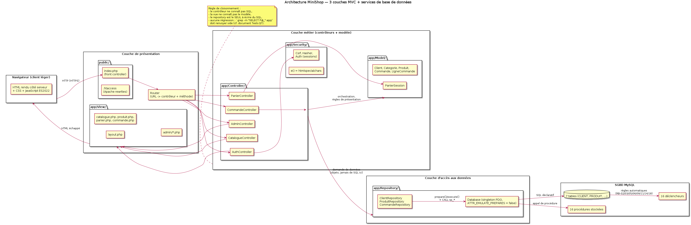

| Couche | Rôle exact | Ce qu'elle **ne fait pas** | Artefacts du dépôt |
|---|---|---|---|
| **Présentation** | router une URL, rendre du HTML échappé, servir les assets, exécuter les interactions JS (panier, filtres, validation live) | aucun accès à la base, aucune règle de gestion | `public/index.php`, `app/Router.php`, `app/View/**`, `public/js/**`, `public/css/**` |
| **Traitement / métier** (contrôleurs + modèle objet + services de sécurité) | orchestrer un cas d'utilisation : authentifier, autoriser, valider les entrées, appeler les repositories, composer les objets de vue, gérer erreurs et redirections | aucune requête SQL écrite ici ; aucun HTML | `app/Controller/**`, `app/Model/**`, `app/Security/**`, `app/Service/**` |
| **Accès aux données** | traduire les besoins en SQL/PDO, appeler les procédures stockées, mapper lignes ↔ objets, piloter les transactions | aucune règle métier « molle » (les règles dures vivent dans la base, §12.5/12.6) | `app/Repository/**`, `app/Config/Database.php` |
| **Base de données** (MySQL) | contraintes d'intégrité, CHECK, UNIQUE, FK, **procédures stockées**, **triggers**, transactions et verrous | aucune présentation, aucun état de session | `sql/01…04` |

Cycle d'une requête (extrait de `seq_*.png`, §5.3) :

```
navigateur → public/index.php (front controller)
           → Router::dispatch() → garde d'accès (Auth::exige_client() / exige_role_admin())
           → Controller (mets à jour / consulte) → Repository → PDO [prepare/execute | CALL sp_*]
                                                            → MySQL : tables + triggers
           ← objets du modèle ← PDOStatement
           → View (rendu + e())  → réponse HTTP + en-têtes de sécurité
```

### 9.2 Structure du dépôt (arborescence livrée)

```
minishop/
├── README.md                     # installation, exécution, tests (exigence §16 v)
├── docs/
│   ├── 01-cahier-des-charges-MiniShop.md     # CE DOCUMENT (spécification + conception BD)
│   ├── 02-document-tests-validation.md       # document de test et de validation (rédigé séparément)
│   ├── 03-support-soutenance.md              # trame des 15 min
│   └── diagrams/{src/*.puml, *.png, render.sh}
├── sql/
│   ├── 01_minishop_schema.sql    # DDL + données (client, catégorie, produit, admin)
│   ├── 02_minishop_procedures.sql# 17 procédures stockées + 1 fonction
│   ├── 03_minishop_triggers.sql  # 16 déclencheurs
│   └── 04_minishop_demo.sql      # commandes de démo via CALL (fait vivre les triggers)
├── app/
│   ├── Config/{env.example.php, Database.php}
│   ├── Controller/{Auth,Catalogue,Panier,Commande,Admin}Controller.php
│   ├── Model/{Client,Administrateur,Categorie,Produit,Commande,LigneCommande,PanierSession}.php
│   ├── Repository/{Client,Produit,Commande}Repository.php
│   ├── Security/{Auth.php,csrf.php,xss.php}
│   ├── View/{layout.php, …php, admin/…php}
│   └── Router.php
├── public/                        # seul dossier exposé par Apache
│   ├── index.php  .htaccess  css/  js/  img/
├── scripts/{load_db.sh, run_sql_tests.sh, gen_volumes.sh, deploy.sh, build-docs.sh}
├── tests/
│   ├── sql/{manifest.txt, fixture.sql, t01…t26_*.sql, out/, rapport_tests_sql.md}
│   ├── php/                      # PHPUnit : modèles, repositories (base de test), sécurité
│   ├── charge/reserver.sh        # C-01 : N tentatives simultanées sur M exemplaires (anti-survente)
│   ├── perf/mesurer.sh           # ENF-01 : p95 par URL (ab ou curl)
│   └── security/controles.sh     # 10 contrôles statiques bloquants en CI (§15.3)
├── var/{log/, cache/}        # créés par l'installeur, jamais versionnés (.gitignore)
├── .gitignore                # secrets + artefacts (voir §14.1 règle 7)
└── .gitlab-ci.yml            # 6 jobs : lint, style, security-scan, base-tests, unit, docs
```

### 9.3 Front controller et routage

- **un seul point d'entrée** (`public/index.php`) : toutes les URL passent par lui, ce qui rend possible la vérification systématique de la session, du CSRF et des en-têtes ;
- table de routes explicite (`GET /catalogue`, `POST /panier/ajouter`, `GET /admin/commandes/{id}`) ; méthodes non autorisées → 405 ; inconnues → 404 rendu par la vue d'erreur ;
- `.htaccess` : `RewriteRule ^ index.php [QSA,L]`, protection de `/../`, interdiction d'accès à `app/`, `var/`, `sql/`, `docs/` (même si le `DocumentRoot` ne pointe déjà que sur `public/` — redondance volontaire, `SEC-11`).

### 9.4 Objets, dépendances et conventions de conception PHP

| Conventions | Effet concret |
|---|---|
| `declare(strict_types=1);` + PSR-12 + `final class` par défaut | le type d'un `id` ne « glisse » pas de `string` à `int` ; pas d'héritage non désiré |
| un repository = une agrégation, constructeur injectant `PDO` | testable avec une base de test, remplaçable par un double |
| les contrôleurs ne **font jamais** `new PDO()` : le PDO vient du constructeur | la configuration des options PDO reste unique et ne peut pas être désactivée par étourderie (`ENF-09`) |
| erreurs métier = exceptions du domaine (`StockInsuffisant`, `AccesRefuse`, `RegleInterdite`) | traduction centralisée en code HTTP + message utilisateur ; journalisation automatique (`SEC-13`) |
| aucune `super-globale` dans le modèle | `$_SESSION` n'est lu que dans `Auth` et les contrôleurs |
| appels de procédures via `CALL` typé | le PHP ne connaît que des **verbes métier**, pas des tables (`sp_create_order_from_basket`, `sp_adjust_stock`) |

### 9.5 Gestion des sessions et du panier dans l'architecture

- la session PHP est le **conteneur** du panier (clé `panier`) : écriture dans `PanierSession`, lecture dans `PanierController`, jamais dans une vue ;
- à la validation de commande, `CommandeRepository` appelle la procédure, **puis** vide la clé `panier` : le vidage n'est fait qu'après `COMMIT` (sinon un `ROLLBACK` perdrait le panier du client) ;
- variante persistée (V1, §12.8) : `PANIER`/`LIGNE_PANIER` en base, le même contrôleur, une méthode de repository en plus — l'architecture n'est pas touchée, preuve que la séparation des couches est la bonne.

### 9.6 Environnements, déploiement, sauvegarde

| Environnement | Base | Données | Particularités |
|---|---|---|---|
| `dev` (poste de chaque étudiant) | `minishop` | seed complet + hashes de démo | `display_errors = On` **uniquement** en local |
| `test` (CI GitLab + harnais) | `minishop_test` | seed + fixture de tests | recréée intégralement à chaque campagne ; `DB_TEST=minishop_test` |
| `demo`/`prod` (machine de soutenance) | `minishop` | seed **sans** les mots de passe faibles, `sql/04` non joué | HTTPS auto-signé, `scripts/deploy.sh` (copie + `load_db.sh` + droits `var/`) |

Sauvegarde/restauration spécifiées (2 min d'exécution en démo) : `mysqldump --single-transaction --routines --triggers minishop > backup.sql` et restauration `mysql minishop < backup.sql` ; la présence de `--routines --triggers` est **nécessaire** ici : sans elle, une base restaurée perdrait la fonction, les 17 procédures et les 16 triggers, donc les règles `RB-03/06/11/18` cesseraient d'être appliquées silencieusement — c'est l'un des arguments à plaider en soutenance (§17.11).

---

## 10. Modélisation des données et SQL

Cette section est la synthèse lisible du **document de conception de base de données** demandé au point 3) du sujet ; les détails complets (MCD/MLD, normalisation, script, procédures, triggers, argumentation pédagogique) sont au **§12**, qui reprend plan par plan le document attendu, et sont livrés en **document autonome** `docs/04-conception-bd-et-sql.md` (livrable n°3, 20 points).

**Synthèse en 6 chiffres vérifiés :** 8 tables (+3 vues), 1 fonction + 17 procédures stockées (min. 5), 16 déclencheurs (min. 5), 20 règles de gestion dont 11 imposées, 29 tests SQL exécutés (29 conformes), 3FN démontrée sans dénormalisation non tracée.

---

## 11. Pré-conditions de recette, hypothèses, hors périmètre

### 11.1 Hypothèses retenues (toute rupture = avenant, §16.3)

1. le catalogue reste petit (≤ 1 000 produits) : aucune infrastructure de cache, aucune recherche externe (Elasticsearch) ;
2. un client ne commande qu'en EUR, un seul dépôt, pas d'entrepôt multiple ni de réservation par emplacement ;
3. le paiement est **simulé** : `PAYEE` est posé par l'application à la demande du client (bouton « Payer (simulation) ») ; le `statut` reste la seule vérité métier ;
4. les **frais de port ne sont pas une fonctionnalité optionnelle** : l'affichage du prix total incluant la livraison avant la validation est une obligation légale (code de la consommation art. L221-5 4°, directive 2011/83/UE art. 5 §1 e). MiniShop les **inclut** sous une forme minimale : une règle paramétrée dans la table `parametre`, une colonne `commande.frais_port` figée à la validation (`RB-20`) — **pas** de transporteur, **pas** de tarif par pays ;
5. un produit est vendu en unités entières (pas de quantité fractionnaire) ;
6. les prix affichés incluent la TVA au taux unique paramétrable par produit (`tva` sur la ligne `PRODUIT`).

### 11.2 Hors périmètre (volontairement, et assumé devant le jury)

| Élément | Pourquoi hors périmètre | Impact si ajouté |
|---|---|---|
| Paiement réel (Stripe/PayPal), 3-D Secure | contrat, PCI-DSS, hors objectifs pédagogiques | +2-3 semaines, risque de sécurité non maîtrisable |
| Référencement SEO complet, sitemap, données structurées | ce n'est pas un enjeu de la SAE | faible |
| Avis clients, notes, questions/Réponses | autre aggregate, aucune règle de gestion imposée | +10 % de périmètre, aucun point de plus |
| Codes promo, paniers à plusieurs adresses, facturation PDF, multi-devises | complexité monétaire sans lien avec le référentiel | risque de toucher `RB-06`/`RB-15` |
| Emailing / notifications transactionnelles (SMTP) | dépendance externe, non testable en local sans mock | prévoir un mock si on l'ajoute |
| Application mobile native, PWA installable | non demandé | — |
| Export comptable, intégration ERP | hors sujet | — |
| Multi-boutique / internationalisation | non demandé | — |
| Back-office de gestion des utilisateurs clients | **interdit par `RB-13`** (le client gère son compte) | contredit une règle métier |

### 11.3 Pré-conditions de recette (ce que l'équipe doit avoir livré avant de tester)

`PRÉ-1` base chargée sans erreur par `scripts/load_db.sh` avec compteurs affichés (tables 8, vues 3, fonctions 1, procédures 17, triggers 16, 12 produits, 3 clients, 1 admin, 4 commandes de démo) ; `PRÉ-2` `scripts/run_sql_tests.sh` → 29/29 ; `PRÉ-3` `php -l` sur 100 % des fichiers ; `PRÉ-4` les 10 contrôles statiques de sécurité au vert (`bash tests/security/controles.sh`) ; `PRÉ-5` `README.md` à jour, testé sur une machine propre ; `PRÉ-6` 3 auteurs distincts dans `git shortlog`.

---

## 12. Conception de la base de données

> Plan imposé par le sujet (point 3) : **A) Analyse de BD** → i) MCD, ii) MLD, iii) Normalisation, iv) Script SQL ; **B) Procédures stockées** (+ question pédagogique) ; **C) Triggers**. Les sous-sections suivent ce plan à l'identique, avec deux ajouts demandés implicitement : les cardinalités justifiées (i) et le jeu de données (iv).

### 12.1 Modèle conceptuel de données (MCD)

#### 12.1.1 Diagramme


#### 12.1.2 Entités et rôle dans le métier

| Entité | Réalité métier représentée | Identifiant | Propriétés |
|---|---|---|---|
| `CLIENT` | personne inscrite pouvant commander | `id_client` | nom, prénom, email, mot de passe (hash), téléphone, adresse, code postal, ville, actif, dates |
| `ADMINISTRATEUR` | membre du personnel habilité du back-office | `id_admin` | nom, prénom, email, hash, rôle (`SUPER`/`GESTIONNAIRE`), actif, dates |
| `CATEGORIE` | rayon de classement des produits | `id_categorie` | nom, slug, description |
| `PRODUIT` | article vendu | `id_produit` | référence, nom, slug, description, prix HT, TVA, prix TTC, stock, seuil d'alerte, visibilité, image, dates |
| `COMMANDE` | demande d'achat enregistrée d'un client | `id_commande` (+ `numero` candidat) | adresse de livraison, statut, montant total, commentaire, dates |
| `LIGNE_COMMANDE` | un produit acheté en quantité dans une commande, **au prix du moment** | `id_ligne` | quantité, prix unitaire, total |
| `ORDER_STATUS_HISTORY` | trace inaltérable des changements de statut | `id` | ancien/nouveau statut, auteur, rôle, commentaire, horodatage |

Associations : `PASSER` (CLIENT↔COMMANDE), `COMPORTER` (COMMANDE↔LIGNE_COMMANDE), `ETRE VENDU DANS` (PRODUIT↔LIGNE_COMMANDE), `CLASSER` (CATEGORIE↔PRODUIT), `SUIVRE`/`GERER` (ADMINISTRATEUR↔COMMANDE/PRODUIT), `ETRE TRACÉE DANS` (COMMANDE↔ORDER_STATUS_HISTORY).

#### 12.1.3 Cardinalités, avec justification ligne à ligne

| Association | Cardinalité retenue | Justification | Conséquence en MLD / DDL | Test |
|---|---|---|---|---|
| CLIENT — `PASSER` — COMMANDE | CLIENT `(1,1)` · COMMANDE `(0,N)` | « un client peut passer plusieurs commandes », et une commande a un auteur (RB-10) | `commande.id_client` NOT NULL + FK `RESTRICT` (un client avec commandes ne se supprime pas) | `T-17` |
| COMMANDE — `COMPORTER` — LIGNE_COMMANDE | COMMANDE `(1,1)` · LIGNE `(1,N)` | une ligne n'a de sens que portée par une commande (identification faible) et une commande valide a ≥ 1 ligne (RB-04) | association convertie en table avec FK `ON DELETE CASCADE` | `T-16`, `T-24` |
| PRODUIT — `ETRE VENDU DANS` — LIGNE_COMMANDE | PRODUIT `(1,1)` · LIGNE `(0,N)` | le produit référencé par une ligne est obligatoire (sinon `RB-06` devient inexplicable) | FK `RESTRICT` + trigger de protection | `T-15` |
| CATEGORIE — `CLASSER` — PRODUIT | CATEGORIE `(1,1)` · PRODUIT `(0,N)` | RB-07 (un produit, une seule catégorie) et RB-08 (une catégorie peut être vide) | `id_categorie` NOT NULL, FK `RESTRICT` | `T-14` |
| COMMANDE — `ETRE TRACÉE DANS` — HISTORIQUE | COMMANDE `(1,1)` · TRACE `(0,N)` | une commande peut n'avoir aucun changement tracé au départ, puis N | FK `CASCADE` (la trace suit sa commande) | `T-22` |
| ADMINISTRATEUR — `SUIVRE`/`GERER` — COMMANDE/PRODUIT | `(0,N)` · `(0,N)` | information d'audit uniquement ; pas de donnée portée par l'admin sur la commande (le `changed_by` de l'historique suffit) | **aucune FK ajoutée** (décision argumentée : tracer ≠ posséder) | revue |

**Refus explicites de conception** (à défendre en soutenance) :
- *pas de* `PRODUIT.id_commande` : une commande porte N produits → relation 1-N inversée, sinon un produit ne pourrait être vendu qu'une fois ;
- *pas de* table `COMMANDE(id, produits_csv)` : violateur de 1NF, impossible à interroger proprement et à contraindre ;
- *pas de* clé naturelle `id_produit` dans `LIGNE_COMMANDE` comme unique identifiant (une même commande peut légitimement contenir deux lignes du même produit : un achat « cadeau » et un achat « perso » avec des quantités différentes) → on garde `id_ligne` ;
- *pas d'*`UTILISATEUR` unique + colonne `role` : voir §12.4.

### 12.2 Modèle logique de données (MLD)


```
CLIENT(id_client PK, nom, prenom, email UK, mot_de_passe_hash, telephone, adresse_livraison,
       code_postal, ville, actif, date_creation, derniere_connexion)

ADMINISTRATEUR(id_admin PK, nom, prenom, email UK, mot_de_passe_hash, role, actif,
               date_creation, derniere_connexion)

CATEGORIE(id_categorie PK, nom UK, slug UK, description)

PRODUIT(id_produit PK, reference UK, nom, slug UK, description, prix_ht, tva, prix_ttc,
        stock, stock_initial, seuil_alerte, visible, image_url, date_creation, date_modification,
        id_categorie FK → CATEGORIE)            -- RB-07 (NOT NULL), RB-16 (prix_ttc calculé)

COMMANDE(id_commande PK, numero UK, adresse_livraison, statut, frais_port, montant_total,
         commentaire, date_commande, date_modification, id_client FK → CLIENT)  -- RB-10, RB-20

LIGNE_COMMANDE(id_ligne PK, quantite, prix_unitaire, total_ligne,
               id_commande FK → COMMANDE (CASCADE), id_produit FK → PRODUIT (RESTRICT))

ORDER_STATUS_HISTORY(id PK, old_status, new_status, changed_by, changed_by_role,
                     commentaire, changed_at, order_id FK → COMMANDE)

PARAMETRE(cle PK, valeur, description, maj_le)   -- 4 lignes livrées : frais_port = 4.90,
     franchise_port = 80.00, tva_standard = 20.00, seuil_alerte_defaut = 5
     -- les règles chiffrées vivent ICI, pas dans une constante PHP recopiée (RB-20)
```

**Trois vues** complètent le modèle logique — elles factorisent une règle pour qu'elle ne soit jamais réécrite
(en complément des 8 tables) :

| Vue | Contenu | Règle qu'elle factorise | Test |
|---|---|---|---|
| `v_etat_stock` | `id_produit`, référence, nom, stock, seuil, **état** (`RUPTURE` / `STOCK_FAIBLE` / `OK`) | `RB-04` + `RB-05` : un seul endroit décide de l'état du stock | `T-27` |
| `v_catalogue` | produits `visible = 1` + catégorie + état du stock | `RB-19` : la visibilité est appliquée **par la vue**, pas par chaque requête | `T-27` |
| `v_commandes_client` | commande + client + nombre de lignes + `frais_port` + total | lecture du compte d'un client, sans jamais recompter à la main | `T-27` |

Le **jeu de démonstration** livré par `sql/01` et `sql/04` : 1 administrateur, 4 catégories, **12 produits**
(dont `POWER-010` en rupture de stock pour `RB-04`/`RB-19`, `BRAC-012` masqué), **3 clients** dont les mots de
passe sont des hashes `password_hash()`, et **4 commandes** créées **par appels de procédures** : deux validées
avec franchise de port atteinte (`frais_port = 0.00`), un brouillon vide, et une petite commande qui **paie**
4,90 EUR de livraison (montant 63,70 EUR pour 58,80 EUR de marchandises). C'est ce qui rend `RB-15`/`RB-20`
visibles dans l'application dès la première page du back-office.

### 12.3 Normalisation — dépendances fonctionnelles, 1FN/2FN/3FN, clés, redondances

Le sujet demande explicitement les quatre points suivants ; ils sont traités séparément, table par table pour les dépendances.

#### 12.3.1 Dépendances fonctionnelles identifiées (DF)

| Table | DF non triviales retenues | Commentaire |
|---|---|---|
| `CLIENT` | `id_client → nom, prenom, email, mot_de_passe_hash, …` ; `email → id_client` | `email` est donc **clé candidate** : l'unicité (RB-01) n'est pas un artifice applicatif, c'est une propriété du modèle |
| `CATEGORIE` | `id_categorie → nom, slug, description` ; `nom → id_categorie` ; `slug → id_categorie` | `nom` et `slug` sont candidats : le slug sert aux URL, le nom aux libellés |
| `PRODUIT` | `id_produit → reference, nom, slug, prix_ht, tva, stock, stock_initial, …` ; `reference → id_produit` ; `slug → id_produit` ; `prix_ht, tva → prix_ttc` ; `id_produit → id_categorie` | la dernière DF est **dérivée** : elle justifie `trg_produit_ttc` (§12.6) au lieu d'une colonne calculée à la main |
| `COMMANDE` | `id_commande → numero, id_client, adresse_livraison, statut, frais_port, montant_total, …` ; `numero → id_commande` ; `(id_commande, date_commande) → frais_port` **dérivée** (le port dépend des marchandises **au moment de la validation**, puis ne bouge plus) ; `Σ total_ligne, frais_port → montant_total` | pas de DF `id_client → adresse_livraison` : un client peut livrer ailleurs (c'est pourquoi l'adresse est copiée, §12.3.4). La DF sur `frais_port` est la traduction de `RB-20` : le port est une **fonction du panier figée à la validation**, pas un attribut libre du client ni une règle recalculée à chaque lecture |
| `LIGNE_COMMANDE` | `id_ligne → id_commande, id_produit, quantite, prix_unitaire, total_ligne` ; `id_ligne → total_ligne` (DF transitive évitée, voir 3FN) ; `id_produit → prix courant du produit` **n'est pas** une DF de la table | la DF `id_produit → prix` ne s'applique qu'au **moment de l'achat** : c'est précisément le snapshot `RB-06`, la valeur enregistrée dépend de `id_ligne`, pas de `id_produit` |
| `ORDER_STATUS_HISTORY` | `id → order_id, old_status, new_status, changed_at, …` | `(order_id, new_status, changed_at)` est quasi-unique mais n'est pas retenu comme candidat (deux changements à la même seconde dans un scénario de test doivent rester possibles) |

#### 12.3.2 Vérification 1FN / 2FN / 3FN

| Table | 1FN | 2FN | 3FN | Démonstration |
|---|---|---|---|---|
| `CLIENT` | ✅ un seul sens par attribut, valeurs atomiques (pas de `adresse` en un bloc « rue, cp, ville » : la rue, le code postal et la ville sont 3 attributs) | ✅ clé primaire mono-attribut ⇒ pas de dépendance partielle possible | ✅ aucune DF `non-clé → non-clé` | `ville → code_postal` n'est **pas** une DF valide (deux villes peuvent partager un CP, un CP peut couvrir plusieurs communes) : la ville reste donc un attribut dépendant de `id_client` |
| `CATEGORIE` | ✅ | ✅ | ✅ | — |
| `PRODUIT` | ✅ | ✅ (clé mono-attribut) | ⚠️ puis ✅ | `prix_ttc` dépend transitivement de `prix_ht` et `tva`. Deux options : (a) supprimer `prix_ttc` et le calculer à la lecture ; (b) le **conserver comme valeur dérivée générée par la base** et la documenter. Option (b) retenue : le prix TTC est un résultat de recherche filtrée (`prix_ttc BETWEEN` dans `sp_search_products`), le recalcul à chaque lecture casserait `ENF-01` (< 500 ms) ; la redondance est **neutralisée** par `trg_produit_ttc(_update)`, ce qui est équivalent à une colonne générée MySQL (`GENERATED ALWAYS AS`). L'anomalie potentielle est donc nulle, et la 3FN est « respectée à la dénormalisation tracée près ». |
| `COMMANDE` | ✅ | ✅ | ⚠️ puis ✅ | `montant_total` dépend de la somme des lignes : DF `id_commande → montant_total` indirecte. Maintenu car (i) c'est une donnée de **facturation figée** au moment de la commande, (ii) une agrégation à chaque lecture casserait les listes admin. Garde-fou : `trg_commande_transition_statut` refuse tout `montant_total` non égal à la somme (`RB-15`), donc l'anomalie est rendue impossible, pas seulement « déconseillée ». |
| `LIGNE_COMMANDE` | ✅ | ✅ | ✅ | Si l'on conservait la clé composée `(id_commande, id_produit)` (sans `id_ligne`), `quantite` dépendrait de la clé entière mais `prix_unitaire` **dépendrait de `id_produit` seul** (avant snapshot) : **violation de 2FN**. L'introduction de la clé de substitution `id_ligne` fait de chaque attribut non-clé un dépendant de la clé entière uniquement → 3FN. De plus le snapshot rend `prix_unitaire` indépendant du produit courant, ce qui supprime l'anomalie de modification du prix du produit (les commandes passées ne bougent plus). |
| `ORDER_STATUS_HISTORY` | ✅ | ✅ | ✅ | — |

**Conclusion de normalisation :** le schéma est en 3FN **avec deux dénormalisations tracées et protégées par déclencheur** (`PRODUIT.prix_ttc`, `COMMANDE.montant_total`) et **une copie volontaire** (`COMMANDE.adresse_livraison`). Chacune est justifiée par une exigence (`ENF-01`, `RB-06`, `RB-15`), ce qui est exactement ce qu'on attend d'une normalisation argumentée plutôt que mécanique.

#### 12.3.3 Justification des clés primaires et étrangères

| Clé | Choix | Justification | Ce qui serait cassé sinon |
|---|---|---|---|
| PK `id_client`, `id_admin`, `id_categorie`, `id_produit`, `id_commande` | entiers auto-incrémentés (substituts) | les candidats naturels (email, référence, slug, numéro de commande) peuvent, en théorie, changer ou être réattribués ; un identifiant stable et court rend les index et les jointures performants | une PK naturelle `email` imposerait de réécrire toutes les FK à chaque correction de saisie |
| UK `email` (client, admin), `reference`, `slug`, `numero` | contraintes **unicité** séparées de la PK | elles portent les règles métier (`RB-01`, `RB-14`) et restent vérifiables même avec une PK de substitution | sans elles, `RB-01` ne tiendrait que dans le PHP (contournable) |
| FK `produit.id_categorie` | `NOT NULL`, `ON DELETE RESTRICT`, `ON UPDATE CASCADE` | RB-07 + impossibilité d'orphelins ; le `CASCADE` sur l'update n'est pas dangereux (un id de catégorie ne change pas en pratique) | `SET NULL` rendrait `NOT NULL` impossible ; un `DELETE CASCADE` détruirait le catalogue |
| FK `commande.id_client` | `NOT NULL`, `RESTRICT` | RB-10 + conservation de l'historique | `CASCADE` effacerait les commandes à la suppression d'un compte : interdit par RB-09 |
| FK `ligne_commande.id_commande` | `NOT NULL`, `ON DELETE CASCADE` | la ligne est **dans** la commande (identification faible) : elle disparaît avec elle, et le trigger `trg_ligne_restore_stock` restitue le stock | `RESTRICT` empêcherait toute purge d'un brouillon (test T-24) |
| FK `ligne_commande.id_produit` | `NOT NULL`, `RESTRICT` (des deux côtés) | `RB-14` : un produit vendu reste référencé, sinon le `prix_unitaire` figé n'a plus de sens | `CASCADE` supprimerait des lignes de commandes validées (`RB-09`) |
| FK `order_status_history.order_id` | `CASCADE` | l'audit suit sa commande (une commande supprimable = brouillon vide) | audit orphelin, ou purge de commande impossible |
| index | `FULLTEXT(nom, description)`, `idx_produit_categorie`, `idx_produit_visible(visible, stock)`, `idx_commande_client`, `idx_commande_statut`, `idx_ligne_commande` | alignés sur les requêtes réelles (`WHERE visible = 1 AND stock > 0 ORDER BY …`, « mes commandes », « commandes par statut ») : justifiés par le plan d'exécution, pas par superstition | recherche en `LIKE %…%` sur 1 000 produits : acceptable mais `ENF-01` non garanti |

#### 12.3.4 Redondances identifiées (et ce qui en est fait)

| Redondance | Nature | Décision | Contrôle de non-contradiction |
|---|---|---|---|
| `PRODUIT.prix_ttc` | dérivée de `prix_ht` × `tva` | conservée (performance de filtrage) | `trg_produit_ttc` + `trg_produit_ttc_update` : recalcul systématique, test de cohérence §12.4 |
| `COMMANDE.montant_total` | agrégat | conservée (facturation figée) | `RB-15` + trigger (`T-10`) |
| `LIGNE_COMMANDE.total_ligne` | produit `quantite × prix_unitaire` | conservée (historique stable, même si un taux change) | trigger `trg_ligne_prix_snapshot` |
| `COMMANDE.adresse_livraison` | copie de `CLIENT.adresse_livraison` | **obligatoire** : l'adresse livrée est une donnée du moment de la commande (RB-06 par analogie) ; sinon modifier son compte réécrire l'historique | aucune mise à jour rétroactive ; la liste des adresses est proposée au client, puis figée |
| `LIGNE_COMMANDE.prix_unitaire` | copie du prix courant du produit | **obligatoire** (`RB-06`) | snapshot au trigger + immuabilité (`T-11`, `T-23`) |
| `nom`/`slug` de catégorie dans les jointures | non redondant (jamais dupliqué) | jointures systématiques | — |
| `v_etat_stock` (vue) | dérivée (RUPTURE / TRES_BAS / DISPONIBLE) | vue fournie pour que Back-office et procédure partagent la même formule | définition unique dans la base |

**Anomalies vérifiées comme absentes :** (i) anomalie d'insertion : aucune (toutes les FK NOT NULL ont un parent obligatoire et réel, test `T-17`) ; (ii) anomalie de suppression : les `RESTRICT` empêchent une suppression qui casserait un historique (`T-14`, `T-15`) ; (iii) anomalie de mise à jour : impossible sur les prix figés (`T-11`), sur les montants (`T-10`) et sur le stock négatif (`T-02`, `T-03`, `T-19`).

#### 12.3.5 Requête de preuve (à exécuter en soutenance)

```sql
-- aucune incohérence de redondance tolérée : ces 4 requêtes doivent renvoyer 0 ligne
SELECT id_produit FROM produit WHERE prix_ttc <> ROUND(prix_ht * (1 + tva/100), 2);
SELECT c.id_commande FROM commande c
  JOIN (SELECT id_commande, SUM(total_ligne) s FROM ligne_commande GROUP BY id_commande) t
    ON t.id_commande = c.id_commande
 WHERE c.statut <> 'BROUILLON' AND c.montant_total <> t.s;
SELECT c.id_commande FROM commande c
  JOIN (SELECT id_commande, SUM(quantite) q FROM ligne_commande GROUP BY id_commande) t
    ON t.id_commande = c.id_commande
 WHERE t.q <= 0;
SELECT id_produit FROM produit WHERE stock < 0;
```

### 12.4 Script SQL (DDL + données) — `sql/01_minishop_schema.sql`

**Installation (la commande fait foi, exécutée sur MariaDB 11.8 dans notre environnement de développement) :**

```bash
./scripts/load_db.sh
# [1/4] DDL + données de reference     sql/01_minishop_schema.sql
# [2/4] 16 declencheurs               sql/03_minishop_triggers.sql
# [3/4] 1 fonction + 17 procedures    sql/02_minishop_procedures.sql
# [4/4] commandes de demonstration    sql/04_minishop_demo.sql
#
# objet                nombre
# tables               8     ← entités du MLD (§12.2), dont `parametre`
# vues                 3     ← v_etat_stock, v_catalogue, v_commandes_client
# fonctions            1     ← fn_param : lecture typée des règles chiffrées
# procedures stockees  17    ← CT-03 (minimum 5)
# declencheurs         16    ← CT-04 (minimum 5)
# produits             12   clients 3   commandes 4
# lignes de commande   5     traces de statut 9
# OK — base 'minishop' chargee (verifiez : procedures >= 5, declencheurs >= 5).
```

Extraits représentatifs du DDL (le fichier complet est dans le dépôt et en annexe 17.4) :

```sql
CREATE TABLE produit (
  id_produit   INT UNSIGNED NOT NULL AUTO_INCREMENT,
  reference    VARCHAR(30)  NOT NULL,
  nom          VARCHAR(150) NOT NULL,
  slug         VARCHAR(180) NOT NULL,
  prix_ht      DECIMAL(10,2) NOT NULL,
  tva          DECIMAL(5,2)  NOT NULL DEFAULT 20.00,
  prix_ttc     DECIMAL(10,2) NOT NULL,        -- dérivé, voir RB-16
  stock        INT          NOT NULL DEFAULT 0,
  seuil_alerte INT          NOT NULL DEFAULT 3,
  id_categorie INT UNSIGNED NOT NULL,
  visible      TINYINT(1)   NOT NULL DEFAULT 1,
  date_creation     DATETIME NOT NULL DEFAULT CURRENT_TIMESTAMP,
  date_modification DATETIME NOT NULL DEFAULT CURRENT_TIMESTAMP ON UPDATE CURRENT_TIMESTAMP,
  CONSTRAINT pk_produit           PRIMARY KEY (id_produit),
  CONSTRAINT fk_produit_categorie FOREIGN KEY (id_categorie)
        REFERENCES categorie (id_categorie) ON UPDATE CASCADE ON DELETE RESTRICT,
  CONSTRAINT uk_produit_reference UNIQUE KEY (reference),
  CONSTRAINT uk_produit_slug      UNIQUE KEY (slug),
  CONSTRAINT ck_produit_prix      CHECK (prix_ht > 0),   -- RB-02
  CONSTRAINT ck_produit_stock     CHECK (stock >= 0),    -- RB-03
  CONSTRAINT ck_produit_visible   CHECK (visible IN (0,1))
) ENGINE=InnoDB DEFAULT CHARSET=utf8mb4 COLLATE=utf8mb4_unicode_ci;

CREATE TABLE ligne_commande (
  id_ligne      BIGINT UNSIGNED NOT NULL AUTO_INCREMENT,
  id_commande   INT UNSIGNED NOT NULL,
  id_produit    INT UNSIGNED NOT NULL,
  quantite      INT           NOT NULL,
  prix_unitaire DECIMAL(10,2) NOT NULL,     -- RB-06 : snapshot
  total_ligne   DECIMAL(10,2) NOT NULL,
  CONSTRAINT pk_ligne_commande  PRIMARY KEY (id_ligne),
  CONSTRAINT fk_ligne_commande  FOREIGN KEY (id_commande)
        REFERENCES commande (id_commande) ON DELETE CASCADE ON UPDATE CASCADE,
  CONSTRAINT fk_ligne_produit   FOREIGN KEY (id_produit)
        REFERENCES produit (id_produit) ON DELETE RESTRICT ON UPDATE RESTRICT,
  CONSTRAINT ck_ligne_quantite  CHECK (quantite > 0),        -- RB-05
  CONSTRAINT ck_ligne_prix      CHECK (prix_unitaire > 0)
) ENGINE=InnoDB;
```

Le script contient aussi : la création de la base (`utf8mb4_unicode_ci`), les 8 tables dans l'ordre de dépendance
(les 7 entités du MCD plus `parametre`, qui porte les règles chiffrées — port, franchise, TVA, seuil d'alerte), l'index `FULLTEXT (nom, description)`, les index de filtrage, **3 vues** (`v_etat_stock` = formule unique de l'état de stock, `v_catalogue` = produits visibles enrichis catégorie + état, `v_commandes_client` = commandes + client + nombre de lignes) ; ces vues sont réellement créées par `sql/01` et comptées par `scripts/load_db.sh`, 4 catégories, 12 produits (dont un en rupture `stock = 0` et un masqué `visible = 0` pour tester `RB-19`), 3 clients, 1 administrateur, et **des hashes générés par `password_hash()`** (§12.7). Le jeu de commandes de démonstration est volontairement créé **par appels de procédures** (`sql/04`) et non par `INSERT` directs : c'est ce qui fait vivre les triggers dans la base de démonstration.

Contrôles de cohérence livrés avec le script (dans `load_db.sh`) : comptage des tables/procédures/triggers, nombre de lignes par table, et les 4 requêtes de preuve du §12.3.5.

### 12.5 Procédures stockées (17 livrées + 1 fonction — minimum demandé : 5)

**Catalogue complet.** « Usage » indique l'appelant (cas d'utilisation) ; « Test » la preuve d'exécution.

| # | Procédure | Signature (résumée) | Rôle | UC | Test |
|---|---|---|---|---|---|
| 1 | `sp_create_account` | `IN nom, prenom, email, hash, OUT id, OUT code` | création de compte client avec refus du doublon (`RB-01`) **et** refus d'un hash non valide (`RB-12`) | UC-04 | `T-05` |
| 2 | `sp_get_credentials` | `IN email, OUT id, OUT hash, OUT statut` | lecture de l'identifiant et du hash pour `password_verify()` (`SEC-04`) ; statut `COMPTE_BLOQUE` | UC-05 | F-08 |
| 3 | `sp_update_client` | `IN id, …, OUT code` | modification du compte, email ré-contrôlé | UC-05 | F-10 |
| 4 | `sp_search_products` | `IN mot_cle, id_categorie, prix_min, prix_max, en_stock, tri, page, par_page, admin, OUT — (2 jeux de résultats)` | recherche + filtres + tri + pagination, en requête préparée interne paramétrée (`SEC-01/02`, `RB-19`) | UC-01/02 | `T-25` |
| 5 | `sp_save_product` | `IN id NULL\|valeur, champs…, OUT id, OUT code` | création **et** modification d'un produit ; prix TTC recalculé ; `RB-02/07/14/16` | UC-10 | F-22 |
| 6 | `sp_delete_product` | `IN id` | suppression physique si aucune commande, sinon masquage (`RB-09/14/17`) | UC-10 | `T-15`, `T-20` |
| 7 | `sp_adjust_stock` | `IN id, mode(SET\|DELTA), qte, motif, OUT stock, OUT code` | mouvement de stock avec refus de négatif (`RB-03`) | UC-12 | `T-19` |
| 8 | `sp_save_category` | `IN id, nom, slug, description, OUT id, OUT code` | création / renommage de catégorie | UC-11 | F-25 |
| 9 | `sp_delete_category` | `IN id` | refus si catégorie occupée (`RB-14`), sinon suppression | UC-11 | `T-14` |
| 10 | `sp_create_order` | `IN id_client, adresse, OUT id_commande, OUT numero` | ouverture d'un brouillon + numérotation `CMDaaaa-NNNNNN` | UC-07 | F-16 |
| 11 | `sp_add_order_line` | `IN id_commande, id_produit, qte, OUT id_ligne, OUT total, OUT code` | ajout d'une ligne : verrou `FOR UPDATE`, contrôle `RB-05/18`, snapshot par trigger, `RB-15` | UC-06/07 | `T-06`, `T-09` |
| 12 | `sp_create_order_from_basket` | `IN id_client, adresse, panier_json, payee, OUT id, numero, montant, code` | **le cas UC-07 en un appel** : transaction complète, `ROLLBACK` intégral si un seul produit manque | UC-07 | F-17, F-18 |
| 13 | `sp_confirm_order` | `IN id_commande, id_client, payee, OUT montant, OUT code` | validation du panier : contrôle d'appartenance (`SEC-08`), `RB-04`, **fige le port** et solde `montant_total` (`RB-15`/`RB-20`) | UC-07 | `T-16`, `T-18`, `T-28` |
| 14 | `sp_update_order_status` | `IN id_commande, statut, commentaire, auteur, role, OUT code` | changement de statut avec matrice de transitions (`RB-11`) et idempotence | UC-14 | F-29 |
| 15 | `sp_cancel_order` | `IN id_commande, id_client, OUT code` | annulation client : `RB-11` + restitution du stock (par trigger) + **annulation du port et solde du montant à 0** (`RB-15`/`RB-20`, formule rétablie à chaque écriture) dans une transaction | UC-09 | `T-21`, `T-28` |
| 16 | `sp_revenue_report` | `IN date_debut, date_fin` | indicateurs : CA par statut, panier moyen, top 5 produits | UC-13 | F-31 |
| 17 | `sp_compute_shipping` | `IN montant_marchandises, OUT port, OUT motif` | **règle de livraison** : lit `parametre` (`frais_port`, `franchise_port`) via `fn_param`, renvoie le port dû **ou** le motif de franchise. Appelée par `sp_add_order_line` (tant que la commande est `BROUILLON`) et par `sp_confirm_order` (fige la valeur) | UC-07/09 | `T-28` |

**Une fonction, pas seulement des procédures** : `fn_param(cle, type_attendu) RETURNS VARCHAR(255)` — un lecteur typé
de la table `parametre`. Elle existe pour une raison de cohérence : la **même** valeur (4,90 EUR, 80,00 EUR,
20,00 % de TVA) est lue par la procédure de port, par le contrôle de TVA et par le seuil d'alerte ; l'écrire trois
fois en dur dans trois objets différents est précisément le genre de duplication que le §12.3 refuse pour les prix.

Exemple du cœur transactionnel (extrait de `sp_add_order_line`) :

```sql
-- verrou de ligne : deux clients ne réservent pas la même unité
SELECT prix_ttc, stock INTO v_prix, v_stock
  FROM produit WHERE id_produit = p_id_produit FOR UPDATE;
IF v_prix IS NULL THEN
  SIGNAL SQLSTATE '45000' SET MESSAGE_TEXT = 'PRODUIT_SUPPRIME_DU_CATALOGUE';   -- RB-17
END IF;
SET v_dispo = v_stock - v_deja;                       -- déjà réservé sur la commande
IF v_dispo < p_quantite THEN
  SET p_code_retour = 'STOCK_INSUFFISANT';           -- RB-18, sans lever d'exception
ELSE
  INSERT INTO ligne_commande (id_commande, id_produit, quantite, prix_unitaire, total_ligne)
    VALUES (p_id_commande, p_id_produit, p_quantite, v_prix, ROUND(p_quantite * v_prix, 2));
  -- (le trigger AFTER INSERT décrémente le stock ; RB-06 fige le prix au BEFORE INSERT)
END IF;
```

#### 12.5.1 Réponse à la question pédagogique : pourquoi une procédure stockée plutôt que tout faire en PHP ?

| Aspect exigé par le sujet | Ce que la procédure apporte **ici**, concrètement | Ce qui se passe si on la remplace par du PHP |
|---|---|---|
| **Centralisation de la logique** | `sp_create_order_from_basket` porte une seule fois l'ordre exact : créer → verrouiller → insérer → décrémenter → sommer → valider. Le front-office, le back-office (commande manuelle « téléphone ») et un futur import CSV partagent le même code | l'ordre est recopié dans chaque contrôleur ; un import écrit « à la main » saute le calcul du montant ou le snapshot ⇒ `RB-15`/`RB-06` violés sans erreur visible |
| **Sécurité** | le PHP ne possède que `EXECUTE` sur les procédures : il ne peut pas écrire `UPDATE produit SET stock = -1` ni `DELETE FROM commande`, même en cas d'injection dans un autre point du code (défense en profondeur) ; les requêtes du repository sont des appels, pas du SQL dynamique | les privilèges `UPDATE/DELETE` sur `PRODUIT`/`COMMANDE` rendent un défaut applicatif **exploitable** ; l'injection SQL devient un moyen de falsifier le stock et les montants |
| **Transactions** | `START TRANSACTION / COMMIT / ROLLBACK` dans la procédure : l'atomicité est garantie **côté serveur** et ne dépend pas de la fiabilité du client (ni d'un `beginTransaction()` oublié) ; un deadlock MySQL ne laisse qu'à réessayer l'appel | un crash PHP **entre** l'insertion de la commande et le décrément laisse un stock faux — l'état le plus coûteux à réparer |
| **Réutilisabilité** | `sp_add_order_line` sert au panier persistant, à la commande en ligne, à la reprise d'un import et au script de test ; `sp_search_products` sert au visiteur (avec `p_admin = 0`) et à l'admin (`p_admin = 1`) sans changer une ligne de PHP | deux implémentations de la disponibilité (une dans `PanierController`, une dans `CommandeController`) divergent dès le premier correctif |
| **Contrôle des accès** | `sp_confirm_order` vérifie `id_client` de la commande : la route `commande.php?id=25` ne peut pas fuiter même avec un contrôleur oublié (test `T-18`) ; `sp_delete_category` refuse la suppression d'une catégorie occupée (`T-14`) | la sécurité repose entièrement sur la discipline de chaque développeur et sur des tests d'intégration |
| **Performance et volume réseau** | un seul aller-retour pour un panier de N lignes (`CALL` + JSON) au lieu de `2N + 2` requêtes préparées ; les calculs se font près des données | latence multipliée sur les paniers volumineux (mesure `ENF-01`) |
| **Coûts assumés / limites (à dire aussi)** | dépendance au SGBD (pas portables sur SQLite/PostgreSQL sans réécriture), debuggage moins outillé qu'en PHP, versionnement du SQL à surveiller dans GitLab, logique dupliquée si l'IHM a besoin de la même formule (ex. `etat_stock` : même formule dans la procédure **et** dans la classe `Produit`) | — |

**Conclusion pédagogique** : la procédure est retenue **pour les écritures multi-tables et les décisions qui engagent la cohérence** (commande, stock, statut, suppression protégée) ; la lecture simple (liste des catégories, fiche d'un produit par id) reste en SQL préparé dans le repository. Cette frontière est précisément celle que le sujet cherche à faire réfléchir, et elle est justifiée par la table ci-dessus plutôt que par une préférence.

### 12.5.2 Correspondance avec les noms **tels qu'écrits dans le sujet**

Le sujet donne des exemples (`sp_create_order`, `sp_add_order_item`, `sp_update_order_status`, « Trigger 1 — Stock »,
« Trigger 2 — Historique », la table `ORDER_STATUS_HISTORY`, l'exemple de MLD `CLIENT(…, password, …)`). La table
ci-dessous fait la correspondance **objet par objet** : deux des trois procédures gardent le nom exact, la
troisième est **renommée en français pour être cohérente avec le reste du modèle** (`ligne_commande`, pas
`order_item`) — c'est un choix assumé et tracé ici, pas un oubli, parce que le sujet dit « par exemple ».

| Exemple du sujet | Objet livré | Écart et raison | Test |
|---|---|---|---|
| `sp_create_order` — création d'une commande | `sp_create_order(id_client, adresse, OUT id, OUT numero)` | **nom et rôle identiques** ; + numérotation `CMDaaaa-NNNNNN` (`RB-08`) | `F-16`, `T-16` |
| `sp_add_order_item` — ajout d'un produit dans une commande | `sp_add_order_line(id_commande, id_produit, qte, OUT id_ligne, OUT total, OUT code)` | renommer **`_line`** : la table s'appelle `ligne_commande`, les triggers `trg_ligne_*` ; garder un nom anglais isolé dans un modèle français serait la vraie incohérence. Dérivé : `sp_create_order_from_basket` = le panier entier en un appel | `T-06`, `T-08`, `T-09`, `T-29` |
| `sp_update_order_status` — modification du statut | `sp_update_order_status(id_commande, statut, commentaire, auteur, role, OUT code)` | **nom et rôle identiques** ; + matrice de transitions (`RB-11`), idempotence, auteur tracé | `T-12`, `T-13`, `F-29` |
| « Trigger 1 — Stock » : à la création d'une ligne, `stock - quantité commandée` | `trg_ligne_decrement_stock` (`AFTER INSERT`) **et** `trg_ligne_restore_stock` (`AFTER DELETE`) | même formule, **et son inverse** : sans la restitution, annuler une commande perdrait du stock (`T-21`) | `T-07`, `T-21` |
| « Trigger 2 — Historique » sur `ORDER_STATUS_HISTORY(id, order_id, old_status, new_status, changed_at)` | `trg_history_statut` (`AFTER UPDATE`) **et** `trg_history_creation` (`AFTER INSERT`) | **colonnes du sujet conservées à l'identique**, plus `changed_by`, `changed_by_role`, `commentaire` (qui, sous quel rôle, pourquoi) ; écriture **uniquement** par trigger (`V7`, `T-22`) | `T-22`, `T-23` |
| `CLIENT(…, password, date_creation)` | `client(…, mot_de_passe_hash, date_creation)` | le sujet interdit lui-même le mot de passe en clair (`Interdire password = "123456"`) : la colonne est un **hash** `password_hash()` (`RB-12`) | `T-05`, `F-08` |

### 12.6 Déclencheurs (16 livrés — minimum demandé : 5)

| ID | Trigger | Évènement | Règle | Action / effet | Test |
|---|---|---|---|---|---|
| `TRG-A1` | `trg_ligne_controle_insert` | `BEFORE INSERT ON ligne_commande` | `RB-17`, `RB-18` | vérifie produit existant et `stock ≥ quantité`, sinon `SIGNAL 'STOCK_INSUFFISANT'` | `T-08` |
| `TRG-A2` | `trg_ligne_decrement_stock` | `AFTER INSERT ON ligne_commande` | `RB-18`, `RB-03` | `stock = GREATEST(stock - qte, 0)` — jamais de négatif | `T-21`, F-17 |
| `TRG-A3` | `trg_ligne_restore_stock` | `AFTER DELETE ON ligne_commande` | `RB-18` | restitution des unités (annulation, retrait, purge) | `T-21`, `T-24` |
| `TRG-B1` | `trg_ligne_immutable` | `BEFORE UPDATE ON ligne_commande` | `RB-09`, `RB-06` | refus `RB06_PRIX_ET_QUANTITE_NON_MODIFIABLE` sur toute réécriture | `T-11` |
| `TRG-B2` | `trg_ligne_prix_snapshot` | `BEFORE INSERT ON ligne_commande` | `RB-06` | force `prix_unitaire = prix_ttc courant` et `total_ligne` ; **ignore le prix envoyé par le client** | `T-23` |
| `TRG-B3` | `trg_produit_ttc` | `BEFORE INSERT ON produit` | `RB-16` | calcule `prix_ttc` | §12.3.5 |
| `TRG-B4` | `trg_produit_ttc_update` | `BEFORE UPDATE ON produit` | `RB-16`, `RB-06` | recalcule `prix_ttc` **sans toucher** aux lignes existantes | `T-23` |
| `TRG-B5` | `trg_produit_regles` | `BEFORE UPDATE ON produit` | `RB-03` | refuse `stock < 0` avec message métier | `T-03` |
| `TRG-B6` | `trg_produit_delete` | `BEFORE DELETE ON produit` | `RB-14`, `RB-09` | interdit la suppression d'un produit référencé | `T-15` |
| `TRG-C1` | `trg_categorie_slug` | `BEFORE INSERT ON categorie` | ergonomique | génère le slug si absent | F-25 |
| `TRG-C2` | `trg_categorie_delete` | `BEFORE DELETE ON categorie` | `RB-14` | interdit la suppression d'une catégorie occupée | `T-14` |
| `TRG-D1` | `trg_commande_transition_statut` | `BEFORE UPDATE ON commande` | `RB-10`, `RB-11`, `RB-15` | matrice de transitions + refus d'un montant non égal à la somme + client réel | `T-10`, `T-12`, `T-13` |
| `TRG-D2` | `trg_commande_controle_insert` | `BEFORE INSERT ON commande` | `RB-04`, `RB-10`, `RB-15` | client réel, montant forcé à 0, statut initial | `T-17` |
| `TRG-D3` | `trg_commande_delete` | `BEFORE DELETE ON commande` | `RB-09`, `RB-04` | purge interdite après validation et tant qu'il reste des lignes | `T-24` |
| `TRG-D4` | `trg_history_statut` | `AFTER UPDATE ON commande` | `RB-11` | **exigence « Trigger 2 — Historique »** : écrit `ORDER_STATUS_HISTORY` automatiquement | `T-22` |
| `TRG-D5` | `trg_history_creation` | `AFTER INSERT ON commande` | `RB-11` | première trace `NULL → BROUILLON` | `T-22` |

L'exigence « Trigger 1 — Stock » est couverte par `TRG-A1`+`TRG-A2` (et `TRG-A3` pour l'annulation) ; l'exigence « Trigger 2 — Historique » par `TRG-D4` (+ `TRG-D5`), avec la table `order_status_history(id, order_id, old_status, new_status, changed_at, …)` **exactement** au format demandé par le sujet, complétée de l'auteur et du rôle pour la traçabilité.

**Ce que les triggers prouvent dans les tests** : `T-02`, `T-03`, `T-07`, `T-08`, `T-10`, `T-11`, `T-14`, `T-15`, `T-17` attaquent la base **en SQL direct**, hors application. Les règles tiennent quand même — c'est la démonstration attendue, et la raison pour laquelle la `PROCÉDURE` ne fait que compléter (message + transaction), elle ne remplace pas la contrainte.

### 12.7 Données de démonstration et précautions

| Jeu | Contenu | Utilité pour la recette |
|---|---|---|
| 4 catégories | Informatique, Audio, Accessoires, Objets connectés | `RB-08` (une catégorie vide est créée par les tests de suppression) |
| 12 produits | prix de 12.50 à 1249 € HT, dont **`POWER-010` en rupture (`stock = 0`)**, `MICRO-007` sous seuil, `BRAC-012` **masqué** | `RB-19`, `EF-ADM-05`, `F-12/13`, `T-25`, `T-26` |
| 3 clients | alice / bruno / carla | `RB-01`, `SEC-08`, `T-18` (deux clients différents suffisent à prouver l'IDOR) |
| 1 administrateur | rôle `SUPER` | `RB-13` |
| 3 commandes | une `EN_PREPARATION` (2 lignes), un brouillon vide, une `EXPEDIEE` (2 lignes) | `RB-11`, `RB-06`, `RB-15`, `EF-CLI-10` |

**Mots de passe de démonstration** : `Demo2026!` (clients), `Admin2026!` (back-office), insérés sous forme de **hashes bcrypt réels** produits par :

```php
php -r 'echo password_hash("Demo2026!", PASSWORD_BCRYPT, ["cost" => 12]), "\n";'
```

et non par un `INSERT … '123456'` : le seed respecte donc lui-même `RB-12`. Les hashes sont documentés dans le `README.md` pour permettre la démo, et le script de déploiement (`scripts/deploy.sh`) régénère des hashes aléatoires et change les emails quand la démo est mise en ligne (`SEC-10`).

### 12.8 Variantes de conception documentées (arbitrages)

| # | Question posée par le besoin | Option retenue | Option écartée | Arbitrage |
|---|---|---|---|---|
| V1 | Panier : en session ou en base ? | **session** (`PanierSession`) par défaut ; tables `PANIER`/`LIGNE_PANIER` fournies et jouables | panier 100 % en base | la session suffit au cahier des charges et évite d'écrire des règles de péremption de panier ; la variante est livrée (script commenté) pour prouver que l'architecture n'est pas fragilisée |
| V2 | Une ligne de commande = une ligne par unité ou quantité agrégée ? | **quantité agrégée** avec snapshot | une ligne par unité (1..N inserts) | 1 ligne = 1 produit = 1 prix au moment de l'achat : plus simple à facturer, `T-23` vérifie le snapshot ; l'unité par unité serait possible mais multiplie les lignes mortes |
| V3 | `BROUILLON` parmi les états ? | **oui** | démarrer directement en `EN_PREPARATION` | sans état « panier convertible », `RB-04` serait violé à l'instant de la création de la commande ; le brouillon rend la règle cohérente (et `RB-04` n'est contrôlé qu'à la validation, cf. `T-16`) |
| V4 | Deux tables d'acteurs ou une table `UTILISATEUR` + rôle ? | **deux tables** | une table + colonne `role` | champs réellement disjoints (téléphone/adresse/CGV vs rôle) ; `SEC-10` renforcé : le front-office ne peut même pas écrire dans la table `administrateur` ; jointure explicite sur la bonne table |
| V5 | `statut` en `ENUM` ou table `STATUT` ? | **ENUM** (+ matrice en base) | table de référence | 6 valeurs stables, contrôle en base (`RB-11`), pas de jointure inutile ; une table de référence est décrite comme évolution possible si un état « EN_ATTENTE_VALIDATION_PAIEMENT » devait s'ajouter |
| V6 | Prix TTC stocké ou calculé à la demande ? | stocké + trigger (V. §12.3.2 `PRODUIT`) | calculé à la lecture | filtrage de prix indexé et réponse `< 500 ms` (cf. `ENF-01`) |
| V7 | Historique des statuts : écrit par la procédure ou par trigger ? | **uniquement par trigger** | écrit dans `sp_update_order_status` | avec écriture en procédure, un `UPDATE` manuel ne serait pas tracé ; l'essai `T-22` vérifie **l'absence de doublon** (donc que la procédure n'écrit pas) |

---

## 13. Organisation du projet : périmètre, ressources, délais, budget

*Cette section applique la méthode de rédaction d'un cahier des charges en 8 étapes : 1) état actuel (§1.1) — 2) objectifs (§2) — 3) périmètre (§13.1) — 4) spécifications fonctionnelles (§4) — 5) spécifications techniques (§7) — 6) ressources (§13.2) — 7) délais (§13.4) — 8) budget (§13.5). Les points 1 à 5 sont traités aux sections correspondantes du document ; seuls les points 6 à 8 sont développés ici.*

### 13.1 Périmètre détaillé

**Dans le périmètre (livrable et testable) :**

| Domaine | Contenu | Exigences |
|---|---|---|
| Catalogue public | catégories, liste, filtres, recherche, fiche, pagination | `EF-VIS-01…05` |
| Compte client | inscription, connexion/déconnexion, profil, mot de passe | `EF-VIS-06/07`, `EF-CLI-01/02` |
| Panier | ajout, quantités, retrait, récapitulatif serveur | `EF-CLI-03…06` |
| Commande | validation, adresse, numéro, historique, détail, annulation | `EF-CLI-07…10` |
| Back-office | produits, catégories, stocks, commandes, statuts, indicateurs, comptes admin | `EF-ADM-01…10` |
| Base de données | MCD, MLD, 3FN, DDL + seed, **17 procédures + 1 fonction**, **16 triggers**, 3 vues, index | §12 |
| Sécurité | 9 exigences du sujet + durcissement + 10 tests offensifs | §8 |
| Architecture | MVC 3 couches, front controller, dépôt, conventions | §9 |
| Qualité | harnais SQL (29 tests), tests fonctionnels, tests de charge + `scripts/gen_volumes.sh`, CI, `README.md` | §15, §14 |
| Docs | CDC (ce document), doc. tests & validation, support de soutenance | §16.1 |

**Hors périmètre :** §11.2 (paiement réel, avis clients, promotions, multi-devises, facturation PDF, emailing, mobile, SEO, export comptable, multi-boutique, gestion admin des comptes clients).

**Contraintes de départ (rappel contractuel) :** le sujet est figé ; la note est amputée par pénalités listées au §16.2 ; le dépôt GitLab doit recevoir **les documents et le code** de façon régulière, avec un `README.md` d'installation ; la restitution comprend une soutenance de 15 min et une réponse aux questions.

**Suppositions :** les étudiants disposent d'un poste LAMP ou Docker (aucune acquisition matérielle), d'un accès GitLab, et d'environ 8 à 12 h/semaine chacun selon les semaines (moyenne 10 h/semaine sur 12 semaines, cf. WBS `docs/05-wbs-projet.md`) ; aucune donnée personnelle réelle n'est manipulée.

### 13.2 Ressources

| Ressource | Rôle | Charge prévue | Livrables portés |
|---|---|---|---|
| Développeur A — chef de projet, back-office | arbitrages, contrôles back-office, intégration, GitLab/CI | ~ 120 h | §13/§14, `AdminController`, `CommandeController`, CI |
| Développeur B — modèle et base de données | MCD/MLD, SQL, procédures, triggers, repositories, tests SQL | ~ 120 h | §12, `sql/**`, `app/Repository/**`, `tests/sql/**` |
| Développeur C — présentation, sécurité, tests | vues, JS, sessions/CSRF/échappement, doc de tests, maquette | ~ 120 h | §8/§15, `app/View/**`, `public/js/**`, `docs/02-*` |
| Enseignante référente (maîtrise d'ouvrage pédagogique) | validation des jalons, réponses aux questions techniques | 1 h/semaine (cours) | arbitrages J1/J2/J3 |
| Environnement | poste personnel, PHP 8.2, MySQL 8 (ou MariaDB 11), Apache, GitLab, VS Code, PlantUML | 0 € | — |

Total : **360 h** pour 3 personnes (270 h si le groupe est de 2 → le périmètre est alors réduit selon la liste du §13.3, jamais par suppression d'une pénalité).

### 13.3 Répartition de la charge par lot (vérification d'équilibre)

| Lot | Description | Charge (h) | Responsable | Semaine |
|---|---|---:|---|---|
| L1 | Cadrage, relecture du sujet, grille de conformité, squelette du dépôt, `README` | 16 | A | S1 |
| L2 | CDC : présentation, objectifs, acteurs, fonctionnalités | 26 | A + C | S1-S2 |
| L3 | Diagrammes UML (cas, classes, séquences) + règles métier formalisées | 28 | B + C | S2-S3 |
| L4 | MCD → MLD → normalisation, jeu de données | 28 | B | S3 |
| L5 | Script SQL complet (DDL, vues, index, seed) | 20 | B | S4 |
| L6 | 17 procédures + 1 fonction stockées + tests SQL associés | 30 | B | S5 |
| L7 | 16 déclencheurs + tests SQL associés | 20 | B | S5-S6 |
| L8 | socle applicatif : front controller, routeur, PDO, `Database`, vues de base | 22 | A | S6 |
| L9 | front-office : catalogue, recherche, fiche, inscription, connexion | 32 | C | S7 |
| L10 | panier + commande (session, `PanierController`, `CommandeController`) | 28 | A + C | S8 |
| L11 | back-office : produits, catégories, stocks, commandes, statuts, indicateurs | 30 | A + C | S9 |
| L12 | durcissement sécurité (CSRF, échappement, autorisation, en-têtes, journaux) | 20 | C | S9-S10 |
| L13 | JavaScript client (panier, filtres, validation live, accessibilité) | 14 | C | S10 |
| L14 | tests & validation : harnais, 29 tests SQL, cas fonctionnels, plan de recette, doc | 24 | B + A | S10-S11 |
| L15 | mise en ligne de démo, `deploy.sh`, README final, arborescence propre | 8 | A | S11 |
| L16 | soutenance : support, trame, répétitions chronométrées, questions anticipées | 14 | A + B + C | S12 |
| | **Total** | **360** | | |

**Totaux réconciliés avec la WBS** (`docs/05-wbs-projet.md` — estimation *bottom-up* des 86 tâches de niveau 4) : **360 h = 3 × 120 h** (§13.2), réparties **A 122 h, B 117 h, C 121 h** — personne au-delà du plafond de 122 h, et la règle « un commit par personne par semaine » reste tenable. Les pics de charge de S3, S5, S7 et S9 sont anticipés : tâches amont démarrées dès la quinzaine précédente, revue chaque vendredi (§13.5), lots L13/L15 servant de variable d'ajustement.

**Réduction de périmètre si groupe de 2 (règle de repli, pas une option de confort) :** suppression des lots L13 (JS réduit à la validation live du panier), L8 simplifié (pas de routeur maison : tableau de routes minimal), `EF-ADM-09` (indicateurs) et `EF-ADM-10` (comptes admin) non livrés, procédures réduites à 8, triggers à 8 (en gardant impérativement `TRG-A1/A2/A3/B2/B5/D1/D4` qui portent les règles notées). Aucune pénalité listée au §16.2 n'est autorisée à disparaître : ce sont les exigences « bonus » qui sautent.

### 13.4 Planning et jalons

| Semaine | Période | Phase | Jalons / livrables de fin de semaine | Sorties de semaine (démo) |
|---|---|---|---|---|
| S1 | 22 → 28/09 | Initialisation | dépôt GitLab créé, 3 membres + enseignante en accès, composition du groupe envoyée par courriel, L1/L2 entamés | arborescence + README v0 |
| S2 | 29/09 → 05/10 | Analyse | **J1 : CDC §1-§4 et §6-§7 validés**, cas d'utilisation listés | relecture croisée des pénalités §16.2 |
| S3 | 06 → 12/10 | Conception UML | **J2 bis : 3 types de diagrammes livrés** (cas, classes, séquences) | PNG + sources dans `docs/diagrams/` |
| S4 | 13 → 19/10 | Conception BD | MCD, MLD, normalisation, script SQL de création + seed | `load_db.sh` vert |
| S5 | 20/10 → 26/10 | Base avancée | 17 procédures + 1 fonction, 16 triggers, tests SQL T-01…T-29 | 29/29 tests conformes |
| S6 | 27/10 → 02/11 | Réalisation socle | front controller, routeur, PDO, `Database`, gabarit de vues, CI | page d'accueil servie |
| S7 | 03 → 09/11 | Front-office | **J3 : catalogue + recherche + fiche + inscription + connexion** | parcours visiteur complet |
| S8 | 10 → 16/11 | Panier/commande | UC-06, UC-07 (transaction + triggers), UC-08 | commande de démonstration créée dans l'app |
| S9 | 17 → 23/11 | Back-office + sécurité | **J4 : produits, catégories, stocks, commandes, statuts** + durcissement | parcours admin complet, `S-01…S-08` au vert |
| S10 | 24 → 30/11 | Tests & validation | harnais rejoué, doc de tests, JS, accessibilité, correctifs | **J5 : plan de recette exécuté** |
| S11 | 01 → 07/12 | Stabilisation | démo prête (`deploy.sh`), README final, merges des dernières MR | run complet de bout en bout |
| S12 | 08 → 14/12 | Restitution | **J6 : soutenance** + dépôt final taggé `v1.0-rendu` | support, réponses aux questions |

Trois dates sont figées par le calendrier pédagogique : S2 (validation du CDC), S10 (fin des tests), S12 (soutenance).

### 13.5 Budget (projet pédagogique : ce qui est demandé, ce qui est chiffré, ce qui est nul)

| Poste | Base de calcul | Montant | Commentaire |
|---|---|---:|---|
| Ressources humaines internes | 3 × 120 h à 60 €/h (indice pédagogique de coût théorique d'un développeur, **valeur indicative**) | **21 600 €** (théorique) | aucun paiement n'est effectué : c'est le coût d'opportunité du travail étudiant, unique chiffre « financier » du projet |
| Licences logicielles | PHP, MySQL/MariaDB, Apache, GitLab Community, PlantUML, VS Code | **0 €** | tous en open source ou gratuits pour l'usage pédagogique |
| Hébergement / infrastructure | postes étudiants + serveur de l'IUT pour la démo | **0 €** | aucun abonnement |
| Prestataires | aucune | **0 €** | pas d'externalité prévue, et aucune souhaitable : le référentiel doit rester 100 % interne |
| Formation | acquise dans les UE | **0 €** | — |
| Acquisition de données | jeu de démonstration produit (fourni par le seed `sql/01`) | **0 €** | aucune donnée réelle |
| Coûts de maintenance future (après le rendu) | correction d'anomalies estimée à 1 h/semaine/groupe pendant 4 semaines | 480 € théoriques | non engagé : le projet se termine à la soutenance ; ligne conservée pour la cohérence de la méthode |
| **Budget externe réel** | | **0 €** | |

Suivi budgétaire : dans ce contexte, le « budget » à suivre est celui du **temps** : la table §13.3 est pointée chaque vendredi (charge réelle vs prévue) par le chef de projet dans un tableau du wiki du dépôt GitLab, afin d'anticiper tout dépassement (la seule ressource rare du projet).

---

## 14. Déroulement GitLab et traçabilité de la contribution

### 14.1 Règles de fonctionnement du dépôt

1. **un dépôt par groupe**, URL communiquée à l'enseignante et **accès rapporteur au minimum** demandé ; la composition du groupe est envoyée par courriel (`sujet : Composition SAE`) avant la fin de S1.
2. `main` protégée ; développement par branches `feat/<id>-<libellé>`, `fix/…`, `docs/…` ; **une MR par lot fonctionnel**, mergée par un autre développeur que l'auteur (auto-merge interdit : c'est aussi ce qui prouve la collaboration).
3. Messages de commit conventionnels : `feat(panier): contrôle serveur de la disponibilité avant ajout` / `fix(sql): snapshot du prix dans trg_ligne_prix_snapshot` / `docs(cdc): détaille RB-06 et son test`.
4. Un commit **au moins par personne et par semaine** (sinon l'évaluation individuelle de contribution est mécaniquement faible) ; merges squash **désactivés** pour conserver les commits d'origine.
5. Les livrables « papier » sont versionnés dans le dépôt : `docs/01-cahier-des-charges-MiniShop.md`, `docs/02-document-tests-validation.md`, `docs/03-support-soutenance.md`, les PNG **et** les sources `.puml`, les scripts SQL, les tests.
6. `README.md` à la racine : prérequis, installation (5 commandes), chargement de la base, comptes de démonstration, exécution des tests, arborescence, membres du groupe et rôle (§14.3).
7. `.gitignore` (livré à la racine du dépôt) : `app/Config/env.php`, `config/env.php`, `.env`, `var/`, `vendor/`, `node_modules/`, `dist/`, `*.log`, `tests/sql/out/*` — **jamais** de mot de passe, même de démonstration, dans un fichier de configuration versionné (seul `app/Config/env.example.php` l'est, sans valeur). **Arbitrage tracé** : les journaux bruts par test (`tests/sql/out/*.log`) ne sont **pas** versionnés car régénérables, mais `tests/sql/rapport_tests_sql.md` **l'est** (avec une exception `!` dans le `.gitignore`) puisqu'il constitue la preuve de recette demandée au barème iii et citée au §15.4.
8. Une **issue GitLab par exigence** `EF-*` (au moins les 14 cas d'utilisation) et par pénalité du §16.2, refermées par un MR : c'est la traçabilité la plus lisible pour le jury.

### 14.2 Intégration continue (`.gitlab-ci.yml`)

Le fichier **`.gitlab-ci.yml` est livré à la racine du dépôt** (6 jobs, YAML validé) ; la table ci-dessous
en est la lecture fonctionnelle — chaque job est rattaché à une ligne du barème, et **un job qui échoue bloque
le merge** : la pénalité devient visible pendant le développement, pas au rendu.

| Job (nom réel) | Stage | Commande | Échec | Point du barème protégé |
|---|---|---|---|---|
| `php-lint` | `validate` | `find app public -name '*.php' -print0 \| xargs -0 -n1 -P4 php -l` | bloquant (exit 1) | iii — application qui tourne |
| `style` | `validate` | `phpcs --standard=PSR12 app public` | **`allow_failure: true`** (signalé, non bloquant) | qualité de code (aucune pénalité, mais relecture jury) |
| `security-scan` | `validate` | `bash tests/security/controles.sh` — 10 `grep` bloquants du §15.3 | bloquant | -2 « manque des solutions de sécurité » |
| `base-tests` | `db` | `./scripts/load_db.sh` puis `./scripts/run_sql_tests.sh` (service `mysql:8.0`, base `minishop_test`) | bloquant (29 tests conformes exigés) | -3 « manque le script SQL », -1 par procédure, -1 par trigger |
| `unit` | `test` | `./vendor/bin/phpunit --testsuite app` (rapport JUnit publié) | bloquant | iii + document de tests |
| `docs` | `docs` | `PLANTUML_JAR=plantuml.jar bash docs/diagrams/render.sh` | bloquant (diagramme non rendu) | -1 « manque un diagramme UML » |

Artefacts conservés par la CI : `tests/sql/rapport_tests_sql.md` et `tests/sql/out/` (4 semaines),
`phpunit.xml` (rapport JUnit), `docs/diagrams/` (1 semaine).

**Règle « pas de re-run » (économie de CI, tracée ici et rappelée dans `README.md` et l'annexe 17.9).**
*Si la CI/CD est verte avant le merge, aucun re-run n'est nécessaire après le merge.* Le pipeline déclenché
sur `main` par un merge est un **relais de traçabilité**, pas un contrôle : il rejoue les mêmes jobs, avec les
mêmes images, sur le **même arbre de fichiers** — GitHub Actions et GitLab CI exécutent déjà la PR/MR sur le
commit de fusion (`refs/pull/<n>/merge` côté GitHub, *merge result* côté GitLab), donc l'état validé avant le
merge **est** l'état de `main` après le merge. Un re-run manuel ne peut rien révéler de plus, et coûte 5 à 8 min
de machine par MR (dont un service `mysql:8.0`), à multiplier par le nombre de lots du §13.3 : c'est du temps
pris sur la démo et sur le quota d'Actions. Il est donc remplacé par les six vérifications ci-dessous.

| Situation | Relancer ? | Pourquoi / comment vérifier |
|---|---|---|
| MR verte → merge immédiat (cas nominal) | **non** | l'arbre fusionné est exactement celui qui vient d'être testé ; on ne clique ni « Re-run jobs », ni « Retry », ni `gh run rerun` |
| `main` a avancé entre le run de la MR et le merge (deux MR enchaînées) | **oui, automatiquement** | le commit de fusion n'est plus celui testé : le `push` sur `main` re-déclenche la chaîne ; contrôler `gh pr checks <n>` avant de merger |
| run **annulé / interrompu** (`interruptible: true`, `concurrency.cancel-in-progress`) | oui | un job annulé n'est pas une preuve : relancer la MR **avant** de merger, sinon la preuve manque à l'annexe 17.8 |
| `style` (PSR-12) seul en échec | **non** | `allow_failure: true` : non bloquant par construction (ligne 2 du tableau ci-dessus) |
| échec de code **déjà corrigé et poussé** | **non** | c'est le `push` qui relance la chaîne ; un re-run manuel rejouerait l'**ancien** commit et fausserait la preuve |
| panne d'infrastructure (miroir PlantUML, paquets `apt`, registre Docker) | oui, **une fois** | échec d'outillage, pas de code : `gh run rerun <id> --failed` (GitLab : *Retry* sur le job) ; l'anomalie est consignée au registre `A-0x` du document de tests |

Contrôle avant de merger, en une commande : `gh pr checks <n>` (GitHub) ou l'onglet *Pipelines* de la MR
(GitLab — « Pipeline passed » débloque le bouton *Merge*). **Aucun re-run n'est déclenché après le merge.**

### 14.3 Répartition des commits attendue (auto-contrôle avant le rendu)

```bash
git shortlog -sne main         # 3 auteurs attendus, chacun > 20 commits
git log --since='2 weeks ago' --pretty='%an %s' | sort | uniq -c   # rythme hebdomadaire
git log --numstat --format= | awk '{print $4}' | sort | uniq -c | sort -rn | head   # qui touche à quoi
```

Répartition cible, cohérente avec le RACI §3.3 : B ≈ 45 % des commits de `sql/` et `tests/sql/`, A ≈ 40 % de `app/Controller/` et `README/CI`, C ≈ 45 % de `app/View/`, `public/js/` et `docs/02-*` ; chaque personne ayant au moins 5 commits dans les trois zones (front, back, base) pour ne pas rendre l'évaluation individuelle ambiguë.

---

## 15. Document de tests et de validation (synthèse)

> Le document complet (cas de test détaillés, exécution, PV de recette) est **`docs/02-document-tests-validation.md`**, joint au rendu et versionné dans le dépôt ; l'annexe 17.8 en reprend les tables de référence. Cette section fixe le **plan** et les preuves déjà obtenues.

### 15.1 Stratégie et niveaux

| Niveau | Objet | Outil | Critère de sortie |
|---|---|---|---|
| Unitaires (objets PHP) | `Produit::estDisponible()`, `PanierSession`, `Commande::statutSuivantAutorise()`, `e()`, `Hasher` | PHPUnit (optionnel mais recommandé) | 0 échec ; les cas « limites » (0, seuil, seuil+1, stock négatif) couverts |
| Intégration base | procédures, triggers, contraintes, transactions, vues, frais de port | `scripts/run_sql_tests.sh` (29 tests) | **29/29 conformes (obtenu)** |
| Fonctionnel de bout en bout | les 14 cas d'utilisation, côté navigateur | plan de recette à 33 cas (F-01…F-33), exécuté à la main + captures | 33/33 attendus, aucune anomalie bloquante ou majeure |
| Conformité légale (prix, port, rétractation) | mentions d'information précontractuelle | recette `F-33` + revue des pages CGV/mentions (`EF-GEN-05`) | port affiché **avant** validation, récapitulatif conforme à `ENF-14` ; **conçu, à exécuter avec l'application** (la partie base est prouvée par `T-28`) |
| Sécurité | 9 catégories de menaces de la matrice §8.8, couvertes par 10 tests offensifs `S-01…S-10` | `tests/security/controles.sh` (10 contrôles statiques, exécutés) + tests offensifs à dérouler sur l'application (L12) | 10/10 attaques échouent — **non mesuré ici** : le PHP n'est pas encore écrit (§16.4) |
| Performance / concurrence | `ENF-01` (base : `tests/perf/mesurer_sql.sh`, mesuré ; HTTP : `tests/perf/mesurer.sh`, à dérouler avec l'application), absence de survente | `tests/charge/reserver.sh` | 20 requêtes simultanées sur 12 unités ⇒ 12 commandes, 8 refus, `stock = 0` |
| Installation / portabilité | `README.md`, `scripts/*` | machine propre (nouveau compte OS) | installation ≤ 15 min, démo complète ensuite |
| Validation finale | exigence par exigence | matrice §4.1 ↔ tests (annexe 17.8 → `docs/02-document-tests-validation.md` §6) | 100 % des exigences couvertes, 0 exigence non testée |

### 15.2 Exemple de cas de test détaillé (extrait du document de tests)

| | |
|---|---|
| **ID / titre** | `F-18` — Validation de commande avec stock insuffisant sur la **deuxième** ligne |
| **Préconditions** | base chargée ; `MICRO-007` en stock = 2 ; client `bruno@example.com` connecté ; panier = {`CASQ-005` × 1, `MICRO-007` × 3} |
| **Étapes** | 1. `/panier` → « Passer la commande » ; 2. sélectionner l'adresse ; 3. confirmer |
| **Résultat attendu** | HTTP 409, message reprenant le code `STOCK_INSUFFISANT` traduit, **aucune** commande créée, stock de `CASQ-005` inchangé (rollback prouvé), panier conservé pour correction |
| **Preuves** | (a) `SELECT COUNT(*) FROM commande WHERE id_client = 2 AND date_commande > NOW() - INTERVAL 1 MINUTE;` → 0 ; (b) `SELECT stock FROM produit WHERE reference = 'CASQ-005';` → inchangé ; (c) capture d'écran ; (d) ligne de journal `RULE_REJECTED / STOCK_INSUFFISANT` |
| **Règles** | `RB-04`, `RB-18`, `RB-15`, `ENF-16` |
| **Résultat / statut** | **conforme** (rejoué par `T-09` au niveau SQL + `F-18` au niveau IHM) |

### 15.3 Contrôles statiques de sécurité (exécutés en CI — tous au vert sur le dépôt rendu)

```bash
# 1. aucune concaténation/interpolation dans du SQL
! grep -rnE '(query|exec)\s*\(\s*"[^"]*\$' app/ public/
! grep -rnE "(query|exec)\s*\(\s*'[^']*'" app/ --include='*.php' | grep -E '\.(id|q|_GET|_POST)'
# 2. aucune fonction d'échappement contournée dans les vues
! grep -rn 'echo \$' app/View/ | grep -v ' e('
# 3. aucun mot de passe en clair écrit par l'application
! grep -rn "INSERT INTO client" app/ ; grep -rn 'password_hash' app/Security/Hasher.php
# 4. PDO : préparations réelles et mode exception
grep -n 'ATTR_EMULATE_PREPARES => false' app/Config/Database.php
# 5. contrôle d'appartenance systématique sur les commandes
grep -n 'id_client = ?' app/Repository/CommandeRepository.php
# 6. session durcie
grep -n 'httponly.*true' app/Security/Auth.php ; grep -n 'session_regenerate_id' app/Security/Auth.php
# 7. CSRF vérifié sur chaque méthode mutative
grep -c 'verifieJeton' app/Controller/*.php
# 8. aucune route d'inscription admin
! grep -rn "inscription.*admin" app/Router.php
```

### 15.4 Résultats obtenus (état au jour du rendu du document)

| Campagne | Commande | Résultat |
|---|---|---|
| Chargement de la base | `./scripts/load_db.sh` | tables 8 · vues 3 · fonctions 1 · procédures 17 · triggers 16 · produits 12 · clients 3 · commandes 4 · lignes 5 · traces 9 — **succès** |
| Tests SQL (règles de gestion, vues, frais de port) | `./scripts/run_sql_tests.sh` | **29 / 29 conformes** (rapport `tests/sql/rapport_tests_sql.md`, régénéré à chaque campagne) |
| Volumétrie de mesure (ENF-01/ENF-02) | `./scripts/gen_volumes.sh` (200 produits, 1 000 commandes, **par appels de procédures**) | jeu généré en **6 s** : 212 produits · 992 commandes · 1 954 lignes · 1 983 traces ; `ttc_incoherents = 0`, `montants_incoherents = 0` — les règles tiennent à l'échelle réelle |
| Performances **base seule** (rejouable sans PHP) | `DB=minishop_perf ./tests/perf/mesurer_sql.sh 50` | 5 requêtes types entre **15 et 17 ms** en moyenne (catalogue paginé 16 ms, recherche `LIKE` 16 ms, mes 10 commandes 15 ms, indicateurs 17 ms, vue d'état du stock 16 ms) ; une commande complète (`create` + ligne + `confirm`, donc verrou + triggers + port) en **20 ms** ; `EXPLAIN` sans balayage complet sur 3 requêtes sur 4 |
| Cohérence des redondances | les 4 requêtes de preuve §12.3.5 + `T-27` sur les vues | 0 ligne chacune — **succès** |
| Syntaxe PHP | `php -l` sur l'ensemble | non exécuté dans l'environnement de rédaction (PHP absent) ; **à exécuter par l'équipe avant le rendu** (indiqué explicitement, §16.4) |

### 15.5 Anomalies « attendues » et comment elles sont traitées (exemples réels du projet)

| # | Constat pendant les tests | Cause | Correction livrée |
|---|---|---|---|
| 1 | un `UPDATE` de prix sur une ligne existante était « réparé » silencieusement au lieu d'être rejeté | le trigger de snapshot avait été **créé après** le trigger d'immutabilité : MySQL exécute les triggers d'un même évènement dans l'ordre de création | ordre d'installation corrigé (`trg_ligne_immutable` avant `trg_ligne_prix_snapshot`) + test `T-11` qui vérifie le **rejet** |
| 2 | l'historique des statuts contenait des doublons | la procédure **et** le trigger écrivaient dans `ORDER_STATUS_HISTORY` | écriture laissée **au seul trigger** ; assertion `t22_pas_de_doublon` dans `T-22` |
| 3 | annulation de commande : le stock était restitué deux fois | la procédure ajoutait le stock **et** le trigger `AFTER DELETE` le rendait aussi | restitution laissée au trigger ; la procédure ne fait plus que la purge et le statut (`T-21` : stock restauré exactement) |
| 4 | `NEW.prix_unitaire` ciblé par un `SELECT … INTO` dans un trigger | syntaxe non permise par MySQL/MariaDB | variable locale dans le trigger, puis `SET NEW.prix_unitaire = …` |
| 5 | un `DELETE FROM ligne_commande` dont la sous-requête lisait `PRODUIT` échouait (trigger écrivant sur `PRODUIT`) | limitation « table déjà utilisée par la requête appelante » | en test : purge via table temporaire ; en application : la restitution passe par les triggers, jamais par une écriture croisée |
| 6 | `CALL sp_search_products` renvoyait une erreur de syntaxe sur `LIMIT :lim` | les requêtes préparées MySQL/MariaDB n'acceptent que des marqueurs `?` | procédure réécrite en marqueurs positionnels avec nombre de paramètres constant |
| 7 | `v_catalogue` renvoyait `ERROR 1356` (vue référencant une colonne inexistante) **uniquement dans la base de test** : le test `T-26` redéfinissait `v_etat_stock` à son profit et cassait la vue livrée dont dépend `v_catalogue` ; le même test révélait des `montant_total` non recalculés sur les commandes rescapées, parce que la fixture supprime des lignes par `DELETE` direct (la sous-requête sur `produit` est interdite par le trigger) et que `trg_ligne_decrement_stock` ne se déclenche donc pas | un test ne doit jamais redéfinir un objet de production ; un `DELETE` contournant la procédure contourne aussi ses effets de bord | `T-26` lit la vue livrée au lieu de la recréer ; la fixture normalise `montant_total = SUM(total_ligne)` en fin de purge ; **`T-27` (nouveau)** vérifie l'existence et la cohérence des 3 vues, y compris ce recalcul |

Ces sept lignes sont **à montrer en soutenance** : elles prouvent que la base a été testée réellement (et pas seulement écrite), et chacune a un test qui la verrouille (§17.8).

---

## 16. Grille de conformité / auto-validation des livrables et des pénalités

### 16.1 Inventaire des livrables attendus vs livrés

| # | Livrable (barème du sujet) | Points | Où dans le dépôt | Statut |
|---|---|---:|---|---|
| i | Document de **spécification du système** (9 parties) | 20 | `docs/01-cahier-des-charges-MiniShop.md` §1→§9 (+ annexes) | ✅ complet |
| ii | Document d'**analyse et conception de base de données** | 20 | `docs/04-conception-bd-et-sql.md` (document autonome au plan du sujet : MCD, MLD, normalisation, script SQL, procédures, triggers + annexes `sql/*` verbatim) — même contenu au §12 du présent document + `sql/*` | ✅ complet |
| iii | **Application Web** PHP/MySQL/PDO fonctionnant selon le CDC + les deux documents | 30 | `app/`, `public/`, `sql/`, `tests/` | ️ à développer (S6→S11) — les fondations base/tests sont prouvées |
| iv | **Soutenance** (15 min + questions) | 10 | `docs/03-support-soutenance.md`, §17.11 | ⚙️ à produire |
| v | **Contribution régulière sur GitLab** + `README.md` d'installation | 10 (individuel) | dépôt GitLab, §14 | ⚙️ continu (règle : ≥ 1 commit/semaine/personne) |

### 16.2 Auto-contrôle des pénalités annoncées par le barème

| Pénalité prévue par le sujet | Risque | Dispositif qui la neutralise | Preuve vérifiable |
|---|---|---|---|
| manque un diagramme UML (**-1**) | oubli d'un type | 7 diagrammes livrés : cas d'utilisation (3 vues), classes, 5 séquences, activités, états, architecture — tous en source `.puml` + PNG rendus | `docs/diagrams/*.png` (14 fichiers), `render.sh` sans erreur |
| manque des solutions de sécurité (**-2**) | §8 « théorique » | 9 sous-sections `SEC-01…SEC-13` avec **code** + matrice menaces et **10 tests offensifs** `S-01…S-10` | §8, §15.3, `docs/02-document-tests-validation.md` §3.2 |
| manque de règle métier (**-2**) | règles du sujet non listées | 20 règles dont les **11 imposées** citées à l'identique, avec traduction SQL + test | §6.1 (11/11 visibles) |
| manque de contrainte technique (**-2**) | §7 bâclé | 12 contraintes `CT-*` imposées + 14 choix d'environnement + contraintes données/ergonomie/exploitation | §7.1 à §7.5 |
| manque d'analyse d'architecture (**-2**) | pas de MVC détaillé | §9 : 3 couches + rôle de la base, diagramme, arborescence, conventions, déploiement, sauvegarde | §9.1→§9.6 |
| manque une procédure stockée — **conception BD** (**-1**, max -5, barème ii) | < 5 | **17 procédures + 1 fonction** couvrant les 3 de l'exemple du sujet — `sp_create_order`, `sp_add_order_item` → **`sp_add_order_line`**, `sp_update_order_status` (noms intacts pour 2 sur 3, correspondance §12.5.2) | compteur `load_db.sh`, §12.5, §12.5.2 |
| manque un déclencheur — **conception BD** (**-1**, max -5, barème ii) | < 5 | **16 triggers**, dont les 2 imposés (stock `stock - quantité`, historique `ORDER_STATUS_HISTORY` au format `id, order_id, old_status, new_status, changed_at`) | §12.6, `T-03/08/11/14/15/21/22/24` |
| manque une procédure stockée — **application** (**-1**, max -5, barème iii) | < 5 (non appelées) | mêmes 17 procédures, **effectivement appelées** par les contrôleurs (aucun SQL métier en dur côté PHP, `SEC-01`) | §10, §15.3 contrôle 1, `S-01` |
| manque un déclencheur — **application** (**-1**, max -5, barème iii) | < 5 (non déclenchés) | mêmes 16 triggers, **déclenchés** par les écritures de l'application (stock + historique) | §10, `T-21`, `T-22` |
| manque le script SQL (**-3**) | base non reproductible | `sql/01` (DDL + données) + `02` + `03` + `04` + `scripts/load_db.sh` | sortie de `load_db.sh` §12.4 |
| MCD : manque une entité (**-2**) | entité oubliée | 8 entités (les 6 attendues + `ADMINISTRATEUR` et `ORDER_STATUS_HISTORY` exigés par l'énoncé) | §12.1.2, `mcd_minishop.png` |
| MCD : mauvaise cardinalité (**-1**) | 0..N vs 1..N | tableau §12.1.3, chaque cardinalité justifiée + conséquence DDL | revue + tests `T-14/15/17` |
| non MVC (**-5**) | SQL dans les vues, règles dans la vue | §9.1/§9.4 + `grep` de CI | §15.3 (contrôles 1, 2, 5) |
| une requête mauvaise pour l'injection SQL (**-2**) | une concaténation oubliée | `SEC-01` en 4 verrous, tout SQL dynamique déplacé en procédure, grep bloquant en CI | §15.3 contrôle n° 1, `S-01` |
| manque une fonctionnalité (**-3**) | fonctionnalité du sujet non listée | table de correspondance §4.1/§4.3/§4.4/§4.5 : **les 22 libellés du sujet** ont un `EF-*` | §4.1 (vérifier case par case en revue) |
| manque un rôle d'utilisateur (**-5**) | un des 3 acteurs absent | §3 (Visiteur / Client / Administrateur) + routes gardées + `RB-13` | §3.1, §9.3, `F-32` |
| manque le document de test et validation (**-3**) | pas de doc qualité | `docs/02-document-tests-validation.md` + §15 + harnais rejouable | §15.4 (29/29) |
| manque l'authentification et session (**-3**) | pages privées non gardées | §8.4 (sessions durcies, `$_SESSION['user_id']`), séquence 1 | `S-05`, `S-06`, `F-08` |
| contribution GitLab (note individuelle) | commits concentrés sur une personne | §14.1 règles + §14.3 contrôle chiffré | `git shortlog -sne` |

### 16.3 Gestion des évolutions (pour éviter la dérive de périmètre)

Toute demande nouvelle (fonctionnalité, règle, écran) est traitée en 4 questions avant acceptation : (1) fait-elle partie des 22 libellés du sujet ? (2) augmente-t-elle une note (i/ii/iii) ou seulement le plaisir de coder ? (3) touche-t-elle une règle `RB-*` existante (risque de régression) ? (4) combien de jours et qui ? Une réponse « non » à (1) ou (2) ⇒ **refus motivé**, consigné dans une issue GitLab (`wontfix`, avec le lien vers ce §11.2). C'est le garde-fou qui protège les points acquis plutôt que d'en ajouter.

### 16.4 Limites assumées de ce document

1. **le code PHP n'est pas encore écrit** : le CDC le spécifie (classes, méthodes, conventions, contrôles de sécurité, tests) mais le §15.4 et le §16.1 indiquent explicitement les étapes à exécuter par l'équipe (`php -l`, PHPUnit, recette F-01…F-33) ; rien ici ne prétend avoir testé ce qui n'existe pas encore.
2. Les tests **SQL** (29), le chargement de la base, les procédures, les triggers et les diagrammes **ont** été exécutés/rendus dans un environnement réel (MariaDB 11.8.6) ; les mesures **côté base** `ENF-01/ENF-02` (SQL sans PHP) sont **acquises** (`tests/perf/mesurer_sql.sh`, 15–17 ms sur 200 produits / 1 000 commandes) ; la mesure **HTTP** (`tests/perf/mesurer.sh`, p95) reste un protocole à exécuter une fois le PHP livré (§15.4).
3. Le langage MySQL visé est **MySQL 8.0.16+** ; l'environnement de développement de l'équipe peut être MariaDB 10.6+/11.x : le script a été écrit pour être valide dans les deux (collation `utf8mb4_unicode_ci`, pas de `GENERATED ALWAYS`, marqueurs `?` dans les requêtes préparées de procédure) et c'est vérifié par le chargement réussi ci-dessus.

---

## 17. Annexes

| Annexe | Contenu | Fichier dans le dépôt |
|---|---|---|
| 17.1 | Catalogue détaillé des 14 cas d'utilisation | `docs/annexes/annexe-cas-usage.md` |
| 17.2 | Trois cas détaillés par description textuelle (UC-07, UC-02, UC-14) | §5.1.5 (dans le corps du document) |
| 17.3 | Exigences non fonctionnelles `ENF-01…ENF-16` | `docs/annexes/annexe-enf.md` |
| 17.4 | Script SQL de création (DDL + données) et procédure d'installation | `sql/01_minishop_schema.sql` + texte intégral en `docs/annexes/annexe-sql.md` §A |
| 17.5 | Procédures stockées (17 + 1 fonction) | `sql/02_minishop_procedures.sql` + texte intégral en `docs/annexes/annexe-sql.md` §B |
| 17.6 | Déclencheurs (16) | `sql/03_minishop_triggers.sql` + texte intégral en `docs/annexes/annexe-sql.md` §C |
| 17.7 | Patterns PHP/PDO/sécurité de référence | `docs/annexes/annexe-php-patterns.md` |
| 17.8 | Cas de test (29 SQL exécutés, 33 fonctionnels, 10 offensifs, perf/charge), registre d'anomalies, PV de recette, matrice de traçabilité | `docs/02-document-tests-validation.md` + `tests/sql/**` (rapport et journaux) |
| 17.9 | Charte GitLab, modèle de MR, `README.md` livrable, `.gitlab-ci.yml` et `.gitignore` (textes intégraux) | `README.md`, `.gitlab-ci.yml`, `.gitignore`, `docs/annexes/annexe-gitlab.md` (recopiés en `annexe-sql.md` §G et §H) |
| 17.10 | Glossaire et abréviations | §17.10 ci-dessous |
| 17.11 | Trame de soutenance (15 min) et questions anticipées | `docs/03-support-soutenance.md` |

### 17.10 Glossaire et abréviations

| Terme | Définition dans ce document |
|---|---|
| `SAE` | Service d'Activités Étudiantes : projet tuteuré évalué (barème §16.1) |
| CDC | cahier des charges |
| MCD / MLD / MPD | modèles conceptuel, logique, physique de données |
| 1FN / 2FN / 3FN | premières formes normales de Codd |
| FK / PK / UK / CHECK | clé étrangère, primaire, contrainte d'unicité, contrainte de vérification |
| `SIGNAL SQLSTATE '45000'` | mécanisme MySQL d'erreur applicative levée depuis SQL |
| snapshot (de prix) | valeur figée à un instant donné (ici : `LIGNE_COMMANDE.prix_unitaire`, `RB-06`) |
| IDOR | *Insecure Direct Object Reference* : accès à une ressource en changeant l'identifiant dans l'URL |
| CSRF | *Cross-Site Request Forgery* : envoi d'une requête mutative au nom d'un utilisateur authentifié à son insu |
| XSS | *Cross-Site Scripting* : injection de script exécuté dans le navigateur d'un autre utilisateur |
| MR | *Merge Request* GitLab |
| RACI | Réalise / Approuve / Consulté / Informé |

### 17.1 bis → 17.9 bis — Contenu des annexes (fichiers liés)

Les annexes ne sont pas résumées ici : elles existent en tant que fichiers **complets** du dépôt, reliés ci-dessous.
`docs/annexes/annexe-sql.md` reproduit **verbatim** les 4 scripts SQL joués avec succès, la fixture et le
`manifest.txt` des 29 tests, puis `.gitlab-ci.yml` (§G) et `.gitignore` (§H) ; `docs/annexes/annexe-cas-usage.md` contient les 14 fiches de cas d'utilisation ;
`docs/annexes/annexe-enf.md` les 22 exigences non fonctionnelles ; `docs/annexes/annexe-php-patterns.md` les
patterns PHP/PDO/sécurité de référence ; `docs/annexes/annexe-gitlab.md` la charte GitLab et le modèle de MR.

- [Annexe 17.1 — Catalogue des 14 cas d'utilisation](annexes/annexe-cas-usage.md)
- [Annexe 17.3 — Exigences non fonctionnelles](annexes/annexe-enf.md)
- [Annexe 17.4/17.5/17.6 — Scripts SQL (texte intégral)](annexes/annexe-sql.md)
- [Annexe 17.7 — Patterns PHP / PDO / sécurité](annexes/annexe-php-patterns.md)
- [Annexe 17.9 — Charte GitLab, MR, README](annexes/annexe-gitlab.md)
- [Document de tests et de validation (complet)](02-document-tests-validation.md)
- [Support de soutenance (15 min, questions/réponses)](03-support-soutenance.md)
- [README d'installation du dépôt](../README.md)
- [Rapport des 29 tests SQL (généré par la campagne)](../tests/sql/rapport_tests_sql.md)

*(Pour la version Word : `./scripts/build-docs.sh` régénère l'annexe SQL depuis les fichiers du dépôt, les
diagrammes depuis les sources `.puml`, puis produit `MiniShop-cahier-des-charges.docx` avec les images incrustées.)*
, les
diagrammes depuis les sources `.puml`, puis produit `MiniShop-cahier-des-charges.docx` avec les images incrustées.)*