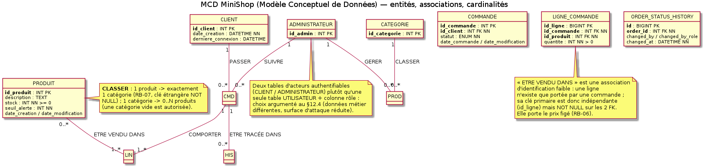
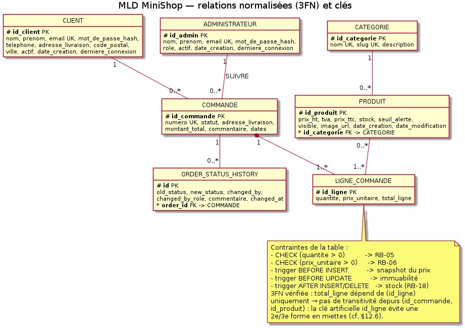

# MiniShop — Conception de la base de données et SQL

**Livrable n°3 du sujet : « Document à rendre : Conception de BD et SQL dans un langage de programmation ».**

| | |
|---|---|
| **Projet** | MiniShop — site e-commerce avec back-office |
| **Cadre** | SAE — BUT Informatique / Licence 3, Université Côte d'Azur |
| **Référente** | Thanh-Phuong Nguyen — `thanh-phuong.nguyen@univ-cotedazur.fr` |
| **Barème visé** | 20 points — pénalités couvertes : script SQL manquant (−3), procédure stockée manquante (−1, max −5), déclencheur manquant (−1, max −5), entité MCD manquante (−2), mauvaise cardinalité (−1) |
| **Plan imposé par le sujet** | **A)** Analyse de BD : i) MCD · ii) MLD · iii) Normalisation · iv) Script SQL — **B)** Procédures stockées (≥ 5) + question pédagogique — **C)** Triggers (≥ 5) |
| **Chiffres clés** | 8 tables + 3 vues · 1 fonction + **17 procédures stockées** (min. 5) · **16 déclencheurs** (min. 5) · 29 tests SQL conformes |
| **Documents liés** | `docs/01-cahier-des-charges-MiniShop.md` (spécification) · `docs/02-document-tests-validation.md` · `README.md` |
| **Fichiers SQL liés** | `sql/01…04` (schéma, procédures, déclencheurs, démo) · `tests/sql/` (fixture, manifeste) — liens en fin de document |
| **Version** | 1.1 — 23 septembre 2026 (scripts livrés en fichiers, plus de recopie verbatim) |

---

## 0. Conventions de lecture et conformité au plan du sujet

### 0.1 Références croisées (sigles utilisés dans ce document)

| Référence | Signification | Définie en |
|---|---|---|
| `RB-01…RB-20` | règles métier | `docs/01` §6 |
| `SEC-01…SEC-14` | exigences de sécurité | `docs/01` §8 |
| `CT-01…CT-09` | contraintes techniques | `docs/01` §7 |
| `ENF-01…ENF-19` | exigences non fonctionnelles | `docs/01` annexe 17.3 (`docs/annexes/annexe-enf.md`) |
| `UC-01…UC-14` | cas d'utilisation | `docs/01` §5.1 + annexe 17.1 |
| `T-xx` / `F-xx` / `S-xx` / `EF-xxx` | cas de test (règles / fonctionnels / sécurité) | `docs/02` |
| `V1…V7` | variantes de conception (arbitrages) | **partie D du présent document** |
| `A.x` / `B.x` / `C.x` | sections du présent document | — |

### 0.2 Table de conformité — chaque exigence du point 3 du sujet et où elle est traitée

> Plan imposé par le sujet (point 3) : **A) Analyse de BD** → i) MCD, ii) MLD, iii) Normalisation, iv) Script SQL ; **B) Procédures stockées** (+ question pédagogique) ; **C) Triggers**. Les parties suivent ce plan à l'identique, avec deux ajouts demandés implicitement : les cardinalités justifiées (i) et le jeu de données (iv).

| Exigence du sujet | Traité en | Pénalité couverte |
|---|---|---|
| i) MCD — entités, associations, **cardinalités justifiées** | A.1 (figure + justification ligne à ligne) | entité manquante −2 · cardinalité erronée −1 |
| ii) MLD — transformation en relations | A.2 (8 relations + 3 vues) | — |
| iii) Normalisation — DF, 1FN/2FN/3FN, clés primaires **et** étrangères justifiées, redondances | A.3.1 → A.3.4 (+ preuve exécutable A.3.5) | — |
| iv) Script SQL **avec insertion de données** | A.4 + [`sql/01_minishop_schema.sql`](../sql/01_minishop_schema.sql) (DDL + données) + [`sql/04_minishop_demo.sql`](../sql/04_minishop_demo.sql) (jeu créé par `CALL`) | script SQL manquant −3 |
| B) ≥ 5 procédures stockées (ex. `sp_create_order`, `sp_add_order_item`, `sp_update_order_status`) | B.1 : **17 livrées + 1 fonction** ; correspondance nom à nom avec les exemples du sujet en B.3 | procédure manquante −1 (max −5) |
| Question pédagogique (centralisation, sécurité, transactions, réutilisabilité, contrôle des accès) | B.2 (table aspect par aspect, limites comprises) | — |
| C) ≥ 5 triggers (ex. « Trigger 1 — Stock », « Trigger 2 — Historique » sur `ORDER_STATUS_HISTORY`) | C.1 : **16 livrés** ; couverture explicite des deux triggers imposés en C.2 | déclencheur manquant −1 (max −5) |

---

## Partie A — Analyse de la base de données (i → iv du sujet)

### A.1 Modèle conceptuel de données (MCD)

#### 12.1.1 Diagramme



#### 12.1.2 Entités et rôle dans le métier

| Entité | Réalité métier représentée | Identifiant | Propriétés |
|---|---|---|---|
| `CLIENT` | personne inscrite pouvant commander | `id_client` | nom, prénom, email, mot de passe (hash), téléphone, adresse, code postal, ville, actif, dates |
| `ADMINISTRATEUR` | membre du personnel habilité du back-office | `id_admin` | nom, prénom, email, hash, rôle (`SUPER`/`GESTIONNAIRE`), actif, dates |
| `CATEGORIE` | rayon de classement des produits | `id_categorie` | nom, slug, description |
| `PRODUIT` | article vendu | `id_produit` | référence, nom, slug, description, prix HT, TVA, prix TTC, stock, seuil d'alerte, visibilité, image, dates |
| `COMMANDE` | demande d'achat enregistrée d'un client | `id_commande` (+ `numero` candidat) | adresse de livraison, statut, montant total, commentaire, dates |
| `LIGNE_COMMANDE` | un produit acheté en quantité dans une commande, **au prix du moment** | `id_ligne` | quantité, prix unitaire, total |
| `ORDER_STATUS_HISTORY` | trace inaltérable des changements de statut | `id` | ancien/nouveau statut, auteur, rôle, commentaire, horodatage |

Associations : `PASSER` (CLIENT↔COMMANDE), `COMPORTER` (COMMANDE↔LIGNE_COMMANDE), `ETRE VENDU DANS` (PRODUIT↔LIGNE_COMMANDE), `CLASSER` (CATEGORIE↔PRODUIT), `SUIVRE`/`GERER` (ADMINISTRATEUR↔COMMANDE/PRODUIT), `ETRE TRACÉE DANS` (COMMANDE↔ORDER_STATUS_HISTORY).

#### 12.1.3 Cardinalités, avec justification ligne à ligne

| Association | Cardinalité retenue | Justification | Conséquence en MLD / DDL | Test |
|---|---|---|---|---|
| CLIENT — `PASSER` — COMMANDE | CLIENT `(1,1)` · COMMANDE `(0,N)` | « un client peut passer plusieurs commandes », et une commande a un auteur (RB-10) | `commande.id_client` NOT NULL + FK `RESTRICT` (un client avec commandes ne se supprime pas) | `T-17` |
| COMMANDE — `COMPORTER` — LIGNE_COMMANDE | COMMANDE `(1,1)` · LIGNE `(1,N)` | une ligne n'a de sens que portée par une commande (identification faible) et une commande valide a ≥ 1 ligne (RB-04) | association convertie en table avec FK `ON DELETE CASCADE` | `T-16`, `T-24` |
| PRODUIT — `ETRE VENDU DANS` — LIGNE_COMMANDE | PRODUIT `(1,1)` · LIGNE `(0,N)` | le produit référencé par une ligne est obligatoire (sinon `RB-06` devient inexplicable) | FK `RESTRICT` + trigger de protection | `T-15` |
| CATEGORIE — `CLASSER` — PRODUIT | CATEGORIE `(1,1)` · PRODUIT `(0,N)` | RB-07 (un produit, une seule catégorie) et RB-08 (une catégorie peut être vide) | `id_categorie` NOT NULL, FK `RESTRICT` | `T-14` |
| COMMANDE — `ETRE TRACÉE DANS` — HISTORIQUE | COMMANDE `(1,1)` · TRACE `(0,N)` | une commande peut n'avoir aucun changement tracé au départ, puis N | FK `CASCADE` (la trace suit sa commande) | `T-22` |
| ADMINISTRATEUR — `SUIVRE`/`GERER` — COMMANDE/PRODUIT | `(0,N)` · `(0,N)` | information d'audit uniquement ; pas de donnée portée par l'admin sur la commande (le `changed_by` de l'historique suffit) | **aucune FK ajoutée** (décision argumentée : tracer ≠ posséder) | revue |

**Refus explicites de conception** (à défendre en soutenance) :
- *pas de* `PRODUIT.id_commande` : une commande porte N produits → relation 1-N inversée, sinon un produit ne pourrait être vendu qu'une fois ;
- *pas de* table `COMMANDE(id, produits_csv)` : violateur de 1NF, impossible à interroger proprement et à contraindre ;
- *pas de* clé naturelle `id_produit` dans `LIGNE_COMMANDE` comme unique identifiant (une même commande peut légitimement contenir deux lignes du même produit : un achat « cadeau » et un achat « perso » avec des quantités différentes) → on garde `id_ligne` ;
- *pas d'*`UTILISATEUR` unique + colonne `role` : voir A.4.


### A.2 Modèle logique de données (MLD)



```
CLIENT(id_client PK, nom, prenom, email UK, mot_de_passe_hash, telephone, adresse_livraison,
       code_postal, ville, actif, date_creation, derniere_connexion)

ADMINISTRATEUR(id_admin PK, nom, prenom, email UK, mot_de_passe_hash, role, actif,
               date_creation, derniere_connexion)

CATEGORIE(id_categorie PK, nom UK, slug UK, description)

PRODUIT(id_produit PK, reference UK, nom, slug UK, description, prix_ht, tva, prix_ttc,
        stock, stock_initial, seuil_alerte, visible, image_url, date_creation, date_modification,
        id_categorie FK → CATEGORIE)            -- RB-07 (NOT NULL), RB-16 (prix_ttc calculé)

COMMANDE(id_commande PK, numero UK, adresse_livraison, statut, frais_port, montant_total,
         commentaire, date_commande, date_modification, id_client FK → CLIENT)  -- RB-10, RB-20

LIGNE_COMMANDE(id_ligne PK, quantite, prix_unitaire, total_ligne,
               id_commande FK → COMMANDE (CASCADE), id_produit FK → PRODUIT (RESTRICT))

ORDER_STATUS_HISTORY(id PK, old_status, new_status, changed_by, changed_by_role,
                     commentaire, changed_at, order_id FK → COMMANDE)

PARAMETRE(cle PK, valeur, description, maj_le)   -- 4 lignes livrées : frais_port = 4.90,
     franchise_port = 80.00, tva_standard = 20.00, seuil_alerte_defaut = 5
     -- les règles chiffrées vivent ICI, pas dans une constante PHP recopiée (RB-20)
```

**Trois vues** complètent le modèle logique — elles factorisent une règle pour qu'elle ne soit jamais réécrite
(en complément des 8 tables) :

| Vue | Contenu | Règle qu'elle factorise | Test |
|---|---|---|---|
| `v_etat_stock` | `id_produit`, référence, nom, stock, seuil, **état** (`RUPTURE` / `STOCK_FAIBLE` / `OK`) | `RB-04` + `RB-05` : un seul endroit décide de l'état du stock | `T-27` |
| `v_catalogue` | produits `visible = 1` + catégorie + état du stock | `RB-19` : la visibilité est appliquée **par la vue**, pas par chaque requête | `T-27` |
| `v_commandes_client` | commande + client + nombre de lignes + `frais_port` + total | lecture du compte d'un client, sans jamais recompter à la main | `T-27` |

Le **jeu de démonstration** livré par `sql/01` et `sql/04` : 1 administrateur, 4 catégories, **12 produits**
(dont `POWER-010` en rupture de stock pour `RB-04`/`RB-19`, `BRAC-012` masqué), **3 clients** dont les mots de
passe sont des hashes `password_hash()`, et **4 commandes** créées **par appels de procédures** : deux validées
avec franchise de port atteinte (`frais_port = 0.00`), un brouillon vide, et une petite commande qui **paie**
4,90 EUR de livraison (montant 63,70 EUR pour 58,80 EUR de marchandises). C'est ce qui rend `RB-15`/`RB-20`
visibles dans l'application dès la première page du back-office.


### A.3 Normalisation — dépendances fonctionnelles, 1FN/2FN/3FN, clés, redondances

Le sujet demande explicitement les quatre points suivants ; ils sont traités séparément, table par table pour les dépendances.

#### 12.3.1 Dépendances fonctionnelles identifiées (DF)

| Table | DF non triviales retenues | Commentaire |
|---|---|---|
| `CLIENT` | `id_client → nom, prenom, email, mot_de_passe_hash, …` ; `email → id_client` | `email` est donc **clé candidate** : l'unicité (RB-01) n'est pas un artifice applicatif, c'est une propriété du modèle |
| `CATEGORIE` | `id_categorie → nom, slug, description` ; `nom → id_categorie` ; `slug → id_categorie` | `nom` et `slug` sont candidats : le slug sert aux URL, le nom aux libellés |
| `PRODUIT` | `id_produit → reference, nom, slug, prix_ht, tva, stock, stock_initial, …` ; `reference → id_produit` ; `slug → id_produit` ; `prix_ht, tva → prix_ttc` ; `id_produit → id_categorie` | la dernière DF est **dérivée** : elle justifie `trg_produit_ttc` (partie C) au lieu d'une colonne calculée à la main |
| `COMMANDE` | `id_commande → numero, id_client, adresse_livraison, statut, frais_port, montant_total, …` ; `numero → id_commande` ; `(id_commande, date_commande) → frais_port` **dérivée** (le port dépend des marchandises **au moment de la validation**, puis ne bouge plus) ; `Σ total_ligne, frais_port → montant_total` | pas de DF `id_client → adresse_livraison` : un client peut livrer ailleurs (c'est pourquoi l'adresse est copiée, A.3.4). La DF sur `frais_port` est la traduction de `RB-20` : le port est une **fonction du panier figée à la validation**, pas un attribut libre du client ni une règle recalculée à chaque lecture |
| `LIGNE_COMMANDE` | `id_ligne → id_commande, id_produit, quantite, prix_unitaire, total_ligne` ; `id_ligne → total_ligne` (DF transitive évitée, voir 3FN) ; `id_produit → prix courant du produit` **n'est pas** une DF de la table | la DF `id_produit → prix` ne s'applique qu'au **moment de l'achat** : c'est précisément le snapshot `RB-06`, la valeur enregistrée dépend de `id_ligne`, pas de `id_produit` |
| `ORDER_STATUS_HISTORY` | `id → order_id, old_status, new_status, changed_at, …` | `(order_id, new_status, changed_at)` est quasi-unique mais n'est pas retenu comme candidat (deux changements à la même seconde dans un scénario de test doivent rester possibles) |

#### 12.3.2 Vérification 1FN / 2FN / 3FN

| Table | 1FN | 2FN | 3FN | Démonstration |
|---|---|---|---|---|
| `CLIENT` | ✅ un seul sens par attribut, valeurs atomiques (pas de `adresse` en un bloc « rue, cp, ville » : la rue, le code postal et la ville sont 3 attributs) | ✅ clé primaire mono-attribut ⇒ pas de dépendance partielle possible | ✅ aucune DF `non-clé → non-clé` | `ville → code_postal` n'est **pas** une DF valide (deux villes peuvent partager un CP, un CP peut couvrir plusieurs communes) : la ville reste donc un attribut dépendant de `id_client` |
| `CATEGORIE` | ✅ | ✅ | ✅ | — |
| `PRODUIT` | ✅ | ✅ (clé mono-attribut) | ⚠️ puis ✅ | `prix_ttc` dépend transitivement de `prix_ht` et `tva`. Deux options : (a) supprimer `prix_ttc` et le calculer à la lecture ; (b) le **conserver comme valeur dérivée générée par la base** et la documenter. Option (b) retenue : le prix TTC est un résultat de recherche filtrée (`prix_ttc BETWEEN` dans `sp_search_products`), le recalcul à chaque lecture casserait `ENF-01` (< 500 ms) ; la redondance est **neutralisée** par `trg_produit_ttc(_update)`, ce qui est équivalent à une colonne générée MySQL (`GENERATED ALWAYS AS`). L'anomalie potentielle est donc nulle, et la 3FN est « respectée à la dénormalisation tracée près ». |
| `COMMANDE` | ✅ | ✅ | ⚠️ puis ✅ | `montant_total` dépend de la somme des lignes : DF `id_commande → montant_total` indirecte. Maintenu car (i) c'est une donnée de **facturation figée** au moment de la commande, (ii) une agrégation à chaque lecture casserait les listes admin. Garde-fou : `trg_commande_transition_statut` refuse tout `montant_total` non égal à la somme (`RB-15`), donc l'anomalie est rendue impossible, pas seulement « déconseillée ». |
| `LIGNE_COMMANDE` | ✅ | ✅ | ✅ | Si l'on conservait la clé composée `(id_commande, id_produit)` (sans `id_ligne`), `quantite` dépendrait de la clé entière mais `prix_unitaire` **dépendrait de `id_produit` seul** (avant snapshot) : **violation de 2FN**. L'introduction de la clé de substitution `id_ligne` fait de chaque attribut non-clé un dépendant de la clé entière uniquement → 3FN. De plus le snapshot rend `prix_unitaire` indépendant du produit courant, ce qui supprime l'anomalie de modification du prix du produit (les commandes passées ne bougent plus). |
| `ORDER_STATUS_HISTORY` | ✅ | ✅ | ✅ | — |

**Conclusion de normalisation :** le schéma est en 3FN **avec deux dénormalisations tracées et protégées par déclencheur** (`PRODUIT.prix_ttc`, `COMMANDE.montant_total`) et **une copie volontaire** (`COMMANDE.adresse_livraison`). Chacune est justifiée par une exigence (`ENF-01`, `RB-06`, `RB-15`), ce qui est exactement ce qu'on attend d'une normalisation argumentée plutôt que mécanique.

#### 12.3.3 Justification des clés primaires et étrangères

| Clé | Choix | Justification | Ce qui serait cassé sinon |
|---|---|---|---|
| PK `id_client`, `id_admin`, `id_categorie`, `id_produit`, `id_commande` | entiers auto-incrémentés (substituts) | les candidats naturels (email, référence, slug, numéro de commande) peuvent, en théorie, changer ou être réattribués ; un identifiant stable et court rend les index et les jointures performants | une PK naturelle `email` imposerait de réécrire toutes les FK à chaque correction de saisie |
| UK `email` (client, admin), `reference`, `slug`, `numero` | contraintes **unicité** séparées de la PK | elles portent les règles métier (`RB-01`, `RB-14`) et restent vérifiables même avec une PK de substitution | sans elles, `RB-01` ne tiendrait que dans le PHP (contournable) |
| FK `produit.id_categorie` | `NOT NULL`, `ON DELETE RESTRICT`, `ON UPDATE CASCADE` | RB-07 + impossibilité d'orphelins ; le `CASCADE` sur l'update n'est pas dangereux (un id de catégorie ne change pas en pratique) | `SET NULL` rendrait `NOT NULL` impossible ; un `DELETE CASCADE` détruirait le catalogue |
| FK `commande.id_client` | `NOT NULL`, `RESTRICT` | RB-10 + conservation de l'historique | `CASCADE` effacerait les commandes à la suppression d'un compte : interdit par RB-09 |
| FK `ligne_commande.id_commande` | `NOT NULL`, `ON DELETE CASCADE` | la ligne est **dans** la commande (identification faible) : elle disparaît avec elle, et le trigger `trg_ligne_restore_stock` restitue le stock | `RESTRICT` empêcherait toute purge d'un brouillon (test T-24) |
| FK `ligne_commande.id_produit` | `NOT NULL`, `RESTRICT` (des deux côtés) | `RB-14` : un produit vendu reste référencé, sinon le `prix_unitaire` figé n'a plus de sens | `CASCADE` supprimerait des lignes de commandes validées (`RB-09`) |
| FK `order_status_history.order_id` | `CASCADE` | l'audit suit sa commande (une commande supprimable = brouillon vide) | audit orphelin, ou purge de commande impossible |
| index | `FULLTEXT(nom, description)`, `idx_produit_categorie`, `idx_produit_visible(visible, stock)`, `idx_commande_client`, `idx_commande_statut`, `idx_ligne_commande` | alignés sur les requêtes réelles (`WHERE visible = 1 AND stock > 0 ORDER BY …`, « mes commandes », « commandes par statut ») : justifiés par le plan d'exécution, pas par superstition | recherche en `LIKE %…%` sur 1 000 produits : acceptable mais `ENF-01` non garanti |

#### 12.3.4 Redondances identifiées (et ce qui en est fait)

| Redondance | Nature | Décision | Contrôle de non-contradiction |
|---|---|---|---|
| `PRODUIT.prix_ttc` | dérivée de `prix_ht` × `tva` | conservée (performance de filtrage) | `trg_produit_ttc` + `trg_produit_ttc_update` : recalcul systématique, test de cohérence A.4 |
| `COMMANDE.montant_total` | agrégat | conservée (facturation figée) | `RB-15` + trigger (`T-10`) |
| `LIGNE_COMMANDE.total_ligne` | produit `quantite × prix_unitaire` | conservée (historique stable, même si un taux change) | trigger `trg_ligne_prix_snapshot` |
| `COMMANDE.adresse_livraison` | copie de `CLIENT.adresse_livraison` | **obligatoire** : l'adresse livrée est une donnée du moment de la commande (RB-06 par analogie) ; sinon modifier son compte réécrire l'historique | aucune mise à jour rétroactive ; la liste des adresses est proposée au client, puis figée |
| `LIGNE_COMMANDE.prix_unitaire` | copie du prix courant du produit | **obligatoire** (`RB-06`) | snapshot au trigger + immuabilité (`T-11`, `T-23`) |
| `nom`/`slug` de catégorie dans les jointures | non redondant (jamais dupliqué) | jointures systématiques | — |
| `v_etat_stock` (vue) | dérivée (RUPTURE / TRES_BAS / DISPONIBLE) | vue fournie pour que Back-office et procédure partagent la même formule | définition unique dans la base |

**Anomalies vérifiées comme absentes :** (i) anomalie d'insertion : aucune (toutes les FK NOT NULL ont un parent obligatoire et réel, test `T-17`) ; (ii) anomalie de suppression : les `RESTRICT` empêchent une suppression qui casserait un historique (`T-14`, `T-15`) ; (iii) anomalie de mise à jour : impossible sur les prix figés (`T-11`), sur les montants (`T-10`) et sur le stock négatif (`T-02`, `T-03`, `T-19`).

#### 12.3.5 Requête de preuve (à exécuter en soutenance)

```sql
-- aucune incohérence de redondance tolérée : ces 4 requêtes doivent renvoyer 0 ligne
SELECT id_produit FROM produit WHERE prix_ttc <> ROUND(prix_ht * (1 + tva/100), 2);
SELECT c.id_commande FROM commande c
  JOIN (SELECT id_commande, SUM(total_ligne) s FROM ligne_commande GROUP BY id_commande) t
    ON t.id_commande = c.id_commande
 WHERE c.statut <> 'BROUILLON' AND c.montant_total <> t.s;
SELECT c.id_commande FROM commande c
  JOIN (SELECT id_commande, SUM(quantite) q FROM ligne_commande GROUP BY id_commande) t
    ON t.id_commande = c.id_commande
 WHERE t.q <= 0;
SELECT id_produit FROM produit WHERE stock < 0;
```


### A.4 Script SQL (DDL + données) — `sql/01_minishop_schema.sql`

**Installation (la commande fait foi, exécutée sur MariaDB 11.8 dans notre environnement de développement) :**

```bash
./scripts/load_db.sh
# [1/4] DDL + données de reference     sql/01_minishop_schema.sql
# [2/4] 16 declencheurs               sql/03_minishop_triggers.sql
# [3/4] 1 fonction + 17 procedures    sql/02_minishop_procedures.sql
# [4/4] commandes de demonstration    sql/04_minishop_demo.sql
#
# objet                nombre
# tables               8     ← entités du MLD (A.2), dont `parametre`
# vues                 3     ← v_etat_stock, v_catalogue, v_commandes_client
# fonctions            1     ← fn_param : lecture typée des règles chiffrées
# procedures stockees  17    ← CT-03 (minimum 5)
# declencheurs         16    ← CT-04 (minimum 5)
# produits             12   clients 3   commandes 4
# lignes de commande   5     traces de statut 9
# OK — base 'minishop' chargee (verifiez : procedures >= 5, declencheurs >= 5).
```

Extraits représentatifs du DDL (le fichier complet est dans le dépôt et dans le fichier `sql/01_minishop_schema.sql`, livré à la racine du dépôt) :

```sql
CREATE TABLE produit (
  id_produit   INT UNSIGNED NOT NULL AUTO_INCREMENT,
  reference    VARCHAR(30)  NOT NULL,
  nom          VARCHAR(150) NOT NULL,
  slug         VARCHAR(180) NOT NULL,
  prix_ht      DECIMAL(10,2) NOT NULL,
  tva          DECIMAL(5,2)  NOT NULL DEFAULT 20.00,
  prix_ttc     DECIMAL(10,2) NOT NULL,        -- dérivé, voir RB-16
  stock        INT          NOT NULL DEFAULT 0,
  seuil_alerte INT          NOT NULL DEFAULT 3,
  id_categorie INT UNSIGNED NOT NULL,
  visible      TINYINT(1)   NOT NULL DEFAULT 1,
  date_creation     DATETIME NOT NULL DEFAULT CURRENT_TIMESTAMP,
  date_modification DATETIME NOT NULL DEFAULT CURRENT_TIMESTAMP ON UPDATE CURRENT_TIMESTAMP,
  CONSTRAINT pk_produit           PRIMARY KEY (id_produit),
  CONSTRAINT fk_produit_categorie FOREIGN KEY (id_categorie)
        REFERENCES categorie (id_categorie) ON UPDATE CASCADE ON DELETE RESTRICT,
  CONSTRAINT uk_produit_reference UNIQUE KEY (reference),
  CONSTRAINT uk_produit_slug      UNIQUE KEY (slug),
  CONSTRAINT ck_produit_prix      CHECK (prix_ht > 0),   -- RB-02
  CONSTRAINT ck_produit_stock     CHECK (stock >= 0),    -- RB-03
  CONSTRAINT ck_produit_visible   CHECK (visible IN (0,1))
) ENGINE=InnoDB DEFAULT CHARSET=utf8mb4 COLLATE=utf8mb4_unicode_ci;

CREATE TABLE ligne_commande (
  id_ligne      BIGINT UNSIGNED NOT NULL AUTO_INCREMENT,
  id_commande   INT UNSIGNED NOT NULL,
  id_produit    INT UNSIGNED NOT NULL,
  quantite      INT           NOT NULL,
  prix_unitaire DECIMAL(10,2) NOT NULL,     -- RB-06 : snapshot
  total_ligne   DECIMAL(10,2) NOT NULL,
  CONSTRAINT pk_ligne_commande  PRIMARY KEY (id_ligne),
  CONSTRAINT fk_ligne_commande  FOREIGN KEY (id_commande)
        REFERENCES commande (id_commande) ON DELETE CASCADE ON UPDATE CASCADE,
  CONSTRAINT fk_ligne_produit   FOREIGN KEY (id_produit)
        REFERENCES produit (id_produit) ON DELETE RESTRICT ON UPDATE RESTRICT,
  CONSTRAINT ck_ligne_quantite  CHECK (quantite > 0),        -- RB-05
  CONSTRAINT ck_ligne_prix      CHECK (prix_unitaire > 0)
) ENGINE=InnoDB;
```

Le script contient aussi : la création de la base (`utf8mb4_unicode_ci`), les 8 tables dans l'ordre de dépendance
(les 7 entités du MCD plus `parametre`, qui porte les règles chiffrées — port, franchise, TVA, seuil d'alerte), l'index `FULLTEXT (nom, description)`, les index de filtrage, **3 vues** (`v_etat_stock` = formule unique de l'état de stock, `v_catalogue` = produits visibles enrichis catégorie + état, `v_commandes_client` = commandes + client + nombre de lignes) ; ces vues sont réellement créées par `sql/01` et comptées par `scripts/load_db.sh`, 4 catégories, 12 produits (dont un en rupture `stock = 0` et un masqué `visible = 0` pour tester `RB-19`), 3 clients, 1 administrateur, et **des hashes générés par `password_hash()`** (A.5). Le jeu de commandes de démonstration est volontairement créé **par appels de procédures** (`sql/04`) et non par `INSERT` directs : c'est ce qui fait vivre les triggers dans la base de démonstration.

Contrôles de cohérence livrés avec le script (dans `load_db.sh`) : comptage des tables/procédures/triggers, nombre de lignes par table, et les 4 requêtes de preuve de la section A.3.5.


### A.5 Données de démonstration et précautions

| Jeu | Contenu | Utilité pour la recette |
|---|---|---|
| 4 catégories | Informatique, Audio, Accessoires, Objets connectés | `RB-08` (une catégorie vide est créée par les tests de suppression) |
| 12 produits | prix de 12.50 à 1249 € HT, dont **`POWER-010` en rupture (`stock = 0`)**, `MICRO-007` sous seuil, `BRAC-012` **masqué** | `RB-19`, `EF-ADM-05`, `F-12/13`, `T-25`, `T-26` |
| 3 clients | alice / bruno / carla | `RB-01`, `SEC-08`, `T-18` (deux clients différents suffisent à prouver l'IDOR) |
| 1 administrateur | rôle `SUPER` | `RB-13` |
| 3 commandes | une `EN_PREPARATION` (2 lignes), un brouillon vide, une `EXPEDIEE` (2 lignes) | `RB-11`, `RB-06`, `RB-15`, `EF-CLI-10` |

**Mots de passe de démonstration** : `Demo2026!` (clients), `Admin2026!` (back-office), insérés sous forme de **hashes bcrypt réels** produits par :

```php
php -r 'echo password_hash("Demo2026!", PASSWORD_BCRYPT, ["cost" => 12]), "\n";'
```

et non par un `INSERT … '123456'` : le seed respecte donc lui-même `RB-12`. Les hashes sont documentés dans le `README.md` pour permettre la démo, et le script de déploiement (`scripts/deploy.php`) régénère des hashes aléatoires et change les emails quand la démo est mise en ligne (`SEC-10`).


---

## Partie B — Procédures stockées

### B.1 Procédures stockées (17 livrées + 1 fonction — minimum demandé : 5)

**Catalogue complet.** « Usage » indique l'appelant (cas d'utilisation) ; « Test » la preuve d'exécution.

| # | Procédure | Signature (résumée) | Rôle | UC | Test |
|---|---|---|---|---|---|
| 1 | `sp_create_account` | `IN nom, prenom, email, hash, OUT id, OUT code` | création de compte client avec refus du doublon (`RB-01`) **et** refus d'un hash non valide (`RB-12`) | UC-04 | `T-05` |
| 2 | `sp_get_credentials` | `IN email, OUT id, OUT hash, OUT statut` | lecture de l'identifiant et du hash pour `password_verify()` (`SEC-04`) ; statut `COMPTE_BLOQUE` | UC-05 | F-08 |
| 3 | `sp_update_client` | `IN id, …, OUT code` | modification du compte, email ré-contrôlé | UC-05 | F-10 |
| 4 | `sp_search_products` | `IN mot_cle, id_categorie, prix_min, prix_max, en_stock, tri, page, par_page, admin, OUT — (2 jeux de résultats)` | recherche + filtres + tri + pagination, en requête préparée interne paramétrée (`SEC-01/02`, `RB-19`) | UC-01/02 | `T-25` |
| 5 | `sp_save_product` | `IN id NULL\|valeur, champs…, OUT id, OUT code` | création **et** modification d'un produit ; prix TTC recalculé ; `RB-02/07/14/16` | UC-10 | F-22 |
| 6 | `sp_delete_product` | `IN id` | suppression physique si aucune commande, sinon masquage (`RB-09/14/17`) | UC-10 | `T-15`, `T-20` |
| 7 | `sp_adjust_stock` | `IN id, mode(SET\|DELTA), qte, motif, OUT stock, OUT code` | mouvement de stock avec refus de négatif (`RB-03`) | UC-12 | `T-19` |
| 8 | `sp_save_category` | `IN id, nom, slug, description, OUT id, OUT code` | création / renommage de catégorie | UC-11 | F-25 |
| 9 | `sp_delete_category` | `IN id` | refus si catégorie occupée (`RB-14`), sinon suppression | UC-11 | `T-14` |
| 10 | `sp_create_order` | `IN id_client, adresse, OUT id_commande, OUT numero` | ouverture d'un brouillon + numérotation `CMDaaaa-NNNNNN` | UC-07 | F-16 |
| 11 | `sp_add_order_line` | `IN id_commande, id_produit, qte, OUT id_ligne, OUT total, OUT code` | ajout d'une ligne : verrou `FOR UPDATE`, contrôle `RB-05/18`, snapshot par trigger, `RB-15` | UC-06/07 | `T-06`, `T-09` |
| 12 | `sp_create_order_from_basket` | `IN id_client, adresse, panier_json, payee, OUT id, numero, montant, code` | **le cas UC-07 en un appel** : transaction complète, `ROLLBACK` intégral si un seul produit manque | UC-07 | F-17, F-18 |
| 13 | `sp_confirm_order` | `IN id_commande, id_client, payee, OUT montant, OUT code` | validation du panier : contrôle d'appartenance (`SEC-08`), `RB-04`, **fige le port** et solde `montant_total` (`RB-15`/`RB-20`) | UC-07 | `T-16`, `T-18`, `T-28` |
| 14 | `sp_update_order_status` | `IN id_commande, statut, commentaire, auteur, role, OUT code` | changement de statut avec matrice de transitions (`RB-11`) et idempotence | UC-14 | F-29 |
| 15 | `sp_cancel_order` | `IN id_commande, id_client, OUT code` | annulation client : `RB-11` + restitution du stock (par trigger) + **annulation du port et solde du montant à 0** (`RB-15`/`RB-20`, formule rétablie à chaque écriture) dans une transaction | UC-09 | `T-21`, `T-28` |
| 16 | `sp_revenue_report` | `IN date_debut, date_fin` | indicateurs : CA par statut, panier moyen, top 5 produits | UC-13 | F-31 |
| 17 | `sp_compute_shipping` | `IN montant_marchandises, OUT port, OUT motif` | **règle de livraison** : lit `parametre` (`frais_port`, `franchise_port`) via `fn_param`, renvoie le port dû **ou** le motif de franchise. Appelée par `sp_add_order_line` (tant que la commande est `BROUILLON`) et par `sp_confirm_order` (fige la valeur) | UC-07/09 | `T-28` |

**Une fonction, pas seulement des procédures** : `fn_param(cle, type_attendu) RETURNS VARCHAR(255)` — un lecteur typé
de la table `parametre`. Elle existe pour une raison de cohérence : la **même** valeur (4,90 EUR, 80,00 EUR,
20,00 % de TVA) est lue par la procédure de port, par le contrôle de TVA et par le seuil d'alerte ; l'écrire trois
fois en dur dans trois objets différents est précisément le genre de duplication que la section A.3 refuse pour les prix.

Exemple du cœur transactionnel (extrait de `sp_add_order_line`) :

```sql
-- verrou de ligne : deux clients ne réservent pas la même unité
SELECT prix_ttc, stock INTO v_prix, v_stock
  FROM produit WHERE id_produit = p_id_produit FOR UPDATE;
IF v_prix IS NULL THEN
  SIGNAL SQLSTATE '45000' SET MESSAGE_TEXT = 'PRODUIT_SUPPRIME_DU_CATALOGUE';   -- RB-17
END IF;
SET v_dispo = v_stock - v_deja;                       -- déjà réservé sur la commande
IF v_dispo < p_quantite THEN
  SET p_code_retour = 'STOCK_INSUFFISANT';           -- RB-18, sans lever d'exception
ELSE
  INSERT INTO ligne_commande (id_commande, id_produit, quantite, prix_unitaire, total_ligne)
    VALUES (p_id_commande, p_id_produit, p_quantite, v_prix, ROUND(p_quantite * v_prix, 2));
  -- (le trigger AFTER INSERT décrémente le stock ; RB-06 fige le prix au BEFORE INSERT)
END IF;
```


### B.2 Réponse à la question pédagogique : pourquoi une procédure stockée plutôt que tout faire en PHP ?

| Aspect exigé par le sujet | Ce que la procédure apporte **ici**, concrètement | Ce qui se passe si on la remplace par du PHP |
|---|---|---|
| **Centralisation de la logique** | `sp_create_order_from_basket` porte une seule fois l'ordre exact : créer → verrouiller → insérer → décrémenter → sommer → valider. Le front-office, le back-office (commande manuelle « téléphone ») et un futur import CSV partagent le même code | l'ordre est recopié dans chaque contrôleur ; un import écrit « à la main » saute le calcul du montant ou le snapshot ⇒ `RB-15`/`RB-06` violés sans erreur visible |
| **Sécurité** | le PHP ne possède que `EXECUTE` sur les procédures : il ne peut pas écrire `UPDATE produit SET stock = -1` ni `DELETE FROM commande`, même en cas d'injection dans un autre point du code (défense en profondeur) ; les requêtes du repository sont des appels, pas du SQL dynamique | les privilèges `UPDATE/DELETE` sur `PRODUIT`/`COMMANDE` rendent un défaut applicatif **exploitable** ; l'injection SQL devient un moyen de falsifier le stock et les montants |
| **Transactions** | `START TRANSACTION / COMMIT / ROLLBACK` dans la procédure : l'atomicité est garantie **côté serveur** et ne dépend pas de la fiabilité du client (ni d'un `beginTransaction()` oublié) ; un deadlock MySQL ne laisse qu'à réessayer l'appel | un crash PHP **entre** l'insertion de la commande et le décrément laisse un stock faux — l'état le plus coûteux à réparer |
| **Réutilisabilité** | `sp_add_order_line` sert au panier persistant, à la commande en ligne, à la reprise d'un import et au script de test ; `sp_search_products` sert au visiteur (avec `p_admin = 0`) et à l'admin (`p_admin = 1`) sans changer une ligne de PHP | deux implémentations de la disponibilité (une dans `PanierController`, une dans `CommandeController`) divergent dès le premier correctif |
| **Contrôle des accès** | `sp_confirm_order` vérifie `id_client` de la commande : la route `commande.php?id=25` ne peut pas fuiter même avec un contrôleur oublié (test `T-18`) ; `sp_delete_category` refuse la suppression d'une catégorie occupée (`T-14`) | la sécurité repose entièrement sur la discipline de chaque développeur et sur des tests d'intégration |
| **Performance et volume réseau** | un seul aller-retour pour un panier de N lignes (`CALL` + JSON) au lieu de `2N + 2` requêtes préparées ; les calculs se font près des données | latence multipliée sur les paniers volumineux (mesure `ENF-01`) |
| **Coûts assumés / limites (à dire aussi)** | dépendance au SGBD (pas portables sur SQLite/PostgreSQL sans réécriture), debuggage moins outillé qu'en PHP, versionnement du SQL à surveiller dans GitLab, logique dupliquée si l'IHM a besoin de la même formule (ex. `etat_stock` : même formule dans la procédure **et** dans la classe `Produit`) | — |

**Conclusion pédagogique** : la procédure est retenue **pour les écritures multi-tables et les décisions qui engagent la cohérence** (commande, stock, statut, suppression protégée) ; la lecture simple (liste des catégories, fiche d'un produit par id) reste en SQL préparé dans le repository. Cette frontière est précisément celle que le sujet cherche à faire réfléchir, et elle est justifiée par la table ci-dessus plutôt que par une préférence.


### B.3 Correspondance avec les noms **tels qu'écrits dans le sujet**

Le sujet donne des exemples (`sp_create_order`, `sp_add_order_item`, `sp_update_order_status`, « Trigger 1 — Stock »,
« Trigger 2 — Historique », la table `ORDER_STATUS_HISTORY`, l'exemple de MLD `CLIENT(…, password, …)`). La table
ci-dessous fait la correspondance **objet par objet** : deux des trois procédures gardent le nom exact, la
troisième est **renommée en français pour être cohérente avec le reste du modèle** (`ligne_commande`, pas
`order_item`) — c'est un choix assumé et tracé ici, pas un oubli, parce que le sujet dit « par exemple ».

| Exemple du sujet | Objet livré | Écart et raison | Test |
|---|---|---|---|
| `sp_create_order` — création d'une commande | `sp_create_order(id_client, adresse, OUT id, OUT numero)` | **nom et rôle identiques** ; + numérotation `CMDaaaa-NNNNNN` (`RB-08`) | `F-16`, `T-16` |
| `sp_add_order_item` — ajout d'un produit dans une commande | `sp_add_order_line(id_commande, id_produit, qte, OUT id_ligne, OUT total, OUT code)` | renommer **`_line`** : la table s'appelle `ligne_commande`, les triggers `trg_ligne_*` ; garder un nom anglais isolé dans un modèle français serait la vraie incohérence. Dérivé : `sp_create_order_from_basket` = le panier entier en un appel | `T-06`, `T-08`, `T-09`, `T-29` |
| `sp_update_order_status` — modification du statut | `sp_update_order_status(id_commande, statut, commentaire, auteur, role, OUT code)` | **nom et rôle identiques** ; + matrice de transitions (`RB-11`), idempotence, auteur tracé | `T-12`, `T-13`, `F-29` |
| « Trigger 1 — Stock » : à la création d'une ligne, `stock - quantité commandée` | `trg_ligne_decrement_stock` (`AFTER INSERT`) **et** `trg_ligne_restore_stock` (`AFTER DELETE`) | même formule, **et son inverse** : sans la restitution, annuler une commande perdrait du stock (`T-21`) | `T-07`, `T-21` |
| « Trigger 2 — Historique » sur `ORDER_STATUS_HISTORY(id, order_id, old_status, new_status, changed_at)` | `trg_history_statut` (`AFTER UPDATE`) **et** `trg_history_creation` (`AFTER INSERT`) | **colonnes du sujet conservées à l'identique**, plus `changed_by`, `changed_by_role`, `commentaire` (qui, sous quel rôle, pourquoi) ; écriture **uniquement** par trigger (`V7`, `T-22`) | `T-22`, `T-23` |
| `CLIENT(…, password, date_creation)` | `client(…, mot_de_passe_hash, date_creation)` | le sujet interdit lui-même le mot de passe en clair (`Interdire password = "123456"`) : la colonne est un **hash** `password_hash()` (`RB-12`) | `T-05`, `F-08` |


---

## Partie C — Déclencheurs (16 livrés — minimum demandé : 5)

### C.1 Catalogue des 16 déclencheurs

| ID | Trigger | Évènement | Règle | Action / effet | Test |
|---|---|---|---|---|---|
| `TRG-A1` | `trg_ligne_controle_insert` | `BEFORE INSERT ON ligne_commande` | `RB-17`, `RB-18` | vérifie produit existant et `stock ≥ quantité`, sinon `SIGNAL 'STOCK_INSUFFISANT'` | `T-08` |
| `TRG-A2` | `trg_ligne_decrement_stock` | `AFTER INSERT ON ligne_commande` | `RB-18`, `RB-03` | `stock = GREATEST(stock - qte, 0)` — jamais de négatif | `T-21`, F-17 |
| `TRG-A3` | `trg_ligne_restore_stock` | `AFTER DELETE ON ligne_commande` | `RB-18` | restitution des unités (annulation, retrait, purge) | `T-21`, `T-24` |
| `TRG-B1` | `trg_ligne_immutable` | `BEFORE UPDATE ON ligne_commande` | `RB-09`, `RB-06` | refus `RB06_PRIX_ET_QUANTITE_NON_MODIFIABLE` sur toute réécriture | `T-11` |
| `TRG-B2` | `trg_ligne_prix_snapshot` | `BEFORE INSERT ON ligne_commande` | `RB-06` | force `prix_unitaire = prix_ttc courant` et `total_ligne` ; **ignore le prix envoyé par le client** | `T-23` |
| `TRG-B3` | `trg_produit_ttc` | `BEFORE INSERT ON produit` | `RB-16` | calcule `prix_ttc` | A.3.5 |
| `TRG-B4` | `trg_produit_ttc_update` | `BEFORE UPDATE ON produit` | `RB-16`, `RB-06` | recalcule `prix_ttc` **sans toucher** aux lignes existantes | `T-23` |
| `TRG-B5` | `trg_produit_regles` | `BEFORE UPDATE ON produit` | `RB-03` | refuse `stock < 0` avec message métier | `T-03` |
| `TRG-B6` | `trg_produit_delete` | `BEFORE DELETE ON produit` | `RB-14`, `RB-09` | interdit la suppression d'un produit référencé | `T-15` |
| `TRG-C1` | `trg_categorie_slug` | `BEFORE INSERT ON categorie` | ergonomique | génère le slug si absent | F-25 |
| `TRG-C2` | `trg_categorie_delete` | `BEFORE DELETE ON categorie` | `RB-14` | interdit la suppression d'une catégorie occupée | `T-14` |
| `TRG-D1` | `trg_commande_transition_statut` | `BEFORE UPDATE ON commande` | `RB-10`, `RB-11`, `RB-15` | matrice de transitions + refus d'un montant non égal à la somme + client réel | `T-10`, `T-12`, `T-13` |
| `TRG-D2` | `trg_commande_controle_insert` | `BEFORE INSERT ON commande` | `RB-04`, `RB-10`, `RB-15` | client réel, montant forcé à 0, statut initial | `T-17` |
| `TRG-D3` | `trg_commande_delete` | `BEFORE DELETE ON commande` | `RB-09`, `RB-04` | purge interdite après validation et tant qu'il reste des lignes | `T-24` |
| `TRG-D4` | `trg_history_statut` | `AFTER UPDATE ON commande` | `RB-11` | **exigence « Trigger 2 — Historique »** : écrit `ORDER_STATUS_HISTORY` automatiquement | `T-22` |
| `TRG-D5` | `trg_history_creation` | `AFTER INSERT ON commande` | `RB-11` | première trace `NULL → BROUILLON` | `T-22` |

### C.2 Couverture des deux triggers imposés par le sujet

L'exigence « Trigger 1 — Stock » est couverte par `TRG-A1`+`TRG-A2` (et `TRG-A3` pour l'annulation) ; l'exigence « Trigger 2 — Historique » par `TRG-D4` (+ `TRG-D5`), avec la table `order_status_history(id, order_id, old_status, new_status, changed_at, …)` **exactement** au format demandé par le sujet, complétée de l'auteur et du rôle pour la traçabilité.

### C.3 Preuves par les tests SQL directs

Les tests `T-02`, `T-03`, `T-07`, `T-08`, `T-10`, `T-11`, `T-14`, `T-15`, `T-17` attaquent la base **en SQL direct**, hors application. Les règles tiennent quand même — c'est la démonstration attendue, et la raison pour laquelle la `PROCÉDURE` ne fait que compléter (message + transaction), elle ne remplace pas la contrainte.


---

## Partie D — Variantes de conception documentées (arbitrages)

### 12.8 Variantes de conception documentées (arbitrages)

| # | Question posée par le besoin | Option retenue | Option écartée | Arbitrage |
|---|---|---|---|---|
| V1 | Panier : en session ou en base ? | **session** (`PanierSession`) par défaut ; tables `PANIER`/`LIGNE_PANIER` fournies et jouables | panier 100 % en base | la session suffit au cahier des charges et évite d'écrire des règles de péremption de panier ; la variante est livrée (script commenté) pour prouver que l'architecture n'est pas fragilisée |
| V2 | Une ligne de commande = une ligne par unité ou quantité agrégée ? | **quantité agrégée** avec snapshot | une ligne par unité (1..N inserts) | 1 ligne = 1 produit = 1 prix au moment de l'achat : plus simple à facturer, `T-23` vérifie le snapshot ; l'unité par unité serait possible mais multiplie les lignes mortes |
| V3 | `BROUILLON` parmi les états ? | **oui** | démarrer directement en `EN_PREPARATION` | sans état « panier convertible », `RB-04` serait violé à l'instant de la création de la commande ; le brouillon rend la règle cohérente (et `RB-04` n'est contrôlé qu'à la validation, cf. `T-16`) |
| V4 | Deux tables d'acteurs ou une table `UTILISATEUR` + rôle ? | **deux tables** | une table + colonne `role` | champs réellement disjoints (téléphone/adresse/CGV vs rôle) ; `SEC-10` renforcé : le front-office ne peut même pas écrire dans la table `administrateur` ; jointure explicite sur la bonne table |
| V5 | `statut` en `ENUM` ou table `STATUT` ? | **ENUM** (+ matrice en base) | table de référence | 6 valeurs stables, contrôle en base (`RB-11`), pas de jointure inutile ; une table de référence est décrite comme évolution possible si un état « EN_ATTENTE_VALIDATION_PAIEMENT » devait s'ajouter |
| V6 | Prix TTC stocké ou calculé à la demande ? | stocké + trigger (cf. A.3.2 `PRODUIT`) | calculé à la lecture | filtrage de prix indexé et réponse `< 500 ms` (cf. `ENF-01`) |
| V7 | Historique des statuts : écrit par la procédure ou par trigger ? | **uniquement par trigger** | écrit dans `sp_update_order_status` | avec écriture en procédure, un `UPDATE` manuel ne serait pas tracé ; l'essai `T-22` vérifie **l'absence de doublon** (donc que la procédure n'écrit pas) |

---

## Annexes — les scripts sont livrés en fichiers (liens)

Depuis la version 1.1, les scripts SQL ne sont plus recopiés dans ce document : ils sont livrés comme
**fichiers réels du dépôt** (une seule source de vérité, versionnée, différenciable et rejouable).
Le tableau relie chaque fichier aux parties du présent document qui l'analysent.

| Fichier | Contenu | Rattaché à | Lignes |
|---|---|---|---:|
| [`sql/01_minishop_schema.sql`](../sql/01_minishop_schema.sql) | DDL : 8 tables, 3 vues, index FULLTEXT + jeu de données de référence (4 catégories, 12 produits, 3 clients, 1 admin, hashes `password_hash()`, table `parametre`) | A.1 · A.2 · A.4 · A.5 | 313 |
| [`sql/02_minishop_procedures.sql`](../sql/02_minishop_procedures.sql) | directive `DELIMITER` + 1 fonction (`fn_param`) + 17 procédures stockées | B.1 · B.2 · B.3 | 841 |
| [`sql/03_minishop_triggers.sql`](../sql/03_minishop_triggers.sql) | directive `DELIMITER` + 16 déclencheurs (blocs A stock, B prix/immuabilité, C catégories, D commandes/historique) | C.1 · C.2 · C.3 | 298 |
| [`sql/04_minishop_demo.sql`](../sql/04_minishop_demo.sql) | 4 commandes de démonstration créées **par `CALL` des procédures** (déclencheurs réellement exécutés) | A.5 | 46 |
| [`tests/sql/fixture.sql`](../tests/sql/fixture.sql) | jeu de données des tests (état de référence mémorisé dans `stock_initial`) | C.3 · doc 02 | 105 |
| [`tests/sql/manifest.txt`](../tests/sql/manifest.txt) | manifeste des 29 tests SQL (résultat attendu par test) | C.3 · doc 02 | 38 |
| [`tests/perf/mesurer.sh`](../tests/perf/mesurer.sh) | protocole de mesure p95 HTTP (`ENF-01`) | doc 02 §5 | 19 |
| [`tests/perf/mesurer_sql.sh`](../tests/perf/mesurer_sql.sh) | mesure côté base : plans d'exécution, p95, coût d'une écriture métier | A.3 · doc 02 §5 | 101 |
| [`scripts/gen_volumes.sh`](../scripts/gen_volumes.sh) | générateur de volumétrie (200 produits / 1 000 commandes via les procédures) | doc 02 §5 | 104 |
| [`.gitlab-ci.yml`](../.gitlab-ci.yml) | chaîne CI : 6 jobs alignés sur le barème (lint, sécurité, tests SQL, unitaires, diagrammes) ; **pas de re-run après un merge dont la MR était verte** | CDC §14.2 | 114 |
| [`.gitignore`](../.gitignore) | secrets hors dépôt (`app/Config/env.php`), artefacts régénérables | CDC §14.1 règle 7 | 35 |

**Rejeu complet** (le 01 crée la base et fait `USE` ; 02 et 03 contiennent la directive `DELIMITER` ;
03 et 04 supposent les objets des étapes précédentes) :

```bash
mysql -u root -p          < sql/01_minishop_schema.sql
mysql -u root -p minishop < sql/02_minishop_procedures.sql
mysql -u root -p minishop < sql/03_minishop_triggers.sql
mysql -u root -p minishop < sql/04_minishop_demo.sql
```

**Validation exécutée (23/09/2026, MariaDB 11.8.6)** — chaîne rejouée de zéro : 8 tables, 3 vues,
1 fonction, **17 procédures** et **16 déclencheurs** chargés ; les 4 commandes de démonstration retrouvées
avec leurs montants exacts (324,60 / 0,00 / 405,48 / 63,70 EUR dont 4,90 de port) et les 9 traces
d'historique ; les gardes RB-01/02/03/05/06/09/11/14/15/18 vérifiés **en SQL direct** (rejets attendus) ;
rollback intégral du panier confirmé (stock inchangé, aucune commande créée) ; les 4 hashes du seed
reconnus comme sorties réelles de `password_hash()` (bcrypt) pour les mots de passe de démonstration.

**Corrections v1.1 apportées aux scripts** (blocantes au chargement direct, détectées par ce rejeu) :
(i) ajout des directives `DELIMITER $$ … DELIMITER ;` dans `sql/02` et `sql/03`, promises par l'en-tête
du 01 mais absentes — `mysql < sql/02…` échouait sinon ; (ii) le déclencheur `trg_history_creation`
(TRG-D5) se terminait par `;` au lieu de `$$` : il n'était jamais créé (15/16 déclencheurs seulement,
et aucune trace `NULL → BROUILLON`) ; (iii) commentaire du script 04 corrigé (produit 8 = sac à dos
SAC-008, 58,80 EUR — pas l'écran) ; (iv) en-tête du 01 : commande de chargement complétée (fichier 04,
nom de base pour 02→04) et bloc `parametre` replacé avant la table `commande` ; (v) référence
`Ecran-27-003` normalisée en `ECRA-003` (convention de nommage). Note MySQL/MariaDB : `CAST(… AS JSON)`
est du pur MySQL — sous MariaDB (et donc en PDO), passer le panier **directement comme chaîne** au
paramètre déclaré `JSON` (alias `LONGTEXT`).
